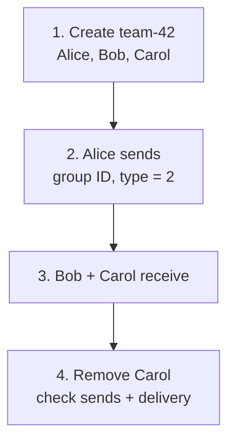
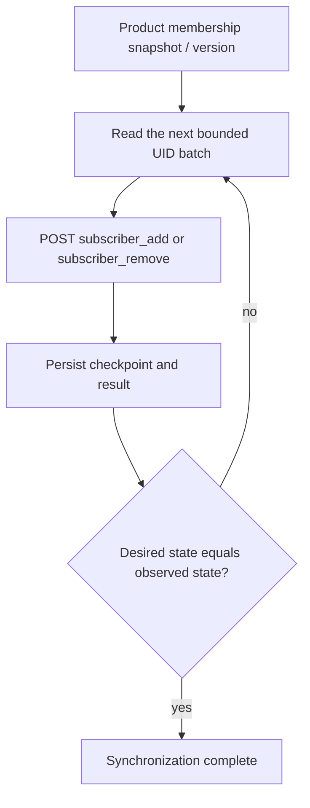

Goal: Alice sends to `team-42`, Bob and Carol each receive it, then you verify the leave boundary.

<div className="tutorial-diagram">



</div>

## 1. Prepare the three-member group

Connect Alice, Bob, and Carol in independent clients with credentials from your backend. The backend creates stable group ID `team-42` with all three as ordinary subscribers.

Your product owns profiles, roles, approvals, moderation, and the membership database. **Membership and send HTTP routes belong behind a trusted backend:** clients call your business API, which checks roles before changing WuKongIM state.

**Check:** verify the exact three members through the authenticated, paginated [Manager](/en/server/operations/manager) subscriber query.

<Callout type="warn" title="Reset replaces members; requests can partially complete">
  `reset=1` replaces the old member list. Use it for a fresh test group or a confirmed desired snapshot. Metadata writes, removal, insertion, and large-group refresh are not one transaction; after failure, retain successful progress and reconcile from the business snapshot.
</Callout>

<details>
  <summary>Create the group: complete backend request</summary>

Choose a stable, non-recycled product group ID such as `team-42`. Create the Channel from a trusted service network and verify it with a small initial member set:

```bash
curl -sS http://127.0.0.1:5001/channel \
  -H 'Content-Type: application/json' \
  -d '{
    "channel_id":"team-42",
    "channel_type":2,
    "reset":1,
    "subscribers":["alice","bob","carol"]
  }'
```

The compatible success response is `{"status":200}`. `channel_type=2` identifies a group Channel. This subscriber list does not replace the product membership database; the server uses it for messaging permission, synchronization, and delivery.

</details>

## 2. Send to the group ID

Alice uses `channel_id=team-42`, `channel_type=2`, a stable `client_msg_no`, and the SDK text format. The sender must satisfy current membership and send permissions.

**Check:** SENDACK or HTTP `reason=1` confirms the default message's durable commit. It does not prove reception by every member or completion of conversation synchronization.

<details>
  <summary>Backend send and history query</summary>

The sender must satisfy current group permission and membership policy. A client SDK uses `channel_id=team-42` and `channel_type=2`; a trusted server-side example is:

This example uses the built-in SDK text format, matching the Web example. Before encoding, the JSON is:

```json
{"type":1,"content":"hello team"}
```

The `payload` below is the UTF-8 Base64 encoding of this JSON. Custom types and fields need a matching client decoder; see [Custom Messages](/en/sdk/javascript/advanced/custom-messages).

```bash
curl -sS http://127.0.0.1:5001/message/send \
  -H 'Content-Type: application/json' \
  -d '{
    "from_uid":"alice",
    "channel_id":"team-42",
    "channel_type":2,
    "client_msg_no":"team-42-0001",
    "payload":"eyJ0eXBlIjoxLCJjb250ZW50IjoiaGVsbG8gdGVhbSJ9"
  }'
```

`reason=1` means this Channel message was durably committed. It does not mean every member was online, every online Session write succeeded, or every client has completed its conversation-directory synchronization.

Bob can sync the group log:

```bash
curl -sS http://127.0.0.1:5001/channel/messagesync \
  -H 'Content-Type: application/json' \
  -d '{
    "login_uid":"bob",
    "channel_id":"team-42",
    "channel_type":2,
    "start_message_seq":0,
    "limit":20,
    "pull_mode":1
  }'
```

`message_seq` defines one order inside the group. Member online delivery, RECVACK, unread state, and reconnect recovery remain separate observations.

</details>

## 3. Check both receivers

| Client | Expected result |
| --- | --- |
| Bob | Receives `hello team`, shown once |
| Carol | Independently receives the same text, shown once |
| Reconnected receiver | Missing persistent messages recover through full-SDK sync or your backend history path |

`message_seq` orders this group only. Online delivery, RECVACK, unread, and recovery are separate checks; EasySDK does not automatically supply offline history or conversation recovery.

## 4. Verify removal

Commit the product membership decision, then remove Carol through the trusted subscriber route. Retain the operation result and reconcile partial failure. After the change converges, verify Carol's later send permissions and delivery behavior against your product policy.

**Check:** removal does not erase committed history or client caches. Define former-member history visibility and the starting point on rejoin.

<details>
  <summary>Remove Carol: complete backend request</summary>

```bash
curl -sS http://127.0.0.1:5001/channel/subscriber_remove \
  -H 'Content-Type: application/json' \
  -d '{"channel_id":"team-42","channel_type":2,"subscribers":["carol"]}'
```

</details>

<details>
  <summary>Add members and verify the desired membership</summary>

Add members:

```bash
curl -sS http://127.0.0.1:5001/channel/subscriber_add \
  -H 'Content-Type: application/json' \
  -d '{"channel_id":"team-42","channel_type":2,"subscribers":["dave","erin"]}'
```

Use `/channel/subscriber_remove` with the same request shape to remove members. Membership changes are de-duplicated and update each user's Channel relationship. The product service still needs the desired member list, version, and operation log so it can reconcile and compensate from successful progress after a failure.


Product HTTP has no symmetric read route for ordinary subscribers, the denylist, or temporary subscribers. For strict verification, use the authenticated Manager `GET /manager/channels/:channel_type/:channel_id/subscribers` bounded paging query. Product HTTP can read the allowlist, but that legacy route returns the whole list at once and is unsuitable for large-group inspection.

</details>

<details>
  <summary>Leave and rejoin policy</summary>

The product service commits its membership decision, calls the trusted subscriber-removal route, and records a retryable task. Removal affects later permission and delivery plans, but it does not delete the existing Channel log or automatically define product database, client-cache, and historical-conversation policy.

Decide which historical sequence a former member may view, whether local records are removed, and where a returning member resumes. Those product rules cannot be inferred solely from “the subscriber row is gone.”

</details>

<details id="scale-to-100000-members">
  <summary>Advanced: reconcile 100,000 members in bounded batches</summary>

Do not place 100,000 UIDs into one `/channel` or `subscriber_add` JSON request. Use a product-owned coordinator:



- Use bounded application batches of hundreds to roughly one thousand UIDs, then tune from request bytes, latency, and error rate. Do not treat an internal chunk default as a permanent public API maximum.
- Each request is still chunked and de-duplicated internally, but neither the stages inside one request nor multiple HTTP requests form one global transaction. Preserve successful progress and repair the desired/observed difference after failure.
- `channel.large_group_subscriber_threshold` defaults to `500`; after an ordinary membership mutation, a count **greater than** the threshold refreshes the large-group marker. After changing the threshold, use controlled membership reconciliation and verification for existing Channels.
- After a large-group message is committed, the server pages through members, resolves online devices, and dispatches by destination node. Channel history retains one message instead of separate logs for all 100,000 members.
- SENDACK confirms durable commit without waiting for delivery to every receiving device. If the product needs “everyone processed it,” build a separate business acknowledgement and aggregation flow.

</details>

<details>
  <summary>Advanced: capacity validation</summary>

Before launch, measure separately:

1. hot-group send rate, durable commit latency, and P99;
2. member paging, online-device lookup latency, and post-commit delivery backlogs;
3. per-node client write latency, disconnect ratio, and reconnect recovery;
4. membership update throughput and resuming progress after partial failures;
5. CPU, memory, disk, network, queue depth, rejection, and end-to-end tail latency.

Do not infer 100,000-member capacity from average QPS alone. Continue with [Channel Concepts](/en/guide/core-concepts/channels), [Cluster Configuration](/en/server/configuration/cluster), and [Benchmark Tooling](/en/server/tools/wkbench).

</details>

Next: [Channel Concepts](/en/guide/core-concepts/channels) and [release checks](/en/guide/integration/acceptance). Use [Benchmark Tooling](/en/server/tools/wkbench) to measure your actual target load.
