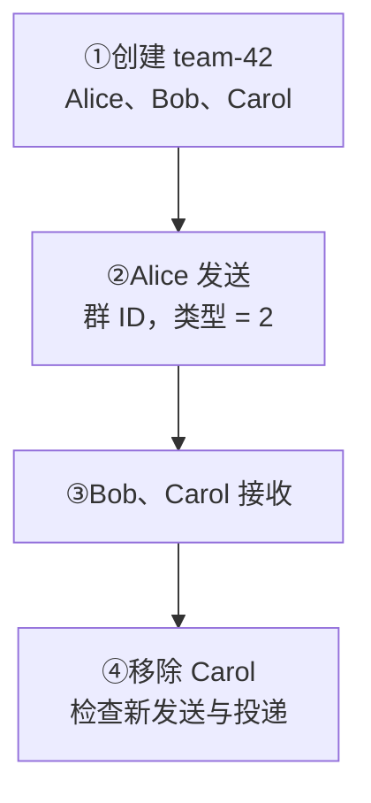
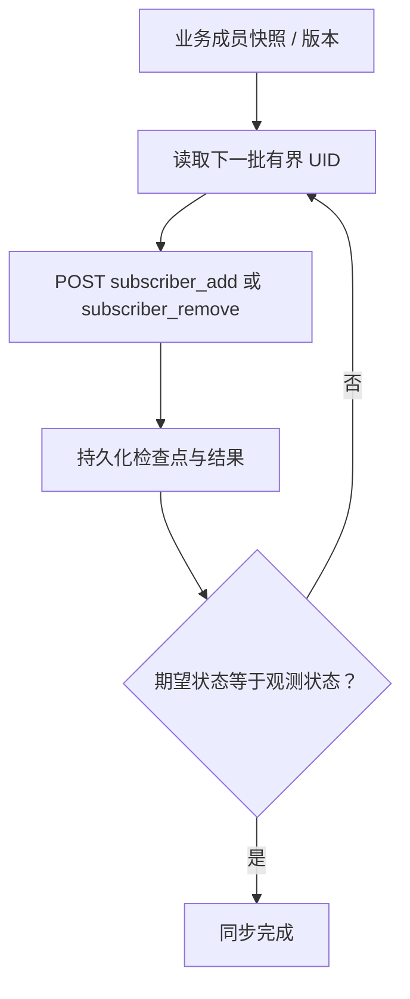

目标：Alice 向 `team-42` 发消息，Bob、Carol 分别接收，再核对离群后的权限与投递。

<div className="tutorial-diagram">



</div>

## 1. 准备三人测试群

Alice、Bob、Carol 使用业务后端提供的凭据，在独立客户端连接。后端创建稳定群 ID `team-42`，将三人加入普通订阅者列表。

业务系统负责群资料、角色、审批、禁言和成员数据库。**成员变更与发送 HTTP 接口只给受信后端：** 客户端调用业务 API，由后端验证角色后再修改 WuKongIM。

**核对：** 通过已鉴权、分页的 [Manager](/zh/server/operations/manager) 成员查询，确认正好三人。

<Callout type="warn" title="Reset 会替换成员，请求可能部分完成">
  `reset=1` 替换旧成员列表，仅用于新建测试群或已确认的期望快照。元数据写入、移除、加入和 large 刷新不是一个事务；失败后保留已成功进度，再根据业务快照协调。
</Callout>

<details>
  <summary>创建群：完整后端请求</summary>

选择稳定且不可复用的业务群 ID，例如 `team-42`。在受信服务网络中创建 Channel，并用一个小的初始成员集完成验证：

```bash
curl -sS http://127.0.0.1:5001/channel \
  -H 'Content-Type: application/json' \
  -d '{
    "channel_id":"team-42",
    "channel_type":2,
    "reset":1,
    "subscribers":["alice","bob","carol"]
  }'
```

成功兼容响应是 `{"status":200}`。`channel_type=2` 表示群组 Channel。不要用这个成员列表替代业务群数据库；服务端使用它检查发送权限、同步消息并确定接收人。

</details>

## 2. 向群 ID 发送

Alice 使用 `channel_id=team-42`、`channel_type=2`、稳定的 `client_msg_no` 与 SDK 文本格式。发送者需满足当前成员与发送权限。

**核对：** 默认持久消息检查 SENDACK 或 HTTP `reason=1`，确认已持久提交。成功不代表所有成员收到，也不代表会话同步完成。

<details>
  <summary>后端发送与历史查询</summary>

发送者必须满足当前群权限与成员策略。客户端 SDK 使用 `channel_id=team-42`、`channel_type=2`；受信服务端示例：

本例使用 SDK 内置文本格式，与 Web 示例一致。编码前的 JSON 是：

```json
{"type":1,"content":"hello team"}
```

下方 `payload` 是该 JSON 的 UTF-8 Base64。自定义字段和类型需要配套客户端消息解码器，见[自定义消息](/zh/sdk/javascript/advanced/custom-messages)。

```bash
curl -sS http://127.0.0.1:5001/message/send \
  -H 'Content-Type: application/json' \
  -d '{
    "from_uid":"alice",
    "channel_id":"team-42",
    "channel_type":2,
    "client_msg_no":"team-42-0001",
    "payload":"eyJ0eXBlIjoxLCJjb250ZW50IjoiaGVsbG8gdGVhbSJ9"
  }'
```

`reason=1` 表示这个 Channel 的消息已完成持久提交。它不表示所有成员都在线、所有在线 Session 都写入成功，或者每位用户都已完成 会话目录同步。

Bob 可以同步群日志：

```bash
curl -sS http://127.0.0.1:5001/channel/messagesync \
  -H 'Content-Type: application/json' \
  -d '{
    "login_uid":"bob",
    "channel_id":"team-42",
    "channel_type":2,
    "start_message_seq":0,
    "limit":20,
    "pull_mode":1
  }'
```

群内 `message_seq` 定义唯一顺序。成员的在线投递、RECVACK、未读数和重连恢复仍是不同观测。

</details>

## 3. 分别检查两个接收端

| 客户端 | 预期结果 |
| --- | --- |
| Bob | 收到 `hello team`，只显示一次 |
| Carol | 独立收到同一原文，只显示一次 |
| 重连的接收端 | 通过完整版 SDK 同步或业务历史能力，恢复缺失持久消息 |

`message_seq` 只定义本群顺序。在线投递、RECVACK、未读与恢复分别检查；EasySDK 不自动提供离线历史与会话恢复。

## 4. 验证移除成员

先提交业务成员决定，再通过受信订阅者接口移除 Carol。保留操作结果并协调部分失败；变更收敛后，按产品策略验证 Carol 后续发送权限与投递行为。

**核对：** 移除不会删除已提交历史或客户端缓存。明确离群用户可见的历史范围，以及再次入群从哪里同步。

<details>
  <summary>移除 Carol：完整后端请求</summary>

```bash
curl -sS http://127.0.0.1:5001/channel/subscriber_remove \
  -H 'Content-Type: application/json' \
  -d '{"channel_id":"team-42","channel_type":2,"subscribers":["carol"]}'
```

</details>

<details>
  <summary>添加成员与核对期望名单</summary>

新增成员：

```bash
curl -sS http://127.0.0.1:5001/channel/subscriber_add \
  -H 'Content-Type: application/json' \
  -d '{"channel_id":"team-42","channel_type":2,"subscribers":["dave","erin"]}'
```

移除成员使用 `/channel/subscriber_remove` 和相同请求结构。成员变更会去重，并更新每个用户的频道关系。业务服务仍需保存期望成员列表、版本和操作记录，失败后根据已成功的进度继续核对与补偿。


WuKongIM HTTP API 没有普通订阅者、拒绝列表和临时订阅者的对称读接口。需要严格核对时，使用已鉴权的 Manager `GET /manager/channels/:channel_type/:channel_id/subscribers` 有界分页查询；允许列表虽可由 WuKongIM HTTP API 读取，但旧接口会一次返回完整列表，不适合大群巡检。

</details>

<details>
  <summary>离群与再次入群策略</summary>

业务系统先提交自己的成员状态，再通过受信调用移除订阅者，并记录可重试任务。成员移除决定之后的发送权限和投递计划，但不会删除既有 Channel 日志，也不会自动清理业务数据库、客户端缓存或历史会话展示策略。

明确产品策略：离群用户能看到哪个历史 sequence、是否删除本地记录、再次入群从哪里同步。这些产品规则不能从“成员行已经删除”自动推导。

</details>

<details id="扩展到十万成员">
  <summary>进阶：十万成员的有界批次协调</summary>

不要把十万 UID 放入一次 `/channel` 或 `subscriber_add` JSON 请求。推荐使用业务侧协调器：



- 使用几百到约一千 UID 的有界应用批次，并按实际请求大小、延迟和错误率调节；不要把内部 chunk 默认值当作永久 API 上限。
- 每个请求内部仍会分块和去重，但请求内部各阶段以及跨多个 HTTP 请求都不是一个全局事务。失败时保留已成功进度，再通过期望/实际差异修复。
- `channel.large_group_subscriber_threshold` 默认是 `500`；普通成员变更后，成员数**大于**阈值会刷新 large-group 标记。改变阈值后，要通过受控成员协调和验证确认现有 Channel 状态。
- 大群消息提交后，服务端分批读取成员并查询在线设备，再按目标节点投递；频道消息历史仍只保留一条消息，不会为十万成员各写一份独立日志。
- SENDACK 确认消息已持久提交，不等待所有接收设备完成投递。需要业务“全部处理”语义时，另建业务回执与聚合流程。

</details>

<details>
  <summary>进阶：容量验证</summary>

上线前至少分别测量：

1. 热点群的发送速率、持久提交耗时与 P99；
2. 分批查询成员、查找在线设备的耗时，以及提交后投递队列的积压；
3. 各节点向客户端写入的耗时、断线比例与重连恢复；
4. 成员变更吞吐、部分失败后的进度保存与恢复；
5. CPU、内存、磁盘、网络、队列深度、拒绝和端到端尾延迟。

不要只用平均 QPS 推导十万成员容量。继续阅读[Channel 核心概念](/zh/guide/core-concepts/channels)、[集群配置](/zh/server/configuration/cluster)和[性能测试工具](/zh/server/tools/wkbench)。

</details>

下一步：[Channel 核心概念](/zh/guide/core-concepts/channels)与[上线检查](/zh/guide/integration/acceptance)。实际目标负载使用[性能测试工具](/zh/server/tools/wkbench)测量。
