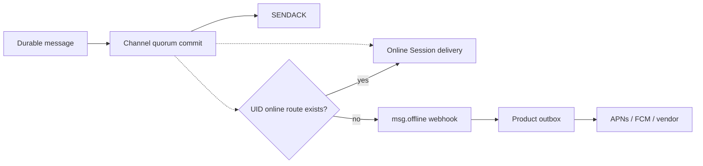

This tutorial turns a committed message into a mobile notification. WuKongIM identifies UIDs with no online route and emits a bounded webhook; the product service owns device tokens, notification policy, APNs/FCM provider calls, retries, and receipts.

<Callout type="warn" title="WuKongIM does not call push providers">
  `msg.offline` is an offline-candidate signal, not an APNs, FCM, or provider delivery receipt. A SENDACK, webhook HTTP 200, or provider acceptance does not prove that the user saw a notification.
</Callout>



## 1. Prepare product-owned device data

At minimum, the product service stores stable UID, device ID, platform, provider token, token version, authorization state, locale, quiet hours, and the latest invalidation reason. `/user/token` can maintain compatible device metadata, but there is no current public token-read API for a push worker, and the default Beta Gateway does not automatically validate CONNECT against this metadata.

Production push therefore uses the product database as its source of truth and updates it during login, token refresh, logout, and provider invalidation callbacks. Never use a nickname or transient Session ID as the push identity.

## 2. Enable the offline webhook

Configure a protected product endpoint in `wukongim.toml`:

```toml
[webhook]
http_addr = "https://events.example.com/wukongim"
focus_events = ["msg.notify", "msg.offline"]
queue_size = 1024
workers = 16
offline_uid_batch_size = 512
request_timeout = "5s"
retry_max_attempts = 3
```

The current sender sets only `Content-Type: application/json`; it adds no signature or shared-secret header. Establish trust with HTTPS, a private network or service mesh, mTLS or fixed egress identity, body-size limits, and rate limits. See [Webhooks](/en/guide/integration/webhooks) for the complete configuration and receiver contract.

## 3. Send a recoverable notification message

First provision a permissioned notification-service UID in the product. This example sends an ordinary durable message to Alice's person Channel. Its payload is an application message model, not a privileged server message type:

```bash
curl -sS http://127.0.0.1:5001/message/send \
  -H 'Content-Type: application/json' \
  -d '{
    "from_uid":"notification-service",
    "channel_id":"alice",
    "channel_type":1,
    "client_msg_no":"order-42-shipped-v1",
    "payload":"eyJ2ZXJzaW9uIjoxLCJ0eXBlIjoib3JkZXJfdXBkYXRlIiwidGl0bGUiOiJPcmRlciBzaGlwcGVkIiwiYm9keSI6IlRyYWNrIHBhY2thZ2UgaW4gdGhlIGFwcCIsIm9yZGVyX2lkIjoib3JkZXItNDIifQ=="
  }'
```

`reason=1` means the message reached Channel quorum commit. Keep `client_msg_no` stable for safe retry after an uncertain result. Trusted system-UID bypass is optional and must not replace product authorization, rate limits, or notification preferences.

## 4. Receive offline candidates

If neither Alice nor `notification-service` has an online route when Presence is resolved, the product endpoint receives a result like this:

```text
POST /wukongim?event=msg.offline
Content-Type: application/json
```

```json
{
  "header": {"no_persist": 0, "red_dot": 0, "sync_once": 0},
  "message_id": 123456789,
  "message_idstr": "123456789",
  "client_msg_no": "order-42-shipped-v1",
  "message_seq": 8,
  "from_uid": "notification-service",
  "channel_id": "<canonical-person-channel>",
  "channel_type": 1,
  "payload": "eyJ2ZXJzaW9uIjoxLCJ0eXBlIjoib3JkZXJfdXBkYXRlIiwidGl0bGUiOiJPcmRlciBzaGlwcGVkIiwiYm9keSI6IlRyYWNrIHBhY2thZ2UgaW4gdGhlIGFwcCIsIm9yZGVyX2lkIjoib3JkZXItNDIifQ==",
  "to_uids": ["notification-service", "alice"]
}
```

Offline candidates are collected before sender-echo suppression, so a person Channel's `to_uids` can include `from_uid`; the notification service is absent from the list when it has an online route. For a person message, webhook `channel_id` is the server's canonical Channel identity; product relationships still use the two UIDs and must not persist this internal value as their primary key. The receiver must also support `compress: "gzip"` with Base64 `compress_to_uids`. `msg.offline` applies only to ordinary durable messages: `SyncOnce`, request-scoped `subscribers`, and transient `NoPersist` do not produce this effect.

Offline classification is per UID, not per device. If Alice has even one online route, she is not in the offline UID list. A policy such as “push every disconnected device” must combine the product's device table with `msg.notify`, client receipts, and product-specific rules.

## 5. Write an outbox before calling the provider

The webhook receiver should quickly:

1. Authenticate the network source and event allowlist, and bound the body size.
2. Expand `to_uids` or decompress `compress_to_uids`, then filter `from_uid`, service identities, and unauthorized users according to product notification policy.
3. For every eligible UID, persist an outbox row keyed by `msg.offline + message_id + uid`.
4. Return HTTP 200 after the outbox commit.
5. Resolve active provider tokens by UID and apply quiet-hour, collapse, locale, and privacy rules in the background.
6. Call the provider, classify permanent token failures and retryable errors, and persist the outcome.

Webhook queues are node-local memory. Queue saturation, process exit, cancellation, or exhausted retries can drop an event, and a crash does not replay it. Critical push work must be reconstructible from a product outbox, a product event, or durable message history instead of relying on ever-larger WuKongIM queues.

## 6. Recover from the message log

A provider payload carries only a safe display summary and product locator, not the complete sensitive message. When the user opens it, the client authenticates again and reads the committed message through SDK sync or `/channel/messagesync`; the provider notification is never the message source of truth.

Before launch, test duplicate and missing webhooks, compressed UID lists, token rotation, partially online users, provider throttling, quiet hours, stale deep links, logout, and retracted content. Continue with [Webhooks](/en/guide/integration/webhooks) and [AI & IoT Communication](/en/guide/tutorials/ai-and-iot).
