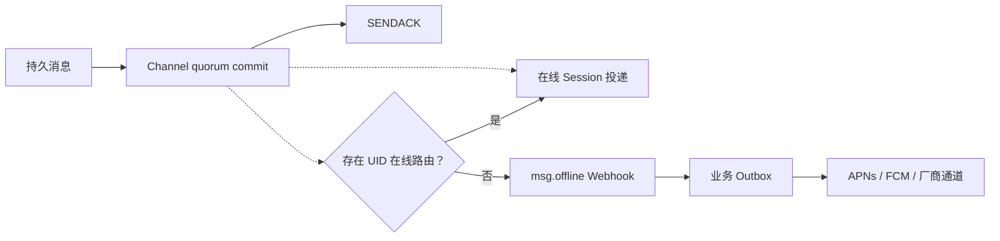

本教程把一条已提交消息转换为移动推送。WuKongIM 负责识别没有在线路由的 UID 并产生有界 Webhook；业务服务负责设备 Token、通知策略、APNs/FCM 等厂商调用、重试和回执。

<Callout type="warn" title="WuKongIM 不直接发送厂商推送">
  `msg.offline` 是离线候选信号，不是 APNs、FCM 或厂商送达回执。不要把 SENDACK、Webhook HTTP 200 或厂商受理当成用户已经看到通知。
</Callout>



## 1. 准备业务侧设备数据

业务服务至少保存：稳定 UID、设备 ID、平台、厂商 Token、Token 版本、授权状态、语言、静默时段和最近失效原因。`/user/token` 保存的是 CONNECT 凭据，默认 Gateway 会按 UID 与设备类别校验它；它不是厂商推送 Token，当前也没有面向推送工作器的公开 Token 查询接口。

因此，生产推送应以业务数据库为准，并在登录、Token 刷新、退出和厂商失效回执时更新状态。不要把昵称或临时 Session ID 当作推送身份。

## 2. 启用离线 Webhook

在 `wukongim.toml` 中配置受保护的业务端点：

```toml
[webhook]
http_addr = "https://events.example.com/wukongim"
focus_events = ["msg.notify", "msg.offline"]
queue_size = 1024
workers = 16
offline_uid_batch_size = 512
request_timeout = "5s"
retry_max_attempts = 3
```

当前 Sender 只设置 `Content-Type: application/json`，没有签名或共享密钥 Header。使用 HTTPS、私网或服务网格、mTLS/固定出口身份、请求大小限制和速率限制建立可信边界。完整配置与接收建议见 [Webhook](/zh/guide/integration/webhooks)。

## 3. 发送可恢复的通知消息

先在业务系统中创建受权限约束的通知服务 UID。本例向 Alice 的个人 Channel 发送一条普通持久消息；Payload 是应用消息模型，不是服务端特权类型：

```bash
curl -sS http://127.0.0.1:5001/message/send \
  -H 'Content-Type: application/json' \
  -d '{
    "from_uid":"notification-service",
    "channel_id":"alice",
    "channel_type":1,
    "client_msg_no":"order-42-shipped-v1",
    "payload":"eyJ2ZXJzaW9uIjoxLCJ0eXBlIjoib3JkZXJfdXBkYXRlIiwidGl0bGUiOiJPcmRlciBzaGlwcGVkIiwiYm9keSI6IlRyYWNrIHBhY2thZ2UgaW4gdGhlIGFwcCIsIm9yZGVyX2lkIjoib3JkZXItNDIifQ=="
  }'
```

`reason=1` 表示消息已达到 Channel quorum commit。保持 `client_msg_no` 稳定，以便不确定结果时安全重试。系统 UID 的权限绕过是可选受信能力，不应替代业务授权、频控和用户通知偏好。

## 4. 接收离线候选

如果 Alice 和 `notification-service` 在 Presence 解析时都没有在线路由，业务端点会收到类似结果：

```text
POST /wukongim?event=msg.offline
Content-Type: application/json
```

```json
{
  "header": {"no_persist": 0, "red_dot": 0, "sync_once": 0},
  "message_id": 123456789,
  "message_idstr": "123456789",
  "client_msg_no": "order-42-shipped-v1",
  "message_seq": 8,
  "from_uid": "notification-service",
  "channel_id": "<canonical-person-channel>",
  "channel_type": 1,
  "payload": "eyJ2ZXJzaW9uIjoxLCJ0eXBlIjoib3JkZXJfdXBkYXRlIiwidGl0bGUiOiJPcmRlciBzaGlwcGVkIiwiYm9keSI6IlRyYWNrIHBhY2thZ2UgaW4gdGhlIGFwcCIsIm9yZGVyX2lkIjoib3JkZXItNDIifQ==",
  "to_uids": ["notification-service", "alice"]
}
```

离线候选在发送者回显抑制之前收集，因此个人 Channel 的 `to_uids` 可能包含 `from_uid`；如果通知服务有在线路由，它就不会出现在列表中。Webhook 中的个人 `channel_id` 是服务端 canonical Channel 身份；业务关系仍使用双方 UID，不能把这个内部值保存为关系主键。接收端还必须支持 `compress: "gzip"` 与 Base64 `compress_to_uids`。`msg.offline` 只针对普通持久消息：`SyncOnce`、请求级 `subscribers` 和瞬态 `NoPersist` 不会产生这个效果。

离线判断粒度是 UID，不是设备。只要 Alice 有一条在线路由，她就不会进入离线 UID 列表；需要“某台设备离线也推送”时，业务服务必须结合自己的设备表、`msg.notify`、客户端回执和产品策略计算目标。

## 5. 先写 Outbox，再调用厂商

Webhook 接收器应快速完成以下步骤：

1. 验证网络来源和事件白名单，限制请求大小。
2. 展开 `to_uids` 或解压 `compress_to_uids`，再按产品通知策略过滤 `from_uid`、服务身份和未授权用户。
3. 对每个合格 UID，以 `msg.offline + message_id + uid` 为幂等键写入持久 Outbox。
4. 提交成功后返回 HTTP 200。
5. 后台按 UID 查询有效设备 Token，应用免打扰、折叠、语言与隐私规则。
6. 调用推送厂商，分类永久 Token 失效和可重试错误，并保存结果。

Webhook 队列是节点本地内存状态，满队列、进程退出、取消或重试耗尽都可能丢事件，也不会在崩溃后重放。关键推送应能从业务 Outbox、业务事件或持久消息历史补偿，而不是依赖扩大 WuKongIM 内存队列。

## 6. 让客户端从消息日志恢复

推送 Payload 只携带安全的展示摘要和业务定位键，不携带完整敏感消息。用户点击通知后，客户端重新认证并从 SDK 同步或 `/channel/messagesync` 读取已提交消息；它不能把厂商通知当作消息真相。

上线前验证：重复 Webhook、Webhook 丢失、压缩 UID、Token 轮换、部分设备在线、厂商限流、静默时段、深链失效、用户退出和消息已撤销等路径。继续阅读 [Webhook](/zh/guide/integration/webhooks) 和 [AI 与 IoT 通信](/zh/guide/tutorials/ai-and-iot)。
