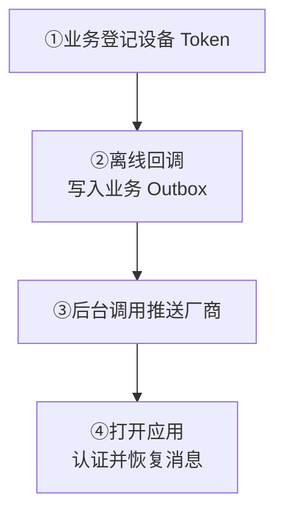

目标：Alice 离线时收到订单通知，打开应用后恢复已提交的原消息。

<div className="tutorial-diagram">


```mermaid
flowchart TD
  device["①业务登记设备 Token"] --> callback["②离线回调<br/>写入业务 Outbox"]
  callback --> provider["③后台调用推送厂商"]
  provider --> recover["④打开应用<br/>认证并恢复消息"]
```

</div>

<Callout type="warn" title="通知受理不等于用户看到">
  WuKongIM 产生离线候选，业务后端调用 APNs、FCM 或厂商通道。SENDACK、Webhook HTTP `200`、厂商受理和用户看到通知分别验证。
</Callout>

## 1. 登记设备与通知偏好

业务后端保存 UID、设备、厂商 Token 和授权状态，在登录、刷新、退出或失效回执时更新。

**核对：** 厂商 Token 与 `/user/token` 的 CONNECT 凭据不同。通知权限、免打扰和展示隐私由业务管理。

<details>
  <summary>设备数据：完整字段与更新时机</summary>

业务服务至少保存：稳定 UID、设备 ID、平台、厂商 Token、Token 版本、授权状态、语言、静默时段和最近失效原因。`/user/token` 保存的是 CONNECT 凭据，默认 Gateway 会按 UID 与设备类别校验它；它不是厂商推送 Token，当前也没有面向推送工作器的公开 Token 查询接口。

因此，生产推送应以业务数据库为准，并在登录、Token 刷新、退出和厂商失效回执时更新状态。不要把昵称或临时 Session ID 当作推送身份。

</details>

## 2. 接收离线回调

启用 `msg.offline`，用受信后端向 Alice 发送普通持久消息；`reason=1` 只证明消息已提交。

**核对：** 离线判断按 UID。Alice 只要还有一条在线路由，就不会进入离线列表；“某台设备离线也推送”需由业务另行计算。

**回调没有内置签名或共享密钥 Header。** 先建立可信网络或受保护代理，再按通知策略过滤发送者、服务身份和未授权用户。

<details>
  <summary>启用回调：完整 TOML 配置</summary>

在 `wukongim.toml` 中配置受保护的业务端点：

```toml
[webhook]
http_addr = "https://events.example.com/wukongim"
focus_events = ["msg.notify", "msg.offline"]
queue_size = 1024
workers = 16
offline_uid_batch_size = 512
request_timeout = "5s"
retry_max_attempts = 3
```

当前 Sender 只设置 `Content-Type: application/json`，没有签名或共享密钥 Header。使用 HTTPS、私网或服务网格、mTLS/固定出口身份、请求大小限制和速率限制建立可信边界。完整配置与接收建议见 [Webhook](/zh/guide/integration/webhooks)。

</details>

<details>
  <summary>发送订单通知：完整后端请求</summary>

先在业务系统中创建受权限约束的通知服务 UID。本例向 Alice 的个人 Channel 发送一条普通持久消息；Payload 是应用消息模型，不是服务端特权类型：

```bash
curl -sS http://127.0.0.1:5001/message/send \
  -H 'Content-Type: application/json' \
  -d '{
    "from_uid":"notification-service",
    "channel_id":"alice",
    "channel_type":1,
    "client_msg_no":"order-42-shipped-v1",
    "payload":"eyJ2ZXJzaW9uIjoxLCJ0eXBlIjoib3JkZXJfdXBkYXRlIiwidGl0bGUiOiJPcmRlciBzaGlwcGVkIiwiYm9keSI6IlRyYWNrIHBhY2thZ2UgaW4gdGhlIGFwcCIsIm9yZGVyX2lkIjoib3JkZXItNDIifQ=="
  }'
```

`reason=1` 表示消息已达到 Channel quorum commit。保持 `client_msg_no` 稳定，以便不确定结果时安全重试。系统 UID 的权限绕过是可选受信能力，不应替代业务授权、频控和用户通知偏好。

</details>

<details>
  <summary>离线候选：Payload、压缩 UID 与适用消息</summary>

如果 Alice 和 `notification-service` 在 Presence 解析时都没有在线路由，业务端点会收到类似结果：

```text
POST /wukongim?event=msg.offline
Content-Type: application/json
```

```json
{
  "header": {"no_persist": 0, "red_dot": 0, "sync_once": 0},
  "message_id": 123456789,
  "message_idstr": "123456789",
  "client_msg_no": "order-42-shipped-v1",
  "message_seq": 8,
  "from_uid": "notification-service",
  "channel_id": "<canonical-person-channel>",
  "channel_type": 1,
  "payload": "eyJ2ZXJzaW9uIjoxLCJ0eXBlIjoib3JkZXJfdXBkYXRlIiwidGl0bGUiOiJPcmRlciBzaGlwcGVkIiwiYm9keSI6IlRyYWNrIHBhY2thZ2UgaW4gdGhlIGFwcCIsIm9yZGVyX2lkIjoib3JkZXItNDIifQ==",
  "to_uids": ["notification-service", "alice"]
}
```

离线候选在发送者回显抑制之前收集，因此个人 Channel 的 `to_uids` 可能包含 `from_uid`；如果通知服务有在线路由，它就不会出现在列表中。Webhook 中的个人 `channel_id` 是服务端 canonical Channel 身份；业务关系仍使用双方 UID，不能把这个内部值保存为关系主键。接收端还必须支持 `compress: "gzip"` 与 Base64 `compress_to_uids`。`msg.offline` 只针对普通持久消息：`SyncOnce`、请求级 `subscribers` 和瞬态 `NoPersist` 不会产生这个效果。

离线判断粒度是 UID，不是设备。只要 Alice 有一条在线路由，她就不会进入离线 UID 列表；需要“某台设备离线也推送”时，业务服务必须结合自己的设备表、`msg.notify`、客户端回执和产品策略计算目标。

</details>

## 3. 先落库，再调用厂商

按 `msg.offline + message_id + uid` 幂等写入业务 Outbox，提交成功后返回 HTTP `200`。后台读取有效厂商 Token，应用通知偏好，再调用厂商并记录结果。

**核对：** 重复回调不重复创建推送任务；厂商失败区分失效 Token 与可重试错误。

<Callout type="warn" title="Outbox 之前仍可能丢事件">
  WuKongIM Webhook 使用有界内存队列，没有崩溃重放。业务 Outbox 只保护已落库任务；关键通知还需从业务事件或持久消息历史核对与补偿。
</Callout>

<details>
  <summary>接收端与工作器：完整处理顺序</summary>

Webhook 接收器应快速完成以下步骤：

1. 验证网络来源和事件白名单，限制请求大小。
2. 展开 `to_uids` 或解压 `compress_to_uids`，再按产品通知策略过滤 `from_uid`、服务身份和未授权用户。
3. 对每个合格 UID，以 `msg.offline + message_id + uid` 为幂等键写入持久 Outbox。
4. 提交成功后返回 HTTP 200。
5. 后台按 UID 查询有效设备 Token，应用免打扰、折叠、语言与隐私规则。
6. 调用推送厂商，分类永久 Token 失效和可重试错误，并保存结果。

Webhook 队列是节点本地内存状态，满队列、进程退出、取消或重试耗尽都可能丢事件，也不会在崩溃后重放。关键推送应能从业务 Outbox、业务事件或持久消息历史补偿，而不是依赖扩大 WuKongIM 内存队列。

</details>

## 4. 点击后恢复原消息

推送只携带安全摘要与业务定位键。Alice 打开应用后重新认证，通过 SDK 同步能力或受信后端的 `/channel/messagesync` 读取原消息；EasySDK 的历史恢复由业务另行实现。

**核对：** 通知定位到正确消息，原文只显示一次；用户退出、权限变化或消息已撤销时仍按当前业务规则处理。

<details>
  <summary>恢复与上线核对清单</summary>

推送 Payload 只携带安全的展示摘要和业务定位键，不携带完整敏感消息。用户点击通知后，客户端重新认证并从 SDK 同步或 `/channel/messagesync` 读取已提交消息；它不能把厂商通知当作消息真相。

上线前验证：重复 Webhook、Webhook 丢失、压缩 UID、Token 轮换、部分设备在线、厂商限流、静默时段、深链失效、用户退出和消息已撤销等路径。继续阅读 [Webhook](/zh/guide/integration/webhooks) 和 [AI 与 IoT 通信](/zh/guide/tutorials/ai-and-iot)。

</details>

继续阅读 [Webhook](/zh/guide/integration/webhooks)与[单聊恢复](/zh/guide/tutorials/direct-chat#4-断网后核对恢复)。
