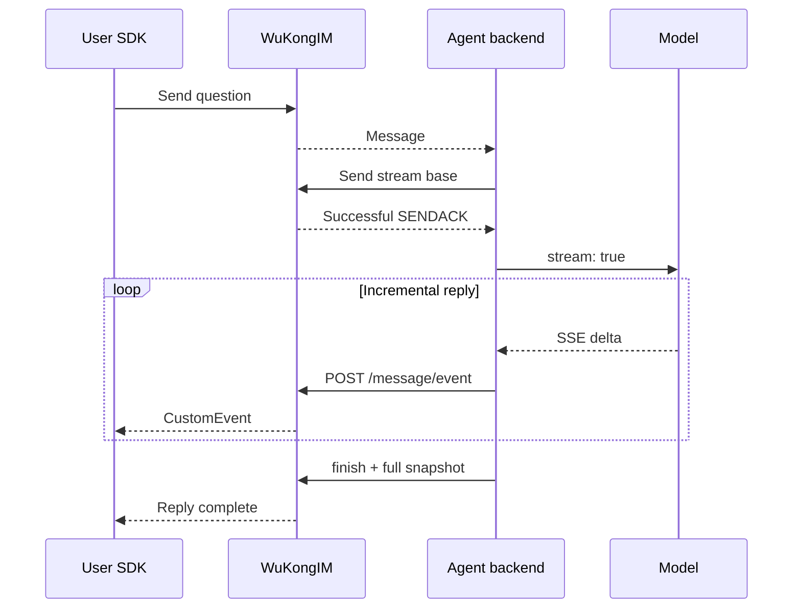
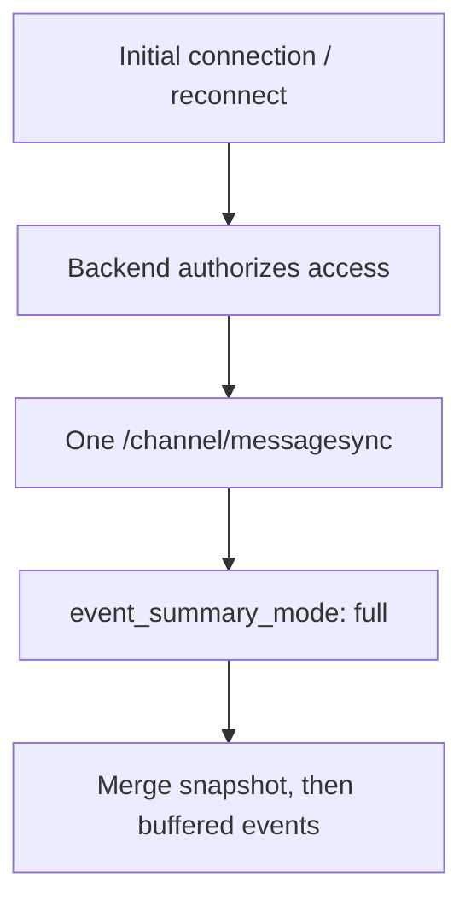

**One base message + incremental events = one continuously updated chat bubble.**

<Callout type="info" title="Before you start">
  Use `easyjssdk@WK_EASYSDK_JAVASCRIPT_VERSION` and complete the [Web Quickstart](/en/sdk/easy/javascript/getting-started). The server must include online EVENT delivery; verify support in older released images.
</Callout>

## 1. Understand the flow



| Location | Responsibility |
| --- | --- |
| Frontend SDK | Send questions, receive events, update bubbles |
| Product backend / BFF | Issue credentials, authorize access, expose history and cancellation |
| Agent backend | Hold model API keys, call the model, serialize event writes |

## 2. Run it

Start a WuKongIM cluster supporting this feature, then run the demo:

```bash
cd demo/streamdemo
npm ci
npm run build
npm start
```

Open `http://127.0.0.1:5175/streamdemo/` and select **真实模型 (Real model)** in settings:

| Setting | Value |
| --- | --- |
| Model URL | Compatible Chat Completions `/v1` base or full `/chat/completions` URL |
| API key | Model service key |
| Model name | Leave blank to try `/models`; enter explicitly when discovery is unavailable |
| WuKongIM URL | Default `http://127.0.0.1:5001`; editable |

The demo uses a local proxy for model CORS. **Production keys and Product HTTP calls stay on the backend.** [Run instructions](https://github.com/WuKongIM/WuKongIM/tree/main/demo/streamdemo)

## 3. Frontend: receive SDK events

```bash
npm install --save-exact easyjssdk@WK_EASYSDK_JAVASCRIPT_VERSION
```

The BFF supplies `bootstrap`. Implement both UI callbacks using the [receiver code](https://github.com/WuKongIM/WuKongIM/blob/main/demo/streamdemo/src/main.ts) as a reference. This example uses group Channel `2` with the user and Agent as members.

```ts
import { WKIM, WKIMEvent } from 'easyjssdk';

const im = WKIM.init(bootstrap.websocketUrl, {
  uid: bootstrap.uid, token: bootstrap.token, deviceFlag: 1,
}, { singleton: false, debugLogging: false });

// On exit: use the same callback references.
function stop() {
  im.off(WKIMEvent.Message, upsertMessage);
  im.off(WKIMEvent.CustomEvent, applyStreamEvent);
  im.destroy();
}
window.addEventListener('pagehide', stop, { once: true });

im.on(WKIMEvent.Message, upsertMessage);
im.on(WKIMEvent.CustomEvent, applyStreamEvent);
await im.connect();
await im.send(channelId, 2, { type: 1, content: 'Hello' });
```

| Callback | Merge rule |
| --- | --- |
| `upsertMessage` | Create the base bubble; reuse a bubble created by an earlier event |
| `applyStreamEvent` | Filter Channel, Agent UID, and lane first; update one reply by `client_msg_no` |
| Duplicates / gaps | Deduplicate `event_id`; merge `text_offset` in UTF-8 bytes; wait for a full snapshot when text is missing |

## 4. Backend: model deltas → message events

This is the **normal-flow core**. `agent` is a connected backend SDK. Authorize the question and membership before creating an idempotent job. `chunks` comes from the [model SSE adapter](https://github.com/WuKongIM/WuKongIM/blob/main/demo/streamdemo/src/model.ts); configure the model URL, key, and name on the backend.

```ts
const clientMsgNo = job.replyClientMsgNo; // Persist once per reply.
const ack = await agent.send(channelId, 2, { type: 1, content: '' }, {
  clientMsgNo, setting: { stream: true },
});
if (ack.reasonCode !== 1) throw new Error('Base message rejected');

await append('stream.open', { kind: 'text' });
let text = '';
for await (const delta of chunks) {
  await append('stream.delta', { kind: 'text', delta }); // Serialize writes.
  text += delta;
}
await append('stream.finish', { snapshot: { kind: 'text', text } });
```

Implement `append` on the backend: call [POST /message/event (OpenAPI reference)](/en/api/product-http/messages/appendMessageEvent), check HTTP and application results, and save the ID and payload before requesting. Reuse them on retries. Example request:

```json
{
  "channel_id": "room-42", "channel_type": 2, "from_uid": "agent-42",
  "client_msg_no": "reply-42", "event_id": "reply-42:2",
  "event_key": "main", "event_type": "stream.delta", "visibility": "public",
  "payload": { "kind": "text", "delta": "Hello" }
}
```

## 5. Finish and recover

| Scenario | Agent action | UI / history |
| --- | --- | --- |
| Complete | `stream.finish` + full `snapshot` | Complete answer |
| User cancels | Abort model → `stream.cancel` → `stream.finish` | Partial text and cancelled state |
| Model fails | `stream.error` → `stream.finish` | Partial text and failed state |
| Uncertain IM write | Stop; reconcile and retry the original event | No blind new error or completion event |



**Online reception uses SDK push. History sync is for offline recovery: no polling or `/message/eventsync`.**

| Keep | Reason |
| --- | --- |
| Persistent base with `stream: true` | Append only after successful SENDACK; no NoPersist / SyncOnce |
| Serialized writes and stable event IDs | Prevent reordering and repeated text |
| Complete terminal snapshot and independent write timeout | Live events may be lost; cancellation still needs finalization |
| Bounded buffers and full text | Buffer during recovery; replay a full snapshot before finish after Leader cache loss |
| `main` and `__finish__` | Finish uses the reserved lane; do not filter it out |
| Backend authorization and history filtering | Private events are not broadcast; visibility is not product authentication |

## 6. Full implementation and acceptance

<Cards>
  <Card title="Chat and recovery" description="Bubble merging, SDK listeners, cancellation, and offline recovery." href="https://github.com/WuKongIM/WuKongIM/blob/main/demo/streamdemo/src/main.ts" />
  <Card title="Real model" description="SSE framing, UTF-8, timeouts, and truncated streams." href="https://github.com/WuKongIM/WuKongIM/blob/main/demo/streamdemo/src/model.ts" />
</Cards>

Check **normal reply → duplicate event → cancellation → truncated model stream → offline reconnect**. The same bubble must match history each time. After fixtures pass, verify your actual model.

API details: [Message Events](/en/api/product-http/messages/appendMessageEvent) · [History Sync](/en/api/product-http/messages/syncQuickstartChannelMessages) · [JSON-RPC](/en/api/client-protocols/json-rpc)
