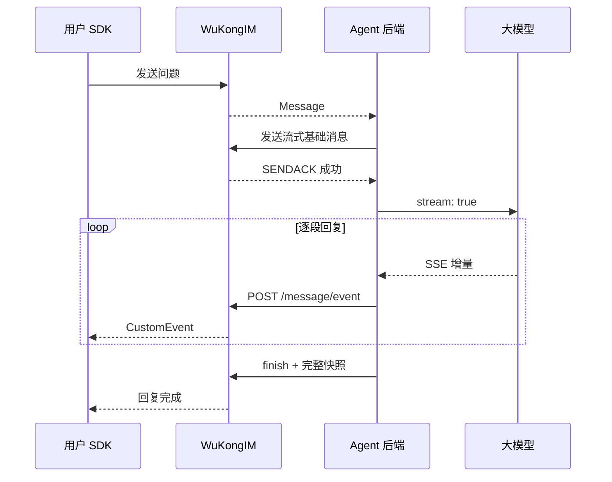
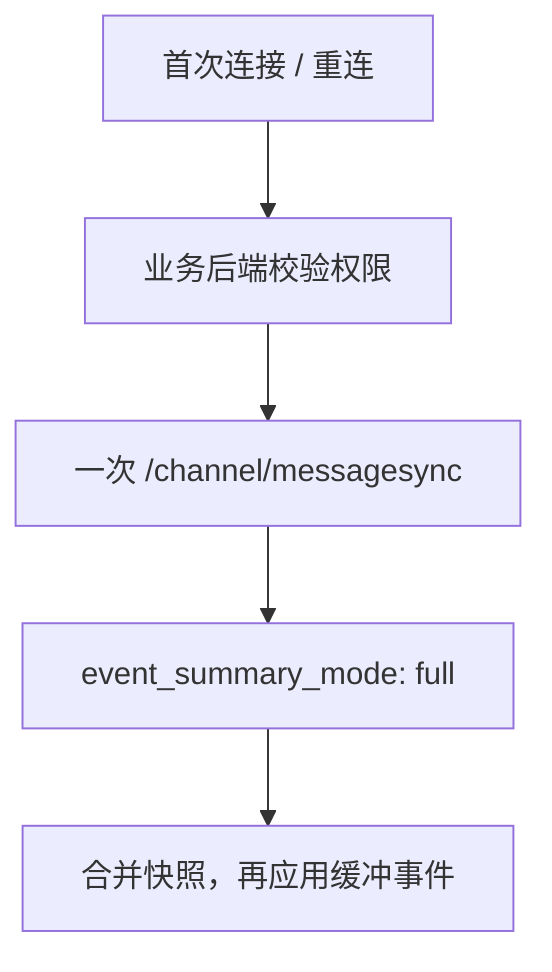

**一条基础消息 + 多次增量事件 = 一个持续更新的聊天气泡。**

<Callout type="info" title="接入前">
  使用 `easyjssdk@WK_EASYSDK_JAVASCRIPT_VERSION`，先完成 [Web 快速接入](/zh/sdk/easy/javascript/getting-started)。服务端须包含在线 EVENT 投递实现，旧发布镜像需核实。
</Callout>

## 1. 看懂链路



| 放在哪里 | 做什么 |
| --- | --- |
| 前端 SDK | 发问题、收事件、更新气泡 |
| 业务后端 / BFF | 发连接凭据、校验权限、提供历史与取消接口 |
| Agent 后端 | 持有模型 API Key、调用模型、串行写事件 |

## 2. 跑起来

先启动支持本功能的 WuKongIM 集群，再运行 Demo：

```bash
cd demo/streamdemo
npm ci
npm run build
npm start
```

打开 `http://127.0.0.1:5175/streamdemo/`，在设置中选择 **真实模型**：

| 配置 | 填写 |
| --- | --- |
| 模型 URL | 兼容 Chat Completions 的 `/v1` 或完整 `/chat/completions` 地址 |
| API Key | 模型服务密钥 |
| 模型名称 | 可留空，尝试 `/models`；不支持发现时手动填写 |
| WuKongIM 地址 | 默认 `http://127.0.0.1:5001`，可修改 |

Demo 用本地代理处理模型 CORS。**生产环境密钥和 Product HTTP 调用留在后端。** [运行说明](https://github.com/WuKongIM/WuKongIM/tree/main/demo/streamdemo)

## 3. 前端：接收 SDK 事件

```bash
npm install --save-exact easyjssdk@WK_EASYSDK_JAVASCRIPT_VERSION
```

`bootstrap` 由 BFF 发放；两个回调由应用实现，参考 [接收代码](https://github.com/WuKongIM/WuKongIM/blob/main/demo/streamdemo/src/main.ts)。本例用群 Channel `2`，成员包含用户和 Agent。

```ts
import { WKIM, WKIMEvent } from 'easyjssdk';

const im = WKIM.init(bootstrap.websocketUrl, {
  uid: bootstrap.uid, token: bootstrap.token, deviceFlag: 1,
}, { singleton: false, debugLogging: false });

// On exit: use the same callback references.
function stop() {
  im.off(WKIMEvent.Message, upsertMessage);
  im.off(WKIMEvent.CustomEvent, applyStreamEvent);
  im.destroy();
}
window.addEventListener('pagehide', stop, { once: true });

im.on(WKIMEvent.Message, upsertMessage);
im.on(WKIMEvent.CustomEvent, applyStreamEvent);
await im.connect();
await im.send(channelId, 2, { type: 1, content: 'Hello' });
```

| 回调 | 合并规则 |
| --- | --- |
| `upsertMessage` | 创建基础气泡；事件先到时复用已有气泡 |
| `applyStreamEvent` | 先筛选 Channel、Agent UID 和 lane；按 `client_msg_no` 更新同一条回复 |
| 去重 / 缺口 | `event_id` 去重；`text_offset` 按 UTF-8 字节合并，缺失部分等待完整快照 |

## 4. 后端：模型增量 → 消息事件

以下是**正常流程核心**。`agent` 是已连接的后端 SDK；任务先校验问题来源与成员权限，幂等创建。`chunks` 来自 [模型 SSE 适配器](https://github.com/WuKongIM/WuKongIM/blob/main/demo/streamdemo/src/model.ts)，模型 URL、Key 和名称由后端配置。

```ts
const clientMsgNo = job.replyClientMsgNo; // Persist once per reply.
const ack = await agent.send(channelId, 2, { type: 1, content: '' }, {
  clientMsgNo, setting: { stream: true },
});
if (ack.reasonCode !== 1) throw new Error('Base message rejected');

await append('stream.open', { kind: 'text' });
let text = '';
for await (const delta of chunks) {
  await append('stream.delta', { kind: 'text', delta }); // Serialize writes.
  text += delta;
}
await append('stream.finish', { snapshot: { kind: 'text', text } });
```

`append` 由后端实现：每次调用 [POST /message/event（OpenAPI 详细说明）](/zh/api/product-http/messages/appendMessageEvent)，检查 HTTP 与应用层结果；ID 和 Payload 在请求前保存，重试时复用。请求示例：

```json
{
  "channel_id": "room-42", "channel_type": 2, "from_uid": "agent-42",
  "client_msg_no": "reply-42", "event_id": "reply-42:2",
  "event_key": "main", "event_type": "stream.delta", "visibility": "public",
  "payload": { "kind": "text", "delta": "Hello" }
}
```

## 5. 结束与恢复

| 场景 | Agent 写入 | UI / 历史 |
| --- | --- | --- |
| 正常完成 | `stream.finish` + 完整 `snapshot` | 显示完整回答 |
| 用户取消 | 中止模型 → `stream.cancel` → `stream.finish` | 保留部分文本与取消状态 |
| 模型失败 | `stream.error` → `stream.finish` | 保留部分文本与失败状态 |
| IM 写入结果未知 | 暂停；对账后重试原事件 | 不盲写新的错误或完成事件 |



**在线只用 SDK 推送；历史同步用于离线恢复，不轮询，不需要 `/message/eventsync`。**

| 必须保留 | 为什么 |
| --- | --- |
| 基础消息持久化、`stream: true` | SENDACK 成功后才能写事件；不使用 NoPersist / SyncOnce |
| 每条回复串行写入、稳定事件 ID | 避免乱序与重复追加 |
| 完整终态快照、独立写入超时 | 在线事件可能丢失；取消模型后仍需落终态 |
| 有界缓冲与完整文本 | 重连期间先缓冲事件；Leader 缓存丢失时重放完整 snapshot 再 finish |
| `main` 和 `__finish__` | finish 使用保留 lane，过滤时不要遗漏 |
| 后端授权与历史筛选 | private 不在线广播，但 visibility 不代替业务鉴权 |

## 6. 完整实现与验收

<Cards>
  <Card title="聊天与恢复" description="气泡合并、SDK 监听、取消和离线恢复。" href="https://github.com/WuKongIM/WuKongIM/blob/main/demo/streamdemo/src/main.ts" />
  <Card title="真实模型" description="SSE 分帧、UTF-8、超时与断流处理。" href="https://github.com/WuKongIM/WuKongIM/blob/main/demo/streamdemo/src/model.ts" />
</Cards>

验收顺序：**正常回复 → 重复事件 → 取消 → 模型断流 → 离线重连**。每次核对同一气泡与历史文本一致；fixture 通过后仍需验证实际模型。

接口详情：[消息事件](/zh/api/product-http/messages/appendMessageEvent) · [历史同步](/zh/api/product-http/messages/syncQuickstartChannelMessages) · [JSON-RPC](/zh/api/client-protocols/json-rpc)
