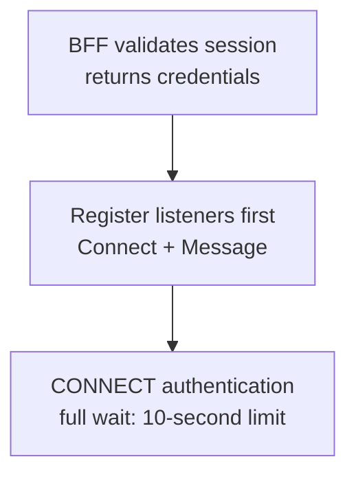

Use **WK_EASYSDK_JAVASCRIPT_VERSION** to exchange online messages between Alice and Bob in separate clients.

## 1. Prepare

| Item | Requirement |
| --- | --- |
| Browser | WebSocket, `TextEncoder`, and `TextDecoder` |
| WuKongIM cluster | Single-node or multi-node cluster; healthy `/readyz` and a browser-reachable WebSocket Gateway |
| Application BFF | Validates the product session and returns the current user's `uid`, short-lived `token`, and `websocketUrl`; same origin or deliberate cross-origin policy |

Start the test page through [the official example](/en/sdk/easy/examples#javascript). Use temporary test accounts and separate Alice and Bob clients. The code below integrates your own application.

<TutorialScreenshot
  src="/tutorials/easy-web/connect.jpg"
  alt="Official Web EasySDK test page with a loopback WebSocket address, Alice test UID, and temporary token"
  width={1240}
  height={281}
  marks={[{ x: 97, y: 22 }, { x: 97, y: 47 }, { x: 21, y: 88 }]}
>
  ① WebSocket address. ② Current UID, with its matching temporary token. ③ Connect. This is the official test tool; production applications obtain credentials from a BFF.
</TutorialScreenshot>

Read [Identity & Token](/en/guide/integration/authentication). Use HTTPS/WSS in production and keep tokens out of URLs, Local Storage, logs, and analytics. The default device category is **WEB `1`**; backend `device_flag` must match (APP `0`, PC `2`).

## 2. Install the SDK

Run in a bundled application such as Vite or Next.js, then commit the lockfile:

```bash
npm install --save-exact easyjssdk@WK_EASYSDK_JAVASCRIPT_VERSION
```

## 3. Connect and listen

<div className="tutorial-diagram">



</div>

`/api/im/bootstrap` is **your product route**, not WuKongIM Product HTTP. The browser never calls `/user/token` or `/route` directly; server credentials, route selection, and response filtering stay in the BFF.

Place the following three code blocks in one TS module, in order: fetch connection material, create the connection owner, then bind the page.

<details>
  <summary>① Fetch BFF connection material</summary>

```ts
interface IMBootstrap {
  uid: string;
  token: string;
  websocketUrl: string;
}

async function fetchIMBootstrap(): Promise<IMBootstrap> {
  const response = await fetch('/api/im/bootstrap', {
    credentials: 'include',
    cache: 'no-store',
    headers: { accept: 'application/json' },
  });
  if (!response.ok) throw new Error(`IM bootstrap failed: ${response.status}`);
  return response.json() as Promise<IMBootstrap>;
}
```

</details>

<details>
  <summary>② Complete connection wrapper: listeners, 10-second limit, and destruction</summary>

```ts
import { WKIM, WKIMChannelType, WKIMEvent, type RecvMessage } from 'easyjssdk';

export class EasyChatClient {
  private im?: WKIM;
  constructor(private readonly receiveMessage: (message: RecvMessage) => void) {}

  private readonly onConnect = (_result: unknown) => {
    console.info('EasySDK connected');
  };

  private readonly onDisconnect = (_info: unknown) => {
    console.info('EasySDK disconnected');
  };

  private readonly onMessage = (message: RecvMessage) => {
    this.receiveMessage(message);
  };

  private readonly onError = (_error: unknown) => {
    console.error('EasySDK operation failed');
  };

  async start(bootstrap: IMBootstrap): Promise<void> {
    this.stop();

    const im = WKIM.init(
      bootstrap.websocketUrl,
      { uid: bootstrap.uid, token: bootstrap.token },
      { singleton: false, debugLogging: false },
    );
    im.on(WKIMEvent.Connect, this.onConnect);
    im.on(WKIMEvent.Disconnect, this.onDisconnect);
    im.on(WKIMEvent.Message, this.onMessage);
    im.on(WKIMEvent.Error, this.onError);

    this.im = im;
    await this.connectWithin(im, 10_000);
  }

  private async connectWithin(im: WKIM, timeoutMs: number): Promise<void> {
    let timeout: ReturnType<typeof setTimeout> | undefined;
    try {
      await Promise.race([
        im.connect(),
        new Promise<void>((_, reject) => {
          timeout = setTimeout(
            () => reject(new Error(`EasySDK connect exceeded ${timeoutMs} ms`)),
            timeoutMs,
          );
        }),
      ]);
    } catch (error) {
      im.destroy();
      if (this.im === im) this.im = undefined;
      throw error;
    } finally {
      if (timeout) clearTimeout(timeout);
    }
  }

  async sendText(targetUid: string, text: string) {
    if (!this.im?.isConnected) throw new Error('EasySDK is not connected');

    return this.im.send(targetUid, WKIMChannelType.Person, {
      type: 1,
      version: 1,
      content: text,
    });
  }

  stop(): void {
    const im = this.im;
    if (!im) return;

    im.off(WKIMEvent.Connect, this.onConnect);
    im.off(WKIMEvent.Disconnect, this.onDisconnect);
    im.off(WKIMEvent.Message, this.onMessage);
    im.off(WKIMEvent.Error, this.onError);
    im.destroy();
    this.im = undefined;
  }
}
```

</details>

`on` and `off` use the same function reference. `singleton: false` prevents hot reload or multiple instances from destroying each other's connections. The full connection wait is bounded at 10 seconds and calls `destroy` on failure. An application normally owns one `EasyChatClient`.

<details>
  <summary>Component lifecycle and diagnostic logging</summary>

React can hold the client in a root Provider and call `stop()` during Effect cleanup. Vue/Svelte use component or application unmount hooks. CONNECT has an internal request timeout, but WebSocket opening can still hang, so bound the full wait.

`debugLogging: false` is the default. Enable it only during controlled diagnosis. The SDK emits sanitized operational metadata; application callbacks and collectors must not log complete events, results, or payloads.

</details>

## 4. Exchange the first message

1. Confirm **Connected** on both clients.
2. Alice sends to Bob; confirm **Message sent successfully** on the sender.
3. Confirm **Message received** on Bob; official test logs show only sequence and Channel type.
4. Bob replies to Alice; verify reception in the reverse direction.

<TutorialScreenshot
  src="/tutorials/easy-web/exchange.jpg"
  alt="Alice's connected official EasySDK test page shows a successful send with sequence 1 followed by Bob's received reply with sequence 2"
  width={1280}
  height={1079}
  marks={[{ x: 3, y: 39 }, { x: 35, y: 78.5 }, { x: 44, y: 80 }]}
>
  ① Target the peer UID. ② Alice's send request succeeds. ③ Alice receives Bob's reply. Check sending and peer reception separately.
</TutorialScreenshot>

A resolved send Promise means the server returned a send result, **not that the peer read or processed it**. This page verifies online exchange; see [SDK selection](/en/sdk) for offline recovery, conversations, and unread state.

<details>
  <summary>③ Complete page button and receive-area example</summary>

Send after both clients connect. Alice targets `bob`; Bob changes it to `alice`. These represent your product UIDs and must match the BFF identities. In your own Message callback, check `fromUid`, `channelId`, `messageId`, and payload. Show only the latest message to avoid an unbounded history.

```html
<button id="send-message" disabled>Send</button>
<pre id="received-message"></pre>
```

```ts
const output = document.querySelector<HTMLElement>('#received-message');
const button = document.querySelector<HTMLButtonElement>('#send-message');
if (!output || !button) throw new Error('Missing message UI');
button.disabled = true;
const chat = new EasyChatClient((message) => {
  output.textContent = JSON.stringify({
    fromUid: message.fromUid,
    payload: message.payload,
  });
});
window.addEventListener('pagehide', () => chat.stop(), { once: true });
try {
  await chat.start(await fetchIMBootstrap());
  button.disabled = false;
} catch {
  chat.stop();
  output.textContent = 'Connection failed';
}
button.onclick = async () => {
  try {
    // Bob sends to 'alice'. Click only after both clients are connected.
    await chat.sendText('bob', 'Hello from Web EasySDK');
    console.info('SEND completed');
  } catch {
    console.error('Send failed; check its outcome before retrying');
  }
};
```

</details>

## 5. Clean up

Call `chat.stop()` on logout, unmount, or page exit: `off` with the original callbacks, then `destroy()`. Page subscribers remove their handlers; the connection owner destroys the instance.

<details>
  <summary>Additional verification: unreachable address and refresh</summary>

Confirm failure and destruction within 10 seconds with an unreachable address, without a permanent Connecting state. Refresh, close, or sign out and confirm the old instance removes listeners and is destroyed, leaving no duplicate connection.

</details>

## 6. Troubleshooting

| Symptom | Check first |
| --- | --- |
| Missing WebSocket or encoding APIs | Browser and build environment; browser support does not imply Mini Program support |
| Connection rejected | BFF-returned WSS address, token lifetime, certificate, proxy Upgrade, and Gateway reachability |
| Duplicate messages after refresh | Avoid `on` on every render; call `off` / `destroy` on unmount |
| Token or payload in Console | The actual SDK version in lockfile and bundle, plus application callbacks, error handling, and collectors |

Reproduce logging problems with the pinned npm artifact and retain only low-sensitivity evidence. SDK diagnostics are off by default and emit only sanitized operational metadata when enabled.

## Next

Continue with [messaging](/en/guide/integration/messaging) and [production checks](/en/guide/integration/acceptance). [Versions and validation records](https://github.com/WuKongIM/WuKongIM/blob/main/docs/superpowers/reports/2026-09-08-easysdk-validation-history.md#javascript) retain historical environments and scope; see [API Versions & Compatibility](/en/api/compatibility) for current boundaries.

Connecting a model? Follow [Agent Streaming Replies](/en/sdk/easy/agent-streaming) to update one reply and keep model keys on your backend.
