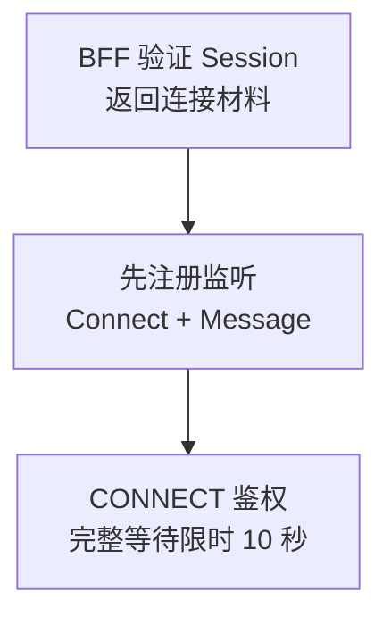

使用 **WK_EASYSDK_JAVASCRIPT_VERSION**，让 Alice 与 Bob 在两个独立客户端中在线收发。

## 1. 准备接入

| 准备项 | 要求 |
| --- | --- |
| 浏览器 | 支持 WebSocket、`TextEncoder`、`TextDecoder` |
| WuKongIM 集群 | 单节点或多节点集群，`/readyz` 正常，浏览器可达 WebSocket Gateway |
| 业务后端 BFF | 验证产品 Session，返回当前用户的 `uid`、短期 `token` 和 `websocketUrl`；同源或正确配置跨域 |

先按[运行官方示例](/zh/sdk/easy/examples#javascript)启动测试页。使用临时测试账号，分别打开 Alice 与 Bob 两个客户端；下文代码用于自己的应用。

<TutorialScreenshot
  src="/tutorials/easy-web/connect.jpg"
  alt="Web EasySDK 官方测试页填写回环 WebSocket 地址、Alice 测试 UID 与临时 Token"
  width={1240}
  height={281}
  marks={[{ x: 97, y: 22 }, { x: 97, y: 47 }, { x: 21, y: 88 }]}
>
  ① WebSocket 地址。② 当前用户 UID，Token 使用匹配的临时凭据。③ Connect。此为官方测试工具界面；生产应用从 BFF 获取凭据。
</TutorialScreenshot>

先读[身份与 Token](/zh/guide/integration/authentication)。生产使用 HTTPS/WSS，不把 Token 写入 URL、Local Storage、日志或分析事件。SDK 默认设备类别为 **WEB `1`**，后端 `device_flag` 必须一致（APP `0`、PC `2`）。

## 2. 安装 SDK

在 Vite、Next.js 等打包工程中执行，并提交锁文件：

```bash
npm install --save-exact easyjssdk@WK_EASYSDK_JAVASCRIPT_VERSION
```

## 3. 连接与监听

<div className="tutorial-diagram">



</div>

`/api/im/bootstrap` 是**你的产品接口**，不是 WuKongIM Product HTTP。浏览器不直接调用 `/user/token` 或 `/route`；服务端凭据、路由选择与响应筛选留在 BFF。

以下三个代码段按顺序放进同一个 TS 模块。先取连接材料，再创建连接所有者，最后绑定页面。

<details>
  <summary>① 获取 BFF 连接材料</summary>

```ts
interface IMBootstrap {
  uid: string;
  token: string;
  websocketUrl: string;
}

async function fetchIMBootstrap(): Promise<IMBootstrap> {
  const response = await fetch('/api/im/bootstrap', {
    credentials: 'include',
    cache: 'no-store',
    headers: { accept: 'application/json' },
  });
  if (!response.ok) throw new Error(`IM bootstrap failed: ${response.status}`);
  return response.json() as Promise<IMBootstrap>;
}
```

</details>

<details>
  <summary>② 完整连接封装：监听、10 秒超时与销毁</summary>

```ts
import { WKIM, WKIMChannelType, WKIMEvent, type RecvMessage } from 'easyjssdk';

export class EasyChatClient {
  private im?: WKIM;
  constructor(private readonly receiveMessage: (message: RecvMessage) => void) {}

  private readonly onConnect = (_result: unknown) => {
    console.info('EasySDK connected');
  };

  private readonly onDisconnect = (_info: unknown) => {
    console.info('EasySDK disconnected');
  };

  private readonly onMessage = (message: RecvMessage) => {
    this.receiveMessage(message);
  };

  private readonly onError = (_error: unknown) => {
    console.error('EasySDK operation failed');
  };

  async start(bootstrap: IMBootstrap): Promise<void> {
    this.stop();

    const im = WKIM.init(
      bootstrap.websocketUrl,
      { uid: bootstrap.uid, token: bootstrap.token },
      { singleton: false, debugLogging: false },
    );
    im.on(WKIMEvent.Connect, this.onConnect);
    im.on(WKIMEvent.Disconnect, this.onDisconnect);
    im.on(WKIMEvent.Message, this.onMessage);
    im.on(WKIMEvent.Error, this.onError);

    this.im = im;
    await this.connectWithin(im, 10_000);
  }

  private async connectWithin(im: WKIM, timeoutMs: number): Promise<void> {
    let timeout: ReturnType<typeof setTimeout> | undefined;
    try {
      await Promise.race([
        im.connect(),
        new Promise<void>((_, reject) => {
          timeout = setTimeout(
            () => reject(new Error(`EasySDK connect exceeded ${timeoutMs} ms`)),
            timeoutMs,
          );
        }),
      ]);
    } catch (error) {
      im.destroy();
      if (this.im === im) this.im = undefined;
      throw error;
    } finally {
      if (timeout) clearTimeout(timeout);
    }
  }

  async sendText(targetUid: string, text: string) {
    if (!this.im?.isConnected) throw new Error('EasySDK is not connected');

    return this.im.send(targetUid, WKIMChannelType.Person, {
      type: 1,
      version: 1,
      content: text,
    });
  }

  stop(): void {
    const im = this.im;
    if (!im) return;

    im.off(WKIMEvent.Connect, this.onConnect);
    im.off(WKIMEvent.Disconnect, this.onDisconnect);
    im.off(WKIMEvent.Message, this.onMessage);
    im.off(WKIMEvent.Error, this.onError);
    im.destroy();
    this.im = undefined;
  }
}
```

</details>

`on` 和 `off` 使用同一函数引用；`singleton: false` 避免多实例或热更新互相销毁连接。完整连接等待限时 10 秒，失败后 `destroy`。应用通常只持有一个 `EasyChatClient`。

<details>
  <summary>组件生命周期与诊断日志</summary>

React 可在根级 Provider 持有客户端，Effect 清理时调用 `stop()`；Vue/Svelte 在组件或应用卸载钩子里释放。SDK 的 CONNECT 请求有内部超时，但 WebSocket 打开阶段仍可能悬挂，因此需要限制完整等待。

`debugLogging: false` 是默认值。仅在受控诊断窗口开启；SDK 只输出脱敏运行元数据，应用回调与采集器也不得记录完整事件、结果或 Payload。

</details>

## 4. 收发第一条消息

1. 两端都确认出现 **Connected**。
2. Alice 发给 Bob；发送端确认 **Message sent successfully**。
3. Bob 确认 **Message received**；官方测试日志只显示序号与频道类型。
4. Bob 回发 Alice，验证反向接收。

<TutorialScreenshot
  src="/tutorials/easy-web/exchange.jpg"
  alt="Alice 的官方 EasySDK 测试页已连接，发送成功序号为 1，随后接收到 Bob 回发的序号 2"
  width={1280}
  height={1079}
  marks={[{ x: 3, y: 39 }, { x: 35, y: 78.5 }, { x: 44, y: 80 }]}
>
  ① 目标使用对方 UID。② Alice 的发送请求成功。③ Alice 收到 Bob 的回发。发送结果与对方接收需要分别核对。
</TutorialScreenshot>

发送 Promise 成功代表服务端返回了发送结果，**不代表对方已读或已处理**。本页只验证在线收发；离线恢复、会话和未读见 [SDK 选择](/zh/sdk)。

<details>
  <summary>③ 页面按钮与接收区完整示例</summary>

两端都连接后再发送。Alice 目标为 `bob`，Bob 改为 `alice`；它们表示各自业务 UID，需与 BFF 返回值一致。在自己的 Message 回调中核对 `fromUid`、`channelId`、`messageId` 和 Payload。页面只显示最近一条消息，避免无界历史。

```html
<button id="send-message" disabled>Send</button>
<pre id="received-message"></pre>
```

```ts
const output = document.querySelector<HTMLElement>('#received-message');
const button = document.querySelector<HTMLButtonElement>('#send-message');
if (!output || !button) throw new Error('Missing message UI');
button.disabled = true;
const chat = new EasyChatClient((message) => {
  output.textContent = JSON.stringify({
    fromUid: message.fromUid,
    payload: message.payload,
  });
});
window.addEventListener('pagehide', () => chat.stop(), { once: true });
try {
  await chat.start(await fetchIMBootstrap());
  button.disabled = false;
} catch {
  chat.stop();
  output.textContent = 'Connection failed';
}
button.onclick = async () => {
  try {
    // Bob sends to 'alice'. Click only after both clients are connected.
    await chat.sendText('bob', 'Hello from Web EasySDK');
    console.info('SEND completed');
  } catch {
    console.error('Send failed; check its outcome before retrying');
  }
};
```

</details>

## 5. 清理连接

退出账号、卸载应用或离开页面时调用 `chat.stop()`：用原回调 `off`，再 `destroy()`。页面订阅者移除自己的回调，连接所有者销毁实例。

<details>
  <summary>补充验证：不可达地址与刷新</summary>

用不可达地址确认 10 秒内失败并销毁，页面不会永久停在 Connecting。刷新、关闭或退出后，确认旧实例已经解绑并销毁，没有重复连接。

</details>

## 6. 常见问题

| 现象 | 先检查 |
| --- | --- |
| 缺少 WebSocket 或编码 API | 浏览器与构建环境；浏览器支持不等于小程序支持 |
| 连接被拒绝 | BFF 返回的 WSS 地址、Token 时效、证书、代理 Upgrade、Gateway 可达性 |
| 刷新后重复收消息 | 避免每次渲染都 `on`；卸载时 `off` / `destroy` |
| Console 出现 Token 或 Payload | 锁文件与 bundle 的实际 SDK 版本，以及应用回调、错误处理和采集器 |

日志问题用固定版本 npm 产物复现，仅保留低敏证据。SDK 默认关闭诊断，开启后也只应输出脱敏运行元数据。

## 下一步

继续阅读[消息收发](/zh/guide/integration/messaging)与[上线检查](/zh/guide/integration/acceptance)。[版本与验证记录](https://github.com/WuKongIM/WuKongIM/blob/main/docs/superpowers/reports/2026-09-08-easysdk-validation-history.md#javascript)保留历史环境和范围；当前边界见 [API 版本与兼容性](/zh/api/compatibility)。

需要接入大模型？跟随 [Agent 流式回复](/zh/sdk/easy/agent-streaming)更新同一条回答，并在后端保护模型密钥。
