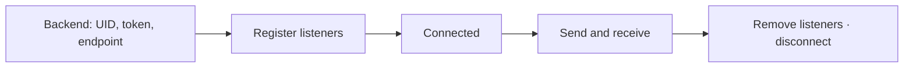

This page has one goal: exchange a text message between two online browser sessions.

<TutorialScreenshot src="/tutorials/web-sdk/exchange.jpg" alt="Alice and Bob are connected: 1 successful server SENDACK, 2 the recipient's RECEIVED event. Open the full-size image." width={1280} height={720} marks={[{ x: 4, y: 94 }, { x: 51, y: 98 }]}>
  **① SENDACK** is the server send result. **② RECEIVED** is the recipient's incoming event. Run this example first, then integrate the code into your app. Click images to enlarge them.
</TutorialScreenshot>

## Run the two-user example first

Install Git, Node.js 20.11 or newer, and npm. If you do not yet have an application backend, the example includes a loopback-only Node.js service (BFF) that prepares development identities and discovers connection endpoints.

### Start WuKongIM

Follow [Docker Deployment](/en/server/deployment/docker) or [Start a Single-node Cluster](/en/guide/quick-start/single-node-cluster).

<details>
<summary>Using a remote server? Set up SSH forwarding first</summary>

If WuKongIM runs on a remote Linux server, open another terminal on your computer and keep this SSH tunnel running:

```bash
ssh -N -L 127.0.0.1:5001:127.0.0.1:5001 -L 127.0.0.1:5200:127.0.0.1:5200 <user>@<server-ip>
```

This path requires the test server's `/route` to return the browser-reachable `ws://127.0.0.1:5200`. For another endpoint, configure `api.external_ws_addr` using [Networking](/en/server/configuration/networking) and restart. Tunnels forward ports; they do not rewrite route responses.

</details>

Check readiness from the computer running Node.js before starting the example:

```bash
curl --fail http://127.0.0.1:5001/readyz
```

### Start the example on your computer

```bash
git clone --depth 1 https://github.com/WuKongIM/WuKongIM.git WuKongIM-web-example
cd WuKongIM-web-example/docs-site/examples/javascript-web-quickstart
npm ci
npm run dev
```

If you already have the repository, enter the same example directory. Open [http://127.0.0.1:5173](http://127.0.0.1:5173) and:

1. Connect Alice and Bob; confirm both sessions are connected.
2. Send from Alice, checking Alice's server send result and Bob's incoming event separately.
3. Disconnect Bob and send another message from Alice.
4. Reconnect Bob; confirm the missing message is restored and displayed once.

The first history sync may briefly be empty; the example retries within a finite budget.

<details>
<summary>Retry details and a different API endpoint</summary>

Person membership is projected asynchronously after a successful SENDACK, so the first history sync can briefly return HTTP 200 with an empty page. The example backend retries an empty latest page (both sequence bounds zero) up to 20 attempts, 250 ms apart. Nonempty results and ordinary cursor pages return immediately. A genuinely empty chat returns an empty list after at most 19 waits: 4.75 seconds plus HTTP request time. Other errors still fail; production integrations need their own consistency and request-deadline policy.


Node.js uses `http://127.0.0.1:5001` by default. Set `WK_DOCS_QUICKSTART_PRODUCT_HTTP_URL` for a different test API endpoint, for example:

```bash
WK_DOCS_QUICKSTART_PRODUCT_HTTP_URL=http://127.0.0.1:15001 npm run dev
```

</details>

The browser calls only the example's `/api/development/identity` and `/api/messages/sync`; the BFF calls WuKongIM HTTP API. In production, replace development identity provisioning with your login and authorization system. Clients do not call `/user/token` directly.

<details>
<summary>See the reconnect recovery result</summary>

<TutorialScreenshot src="/tutorials/web-sdk/recovery.jpg" alt="Alice sends while Bob is offline. After reconnecting, Bob shows SYNCED and Sync complete with one recovered message. Open the full-size image." width={1280} height={720} marks={[{ x: 53, y: 78 }, { x: 53, y: 83 }]}>
  **① SYNCED** identifies the restored message. **② Sync complete · 1 recovered** confirms recovery finished; display the same message only once.
</TutorialScreenshot>

</details>

## Integrate your own frontend

The following explains installation, identity, listeners, and sending. Use two independent tabs, iframes, or browser contexts: `WKSDK.shared()` is a singleton, so do not sign in two users in one page context. The build tool must support npm and TypeScript.



### 1. Install

```bash
npm install --save-exact wukongimjssdk@1.3.5
```

When using pnpm or Yarn, pin the same exact version and keep only the lockfile already used by the project.

### 2. Configure identity and endpoint

```typescript
import WKSDK, {
  Channel,
  ChannelTypePerson,
  ConnectStatus,
  MessageText,
} from 'wukongimjssdk'

// Same-origin example BFF; use bob on Bob's page.
const response = await fetch('/api/development/identity', {
  method: 'POST',
  headers: { 'Content-Type': 'application/json' },
  body: JSON.stringify({ uid: 'alice' }),
})
if (!response.ok) throw new Error('identity request failed')
const bootstrap: { uid: string; token: string; websocketUrl: string } =
  await response.json()

const sdk = WKSDK.shared()
sdk.config.uid = bootstrap.uid
sdk.config.token = bootstrap.token
sdk.config.addr = bootstrap.websocketUrl
sdk.config.deviceFlag = 1 // Web
sdk.config.debug = false
```

`bootstrap` is a backend response, not an SDK type. The runnable example provides this URL; in your own project, replace it with your authenticated application login endpoint returning these three fields. Use a correctly certified `wss://` endpoint in production.

### 3. Register listeners first

<details>
<summary>Show complete listeners: connection, incoming messages, and send results</summary>

```typescript
const onConnect = (status: ConnectStatus, reasonCode?: number) => {
  if (status === ConnectStatus.Connected) {
    console.log('WuKongIM connected')
  } else if (status === ConnectStatus.ConnectFail) {
    console.error('connect failed', reasonCode)
  } else if (status === ConnectStatus.ConnectKick) {
    console.error('this account was signed in elsewhere', reasonCode)
  }
}

const onMessage = (message: any) => {
  if (message.send) return // Sending locally also emits a message event.
  if (message.content instanceof MessageText) {
    console.log(`${message.fromUID}: ${message.content.text}`)
  }
}

const onMessageStatus = (ack: any) => {
  if (ack.reasonCode === 1) {
    console.log('message sent', ack.clientSeq, ack.messageSeq)
  } else {
    console.error('message failed', ack.clientSeq, ack.reasonCode)
  }
}

sdk.connectManager.addConnectStatusListener(onConnect)
sdk.chatManager.addMessageListener(onMessage)
sdk.chatManager.addMessageStatusListener(onMessageStatus)
```

Keep the function references so the page can remove the same listeners during cleanup.

</details>

### 4. Connect and send

```typescript
sdk.connect()
```

After `ConnectStatus.Connected`, send from Alice to Bob:

```typescript
const message = await sdk.chatManager.send(
  new MessageText('Hello, Bob'),
  new Channel('bob', ChannelTypePerson),
)

console.log('local message', message.clientMsgNo)
```

The returned Promise gives you the local message. The server result comes through `onMessageStatus`, while Bob's live message comes through `onMessage`; they are separate events.

## Expected result

1. Alice and Bob both report `ConnectStatus.Connected`.
2. Alice receives a send state with `reasonCode === 1`.
3. Bob prints “Hello, Bob”.

## Clean up the page

```typescript
sdk.connectManager.removeConnectStatusListener(onConnect)
sdk.chatManager.removeMessageListener(onMessage)
sdk.chatManager.removeMessageStatusListener(onMessageStatus)
sdk.disconnect()
```

If connection fails, verify that the endpoint is a WebSocket address rather than an HTTP API address, then check page CSP, reverse proxy, and certificate configuration. Continue with [Connection](/en/sdk/javascript/connection) and [Messages](/en/sdk/javascript/messages).

## Troubleshoot by symptom

| Symptom | Check and action |
| --- | --- |
| `npm ci` or build fails | Check the Node.js version and example directory; keep the repository lockfile |
| Development identity request fails | Check `/readyz`, the API endpoint, and port `5001` forwarding from the Node.js computer |
| Identity succeeds but WebSocket fails | Check the browser can reach the `/route` endpoint result, port `5200` forwarding, certificates, and proxy paths |
| Connected but Bob sees no message | Check the peer UID, server send result, and SDK text payload format |
| Reconnect does not restore messages | Inspect `/api/messages/sync`, confirm durable messages exist, and keep the same test UID |
