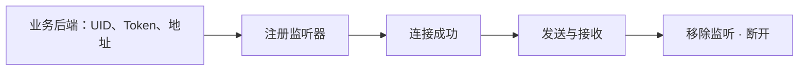

这一页只做一件事：让两个在线浏览器会话互相发送一条文本消息。

<TutorialScreenshot src="/tutorials/web-sdk/exchange.jpg" alt="Alice 与 Bob 都已连接：1 服务器 SENDACK 成功，2 对端 RECEIVED 收到消息。点击查看原图。" width={1280} height={720} marks={[{ x: 4, y: 94 }, { x: 51, y: 98 }]}>
  **① SENDACK** 是服务器发送结果。**② RECEIVED** 是对端实际收到的事件。下面先运行这个示例，再把代码接入自己的应用。点击图片可放大。
</TutorialScreenshot>

## 先运行双用户示例

准备 Git、Node.js 20.11 或更新版本，以及 npm。首次使用还没有业务后端时，示例自带一个只监听本机的 Node.js 服务（BFF），负责准备测试身份和查询连接地址。

### 启动 WuKongIM

按 [Docker 部署](/zh/server/deployment/docker)或[启动单节点集群](/zh/guide/quick-start/single-node-cluster)启动服务。

<details>
<summary>服务运行在远程服务器？先建立 SSH 转发</summary>

如果 WuKongIM 在远程 Linux 服务器，先在电脑另开终端并保持 SSH 转发运行：

```bash
ssh -N -L 127.0.0.1:5001:127.0.0.1:5001 -L 127.0.0.1:5200:127.0.0.1:5200 <user>@<server-ip>
```

此路径要求测试服务器的 `/route` 返回浏览器可访问的 `ws://127.0.0.1:5200`；使用其他地址时，按[网络与客户端接入](/zh/server/configuration/networking)配置 `api.external_ws_addr` 并重新启动。隧道只转发端口，不会改写路由响应。

</details>

从运行 Node.js 的电脑检查就绪状态，成功后再启动示例：

```bash
curl --fail http://127.0.0.1:5001/readyz
```

### 在电脑启动示例

```bash
git clone --depth 1 https://github.com/WuKongIM/WuKongIM.git WuKongIM-web-example
cd WuKongIM-web-example/docs-site/examples/javascript-web-quickstart
npm ci
npm run dev
```

已有仓库时直接进入同一示例目录。打开 [http://127.0.0.1:5173](http://127.0.0.1:5173)，依次操作：

1. 连接 Alice 和 Bob，确认两个会话都已连接。
2. Alice 发送一条消息，检查 Alice 的服务器发送结果和 Bob 的收到事件。
3. 断开 Bob，Alice 再发送一条消息。
4. 重连 Bob，确认缺失消息被恢复并且只显示一次。

首次历史同步可能短暂为空；示例会做有界重试。

<details>
<summary>重试细节与其他 API 地址</summary>

单聊成员目录在 SENDACK 成功后异步建立，首次历史同步可能短暂返回 HTTP 200 空页。示例后端对“最新一页”（起止序号都为 0）的空结果最多请求 20 次，间隔 250 ms；非空结果及普通分页直接返回。真正的空会话会在最多 19 次等待后返回空列表，额外等待最多 4.75 秒，另加 HTTP 请求耗时。其他错误仍失败；生产接入应自行设计一致性和请求期限策略。


默认由 Node.js 访问 `http://127.0.0.1:5001`。其他测试 API 地址通过 `WK_DOCS_QUICKSTART_PRODUCT_HTTP_URL` 设置，例如：

```bash
WK_DOCS_QUICKSTART_PRODUCT_HTTP_URL=http://127.0.0.1:15001 npm run dev
```

</details>

浏览器只调用示例的 `/api/development/identity` 和 `/api/messages/sync`；BFF 再调用 WuKongIM HTTP API。生产接入需要把开发身份接口换成已有登录与授权系统，客户端不直接访问 `/user/token`。

<details>
<summary>看看断线恢复后的结果</summary>

<TutorialScreenshot src="/tutorials/web-sdk/recovery.jpg" alt="Alice 在 Bob 离线时发送消息，Bob 重连后显示 SYNCED 和 Sync complete，缺失消息恢复一次。点击查看原图。" width={1280} height={720} marks={[{ x: 53, y: 78 }, { x: 53, y: 83 }]}>
  **① SYNCED** 是恢复的消息。**② Sync complete · 1 recovered** 表示本次恢复完成；同一条消息应只显示一次。
</TutorialScreenshot>

</details>

## 接入自己的前端工程

下面拆解示例中的安装、身份、监听和发送流程。准备两个独立标签页、iframe 或浏览器上下文；`WKSDK.shared()` 是单例，同一页面上下文不要同时登录两个用户。前端构建工具需支持 npm 和 TypeScript。



### 1. 安装

```bash
npm install --save-exact wukongimjssdk@1.3.5
```

使用 pnpm 或 Yarn 时也固定精确版本，并只保留项目原有的一种锁文件。

### 2. 配置身份和地址

```typescript
import WKSDK, {
  Channel,
  ChannelTypePerson,
  ConnectStatus,
  MessageText,
} from 'wukongimjssdk'

// 示例 BFF 的同源接口；Bob 页面把 uid 改为 bob。
const response = await fetch('/api/development/identity', {
  method: 'POST',
  headers: { 'Content-Type': 'application/json' },
  body: JSON.stringify({ uid: 'alice' }),
})
if (!response.ok) throw new Error('identity request failed')
const bootstrap: { uid: string; token: string; websocketUrl: string } =
  await response.json()

const sdk = WKSDK.shared()
sdk.config.uid = bootstrap.uid
sdk.config.token = bootstrap.token
sdk.config.addr = bootstrap.websocketUrl
sdk.config.deviceFlag = 1 // Web
sdk.config.debug = false
```

`bootstrap` 是后端响应对象，不是 SDK 类型。上面的 URL 由可运行示例提供；在自己的项目中替换为已鉴权的业务登录接口，并返回相同三个字段。生产站点使用证书正确的 `wss://` 地址。

### 3. 先注册监听器

<details>
<summary>展开完整监听器：连接、接收与发送结果</summary>

```typescript
const onConnect = (status: ConnectStatus, reasonCode?: number) => {
  if (status === ConnectStatus.Connected) {
    console.log('WuKongIM connected')
  } else if (status === ConnectStatus.ConnectFail) {
    console.error('connect failed', reasonCode)
  } else if (status === ConnectStatus.ConnectKick) {
    console.error('this account was signed in elsewhere', reasonCode)
  }
}

const onMessage = (message: any) => {
  if (message.send) return // 本端发送时也会产生消息事件
  if (message.content instanceof MessageText) {
    console.log(`${message.fromUID}: ${message.content.text}`)
  }
}

const onMessageStatus = (ack: any) => {
  if (ack.reasonCode === 1) {
    console.log('message sent', ack.clientSeq, ack.messageSeq)
  } else {
    console.error('message failed', ack.clientSeq, ack.reasonCode)
  }
}

sdk.connectManager.addConnectStatusListener(onConnect)
sdk.chatManager.addMessageListener(onMessage)
sdk.chatManager.addMessageStatusListener(onMessageStatus)
```

保留函数引用，页面销毁时需要用同一个引用移除监听器。

</details>

### 4. 连接并发送

```typescript
sdk.connect()
```

收到 `ConnectStatus.Connected` 后，让 Alice 向 Bob 发送：

```typescript
const message = await sdk.chatManager.send(
  new MessageText('你好，Bob'),
  new Channel('bob', ChannelTypePerson),
)

console.log('local message', message.clientMsgNo)
```

返回的 Promise 给出本地消息。服务器结果来自 `onMessageStatus`，Bob 的在线消息来自 `onMessage`，这是两个不同事件。

## 预期结果

1. Alice 和 Bob 都收到 `ConnectStatus.Connected`；
2. Alice 收到 `reasonCode === 1` 的发送状态；
3. Bob 打印“你好，Bob”。

## 清理页面

```typescript
sdk.connectManager.removeConnectStatusListener(onConnect)
sdk.chatManager.removeMessageListener(onMessage)
sdk.chatManager.removeMessageStatusListener(onMessageStatus)
sdk.disconnect()
```

如果连接失败，检查地址是否为 WebSocket 地址而不是 HTTP API 地址，并检查页面的 CSP、反向代理和证书。下一步阅读[连接管理](/zh/sdk/javascript/connection)和[消息管理](/zh/sdk/javascript/messages)。

## 按现象排查

| 现象 | 检查与处理 |
| --- | --- |
| `npm ci` 或构建失败 | 确认 Node.js 版本和当前示例目录，保留仓库的锁文件 |
| 测试身份请求失败 | 从 Node.js 所在电脑检查 `/readyz`、API 地址和 `5001` 转发 |
| 身份已获取但 WebSocket 连不上 | 检查 `/route` 返回的地址能否从浏览器访问，以及 `5200` 转发、证书与代理路径 |
| 连接成功但 Bob 看不到消息 | 确认对端 UID、发送结果以及 Payload 使用 SDK 文本格式 |
| 重连后未恢复消息 | 检查 `/api/messages/sync` 响应，确认消息已持久化且未切换测试 UID |
