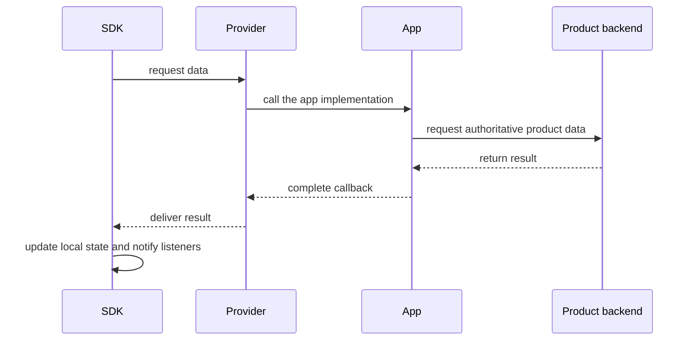

Learn these terms before writing code. Method names vary by platform, but the meanings stay the same.

## UID: who the user is

A `UID` is the stable unique identifier for a user in your product, such as `alice` or `user_1001`. WuKongIM does not own registration, passwords, or user profiles; your product system still manages them.

## Token: whether the user may connect

A `Token` is the credential used to connect to WuKongIM. After the client signs in to your product, the product backend returns the UID, token, and connection endpoint. Do not generate the token in the client or place server management credentials in the app.

## Channel: who receives the message

A `Channel` answers **who should receive this message**:

- Direct chat: the Channel ID is the other user's UID and the type is `1`;
- Group chat: the Channel ID is your product's group ID and the type is `2`.

The SDK uses Channels as one model for direct chats, groups, and other message targets.

## Message: one message and its state

A sent message normally has three separate outcomes:

1. **Sending:** the message was created and stored locally;
2. **Sent:** the server accepted and acknowledged it;
3. **Received by the peer:** the other client emitted a new-message callback.

Sent does not mean read. Read receipts are a separate product feature.

## Conversation: one item in the chat list

A `Conversation` is **one item in the chat list**. It usually contains a Channel, the latest message, a timestamp, and an unread count. Messages belong to Channels; Conversations are the current user's view of recent chats.

## Provider: how the SDK asks for product data

A `Provider` is a callback supplied by your application. When the SDK needs a Channel profile, message history, or conversation data, it invokes the provider. Your app requests that data from the product backend and returns the result to the SDK.

Always complete a provider callback, even when the result is empty or the request failed. Otherwise the SDK may wait indefinitely.

## Next step

Choose a platform and complete its quickstart: [Android](/en/sdk/android), [iOS](/en/sdk/ios), [JavaScript / Web](/en/sdk/javascript), [Flutter](/en/sdk/flutter), or [HarmonyOS](/en/sdk/harmonyos).
