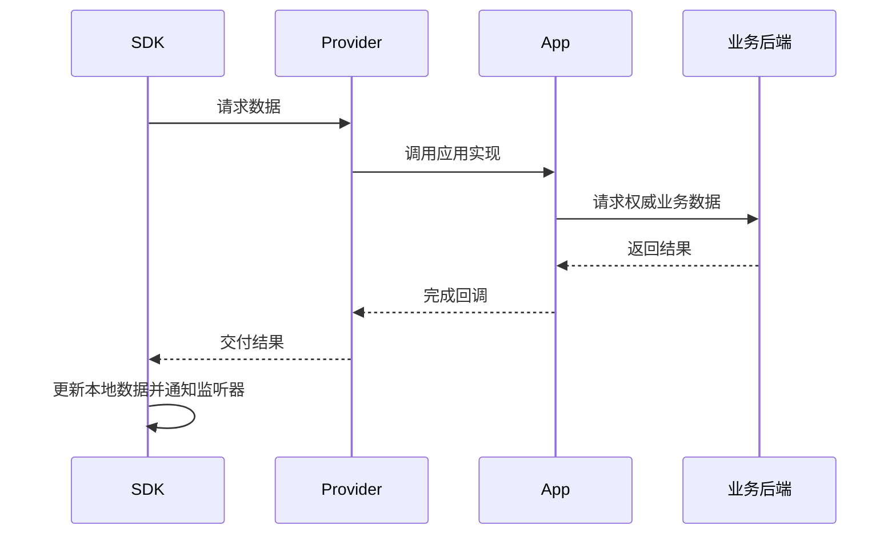

开始写代码前，先理解这些词。各平台的方法名不同，但含义相同。

## UID：用户是谁

`UID` 是用户在你的产品中的稳定唯一标识，例如 `alice` 或 `user_1001`。WuKongIM 不负责注册、密码和用户资料；这些仍由你的业务系统管理。

## Token：这个用户能否连接

`Token` 是连接 WuKongIM 时使用的凭据。客户端登录你的业务系统后，由业务后端返回 UID、Token 和连接地址。不要在客户端生成 Token，也不要把服务端管理密钥放进 App。

## Channel：消息要发给谁

频道（`Channel`）就是**消息要发给谁**：

- 单聊频道：频道 ID 是对方的 UID，频道类型是 `1`；
- 群聊频道：频道 ID 是你的业务群 ID，频道类型是 `2`。

SDK 用“频道”统一表示单聊、群聊和其他消息目标。

## Message：一条消息及其状态

发送消息通常会经历三个不同结果：

1. **发送中**：消息已经创建并写入本地；
2. **发送成功**：服务端已接收并确认；
3. **对方收到**：对方客户端触发了新消息回调。

发送成功不代表对方已读。已读回执属于单独的产品功能。

## Conversation：聊天列表中的一项

会话（`Conversation`）就是**聊天列表中的一项**。它通常包含对应频道、最后一条消息、时间和未读数。消息属于频道，会话是当前用户看到的聊天列表视图。

## Provider：SDK 向业务系统要数据

数据提供器（`Provider`）是 SDK 留给应用的回调。当 SDK 缺少频道资料、历史消息或会话数据时，会调用 Provider；你的 App 再向业务后端请求数据，并把结果交还给 SDK。

Provider 必须在回调完成后返回结果，即使结果为空或请求失败，也不要让 SDK 一直等待。

## 下一步

选择你的平台并完成快速开始：[Android](/zh/sdk/android)、[iOS](/zh/sdk/ios)、[JavaScript / Web](/zh/sdk/javascript)、[Flutter](/zh/sdk/flutter) 或 [HarmonyOS](/zh/sdk/harmonyos)。
