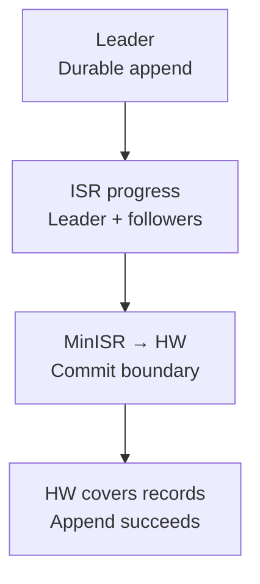
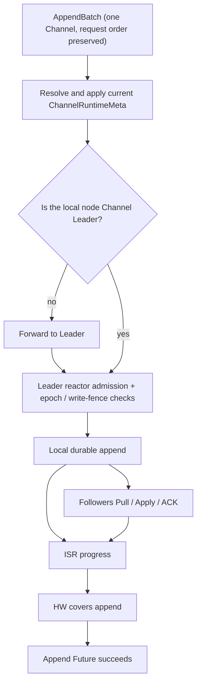

One Channel owns an ordered message log. Active runtimes share bounded reactors/workers; a Channel does not receive permanent goroutines of its own.

## Slot metadata and Channel logs

Slot commits `ChannelRuntimeMeta`; Channel replicas persist message bodies. The Slot Leader and Channel Leader may be different nodes.

  
Full metadata fields and storage boundaries

Channel is the core unit of message routing, ordering, and persistence. Each active channel has independent runtime state and an ordered log, while many channels are hashed across a bounded number of reactors and workers instead of receiving permanent goroutines per channel.

The physical hash slot for a Channel ID owns its `ChannelRuntimeMeta`, which describes how the data plane should run. Channel replicas store actual message records in `pkg/db/message`.

| Metadata field | Constraint |
| --- | --- |
| `Leader` | node currently allowed to accept channel writes |
| `Replicas` | nodes expected to store channel log data |
| `ISR` | synchronized replicas participating in committed-HW calculation |
| `MinISR` | minimum ISR count required for quorum commit |
| `Epoch` | fences membership changes |
| `LeaderEpoch` | fences Leader changes within one membership epoch |
| `WriteFence` | blocks new writes during migration or failover |
| `RetentionThroughSeq` | authoritative logical retention boundary |

The Slot Leader and Channel Leader can be different nodes. The former commits channel metadata; the latter commits channel message logs.

## Channel write and replication

Followers Pull/Apply/ACK; the Leader combines its local progress with current ISR progress under `MinISR`. The public durable path succeeds only after HW covers the records. A single-node cluster with `MinISR=1` uses the same state machine and durable append.

  
Full write, forwarding and replication diagram

The public durable send path uses quorum commit: append succeeds only when the Channel Leader's high watermark covers the records. A single-node cluster with `MinISR=1` still uses the same state machine and durable append.

## Ordering and batching

One Channel exposes log-sequence order; different Channels can run concurrently with no global message order. Batching stays bounded and preserves epoch, Leader epoch, idempotency and write-fence checks; stale results cannot advance a generation.

  
Full ordered batching and completion rules

- Commands for one channel enter its authority writer in submission order. Even if completions return out of order, they drain by append sequence.
- Gateway and channelappend can collect adjacent same-channel requests, and `AppendBatch` assigns contiguous sequences in one path.
- Leader storage and follower apply use bounded workers and batching to reduce fsync and scheduling overhead.
- Batching never relaxes epoch, Leader epoch, idempotency-key, or write-fence checks; a stale result cannot advance the current generation.

Different channels can execute concurrently, but one channel's log sequence defines its visible order. There is no global message order across channels.

## ISR and committed high watermark

Only records at or below HW are committed; history/latest-message reads stay within loaded or durable HW. Learners in `Replicas - ISR` do not count toward HW quorum and cannot become Leader directly; ISR promotion requires progress proof under the current Leader and epoch.

  
Full ISR, learner and committed-read constraints

The Leader tracks replication progress for each ISR member and computes a committable sequence from `MinISR`. Only records at or below HW are committed. Historical reads and node-local latest-message reads must also remain under the loaded or durable HW.

A learner in `Replicas - ISR` can receive replication and catch up, but it does not participate in HW quorum and cannot be promoted directly to Leader. Promotion into ISR requires proof of progress under the current Leader and epoch.

## Activation and eviction

Activate only after resolving authority, opening storage and applying metadata. Idle runtimes unload only when role/progress/lifecycle gates permit; durable messages survive. Later writes, PullHint or metadata changes reactivate; PullHint never replaces authoritative metadata.

  
Full activation, eviction and wakeup lifecycle

Channel runtimes activate on demand. A node resolves authoritative metadata, opens the message store, and applies the complete meta before accepting append or replication. An idle channel can slow follower pulls and eventually evict its local runtime when role, progress, and lifecycle conditions permit. Durable messages survive runtime unload.

A later append, PullHint, or authoritative metadata change resolves and activates it again. PullHint is only a wakeup and refresh hint; it never replaces authoritative meta.

## Backpressure

Full queues reject admission or use bounded waits/retries. Reserve post-commit handoff capacity before durable append; if unavailable, return `ErrChannelBusy` first. Replica/RPC failure stays scoped to its target. Larger queues increase worst-case wait, not capacity.

  
Full pressure-point and backpressure table

| Pressure point | Behavior |
| --- | --- |
| Per-channel mailbox or append queue full | reject new admission with explicit busy/backpressure |
| Durable append workers full | retain bounded wait or retry without blocking storage IO inside the reactor |
| Post-commit handoff full | reserve capacity before durable append; return `ErrChannelBusy` first rather than lose a handoff after commit |
| Follower or remote RPC failure | isolate the affected replica or target and recover with bounded policy |

These limits protect memory and tail latency. Increasing a queue only increases worst-case wait and does not replace capacity planning.

## Large groups and post-commit fanout

Store one committed Channel message; for 100,000-member groups, page subscribers and create bounded delivery plans instead of loading all members. Commit and full receipt remain separate; delivery failures do not roll back logs, and conversation hydration is a separate read.

  
Full large-group storage and fanout boundaries

The channel log stores one committed message rather than one persistent copy per member. Post-commit work pages through large-group subscribers, resolves online authority per page, and creates bounded delivery plans without loading the complete member set into memory.

Consequently, "the large-group message committed" and "every online member received it" are different events. Delivery failures do not roll back the committed log, and later conversation-directory hydration is a separate read-side operation.

## Migration and failover

Persist a Slot write fence and drain the old Leader before task/epoch/proof-fenced switching. Reopening requires newer authoritative metadata; local TTL cannot reopen writes. Conflicting replica/ISR/epoch/Leader evidence keeps append fail-closed. Follow [Scaling](/en/server/operations/scaling).

  
Full migration and failover fences

A Leader transfer or replica replacement first sets a durable write fence in Slot metadata, drains the old Leader, and uses task-, epoch-, and proof-fenced commands to switch Leader or ISR atomically. Clearing the fence also requires newer authoritative metadata; a node-local TTL does not reopen writes automatically.

If replica, ISR, epoch, or Leader evidence conflicts, Channel append fails closed. See [Scaling](/en/server/operations/scaling) for the operator workflow.

## Source entry points

Follow [Message Send Flow](/en/server/architecture/message-flow) to place Channel commit in the full client path.

  
Full Channel source entry-point table

| Goal | Entry point |
| --- | --- |
| Public Channel contracts | `pkg/channel` |
| Multi-reactor state machine | `pkg/channel/reactor`, `pkg/channel/machine` |
| Message storage adapters | `pkg/channel/store`, `pkg/db/message` |
| Metadata resolution and forwarding | `pkg/cluster/channels` |
| Product write authority | `internal/runtime/channelappend` |

Continue with [Message Send Flow](/en/server/architecture/message-flow) to place Channel commit inside the complete client path.

