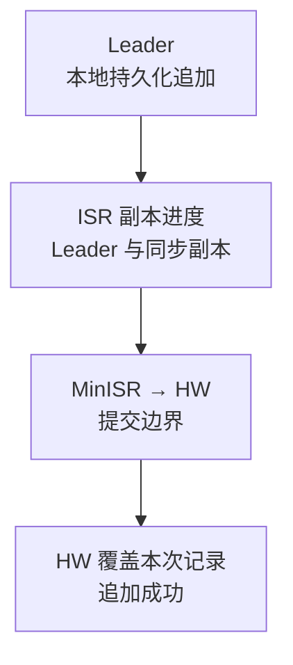
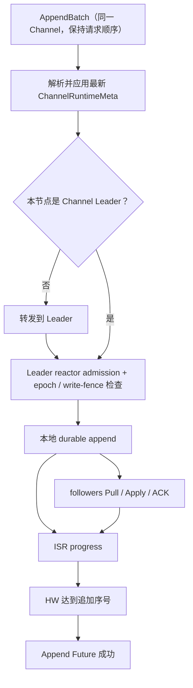

一个 Channel 对应有序消息日志。活跃频道共享有界 reactor/worker，不为每个频道永久创建一组 goroutine。

## Slot 元数据与 Channel 日志

Slot 提交 `ChannelRuntimeMeta`，Channel 副本保存消息正文。Slot Leader 与 Channel Leader 可以位于不同节点。

  
完整元数据字段与存储边界

Channel 是消息路由、排序和持久化的核心单位。每个活跃频道有独立的运行时状态和有序日志，但多个频道会被哈希到有限数量的 reactor 与 worker 上执行，不会为每个频道创建一组永久 goroutine。

`ChannelRuntimeMeta` 由频道 ID 对应的物理哈希槽管理，描述数据面应当如何运行；实际消息记录由 Channel 副本保存在 `pkg/db/message`。

| 元数据字段 | 约束 |
| --- | --- |
| `Leader` | 当前允许接受频道写入的节点 |
| `Replicas` | 应保存频道日志数据的节点集合 |
| `ISR` | 参与提交高水位计算的同步副本集合 |
| `MinISR` | 推进 quorum commit 所需的最小 ISR 数 |
| `Epoch` | fence 成员变化 |
| `LeaderEpoch` | fence 同一成员 epoch 内的 Leader 变化 |
| `WriteFence` | 迁移或故障切换期间阻止新写入 |
| `RetentionThroughSeq` | 权威逻辑保留边界 |

Slot Leader 与 Channel Leader 可以位于不同节点。前者提交频道元数据，后者提交频道消息日志。

## 频道写入与复制

Follower 通过 Pull/Apply/ACK 追赶，Leader 按 `MinISR` 汇总自身与当前 ISR 进度。公开持久化路径在 HW 覆盖记录后才成功；单节点集群 `MinISR=1` 仍走同一状态机与持久化追加。

  
完整写入、转发与复制图

公开的持久化发送路径使用 quorum commit：只有 Channel Leader 的提交高水位（HW）覆盖本次记录，追加才成功。单节点集群的 `MinISR=1` 仍走同一状态机和 durable append。

## 顺序与批量

同一频道按日志序号可见，不同频道可并行，没有全局消息顺序。批量保持有界，仍检查 epoch、Leader epoch、幂等与 write fence；过期结果不能推进当前 generation。

  
完整有序批量与完成规则

- 同一频道的命令按提交顺序进入 authority writer；完成事件即使乱序返回，也会按 append sequence 排空。
- Gateway 和 channelappend 可以收集相邻的同频道请求，最终由 `AppendBatch` 一次提交连续序号。
- Leader 本地存储和 follower apply 使用有界 worker 与批量，降低 fsync 和调度开销。
- 批量不会放松 epoch、Leader epoch、幂等键或写 fence；任何 stale result 都不能推进当前 generation。

跨频道执行可以并行，但同一频道的可见顺序由其日志序号决定。不同频道之间没有一个全局消息顺序。

## ISR 与提交高水位

只有 HW 以内的记录已提交，历史/最新消息读取也受已加载或持久化 HW 约束。`Replicas - ISR` 的 learner 不计入 HW quorum，不能直接成为 Leader；提升 ISR 要有当前 Leader 与 epoch 下的进度证明。

  
完整 ISR、learner 与已提交读取限制

Leader 跟踪每个 ISR 副本的复制进度，按 `MinISR` 计算可提交序号。只有达到 HW 的记录才是 committed；读取历史消息和本地 latest-message 查询也必须受已加载或持久化 HW 约束。

`Replicas - ISR` 中的 learner 可以接收复制并追赶，但不参与 HW quorum，也不能直接成为 Leader。把 learner 提升到 ISR 前必须在当前 Leader 与 epoch 下证明其进度。

## 激活与淘汰

解析权威、打开存储并应用元数据后才激活；满足角色、进度与生命周期条件才卸载空闲 runtime，持久消息保留。写入、PullHint 或元数据变化可重新激活；PullHint 不能替代权威元数据。

  
完整激活、淘汰与唤醒生命周期

Channel runtime 按需激活。节点先解析权威元数据、打开对应消息存储并应用完整 meta，再允许 append 或 replication。空闲频道可以减慢 follower pull，并在满足角色、进度和生命周期条件时淘汰本地运行时；持久消息不会因运行时卸载而丢失。

节点重新收到写入、PullHint 或权威元数据变化时会重新解析并激活。PullHint 只是唤醒/刷新提示，不能替代权威 meta。

## 背压

队列满时拒绝准入或有界等待/重试；durable append 前预留 post-commit handoff 容量，不足先返回 `ErrChannelBusy`。副本/RPC 失败只影响对应目标。扩大队列增加最坏等待，不能替代容量规划。

  
完整压力点与背压表

| 压力点 | 行为 |
| --- | --- |
| 每频道 mailbox 或 append queue 满 | 拒绝新 admission，返回显式 busy/backpressure |
| durable append worker 满 | 保持有界等待或重试，不在 reactor 中阻塞存储 IO |
| post-commit handoff 满 | 在 durable append 前保留容量；无法保留时先返回 `ErrChannelBusy`，不会提交后再丢 handoff |
| follower 或远端 RPC 失败 | 只影响对应副本/目标，按有界策略恢复 |

这些限制保护尾延迟和内存。扩大 queue 只会延长最坏等待，不能替代容量规划。

## 大群与提交后 Fanout

频道保存一份已提交消息；十万成员群分页读取订阅者，生成有界投递计划，不一次加载全员。提交与全员收到分别判断，投递失败不回滚日志，会话 hydration 属于独立读流程。

  
完整大群存储与扇出边界

频道日志只保存一份提交消息，不为十万成员复制十万份持久记录。提交后流程分页读取大群订阅者，每页解析在线 authority 并生成有界投递计划；不会把完整成员列表一次加载到内存。

因此“大群消息已经 commit”和“所有在线成员已经收到”是两个不同事件。投递失败不会回滚已提交日志，之后的会话目录 hydration 是独立读流程。

## 迁移与故障切换

先通过 Slot 持久化 write fence 并排空旧 Leader，再用 task/epoch/proof 切换。重新开放写入需更高版本权威元数据，本地 TTL 不能解锁；副本/ISR/epoch/Leader 证据冲突时保持 fail-closed。操作见[扩缩容](/zh/server/operations/scaling)。

  
完整迁移与故障切换 fence

Leader transfer 或 replica replace 先通过 Slot 元数据设置 durable write fence，排空旧 Leader，再用带 task/epoch/proof 的命令原子切换 Leader 或 ISR。清除 fence 也必须通过更高版本的权威元数据完成，节点本地 TTL 不会自动重新开放写入。

如果实际副本、ISR、epoch 或 Leader 证据冲突，Channel append 保持 fail-closed。运维流程见[扩容与缩容](/zh/server/operations/scaling)。

## 源码入口

继续读[消息发送链路](/zh/server/architecture/message-flow)，把 Channel 提交放回客户端完整流程。

  
完整 Channel 源码入口表

| 目标 | 入口 |
| --- | --- |
| 公共 Channel 合约 | `pkg/channel` |
| 多 reactor 状态机 | `pkg/channel/reactor`, `pkg/channel/machine` |
| 消息存储适配 | `pkg/channel/store`, `pkg/db/message` |
| 元数据解析与跨节点转发 | `pkg/cluster/channels` |
| 产品写入 authority | `internal/runtime/channelappend` |

继续阅读 [消息发送链路](/zh/server/architecture/message-flow)，把 Channel commit 放回完整客户端流程。

