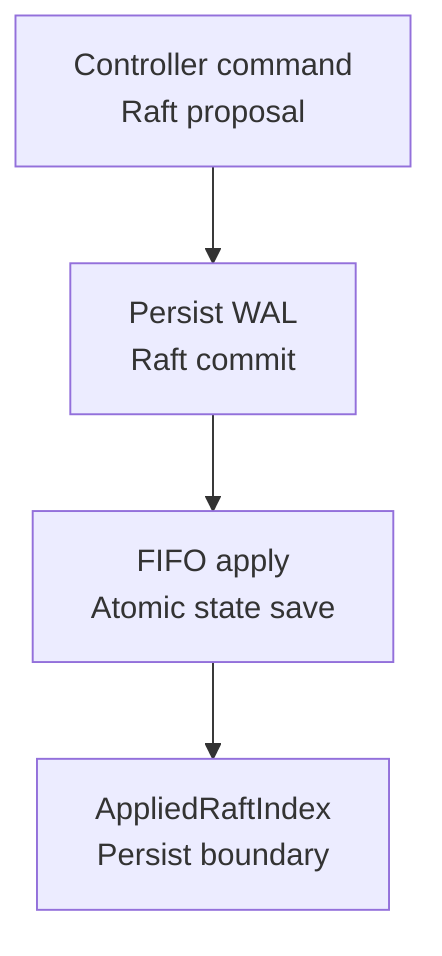
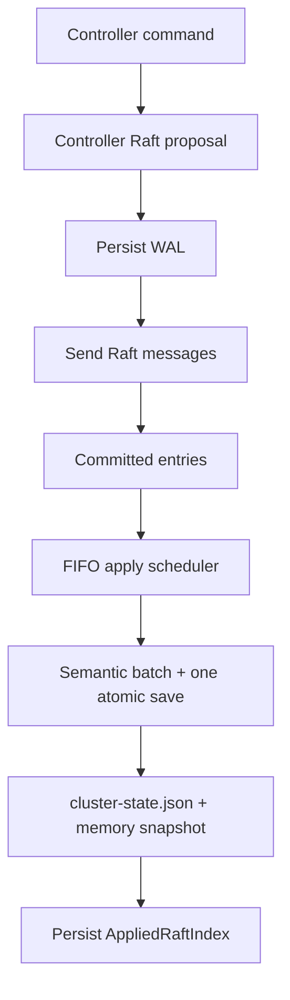
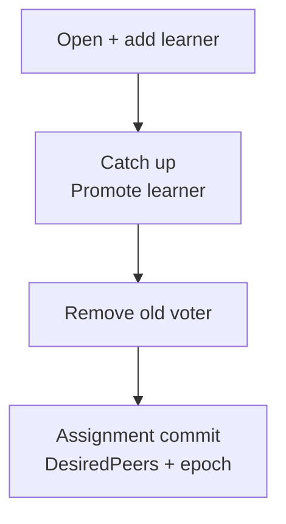

Controller stores low-frequency cluster plans. Raft commits changes before they become materialized state; per-message traffic and user heartbeats stay outside this layer.

## Voters and mirrors

**Voters** participate in Controller Raft; **mirrors** sync a voter's complete state file. A joined data node is not automatically a voter: promotion needs learner stages, membership proof and a final state command.

  
Complete node-role and promotion rules

Controller is authoritative for low-frequency cluster intent: node membership, logical Slot Group assignment, desired replicas, control tasks, and a small amount of cluster-wide planning state converge here. It does not process every message or user heartbeat.

| Node role | Behavior | State source |
| --- | --- | --- |
| Controller voter | participates in Controller Raft, commits commands, applies the state machine | local Raft WAL, snapshots, and materialized state |
| Non-Controller data node | does not join Controller Raft and mirrors a voter's complete state file | Controller state sync |

Only nodes explicitly promoted to Controller voter participate in this Raft Group. A dynamically joined data node does not become a voter automatically; promotion has a separate learner, membership-proof, and final-state command path.

## Commit and materialization order

Persist WAL before sending Raft messages. Committed entries apply in FIFO batches with one atomic state save. WAL is authoritative; `cluster-state.json` is the materialized view. Recovery loads it or a snapshot, then replays the committed suffix after its applied boundary.

  
Complete commit, materialization and replay flow

The Controller Raft WAL is authoritative for committed commands and applied-boundary metadata. `cluster-state.json` is the materialized view of current business state. Startup loads that view, or restores it from a Raft snapshot, and then replays the committed WAL suffix after the materialized applied index.

## Revision and AppliedRaftIndex

`Revision` versions business state and fences plans/tasks; `AppliedRaftIndex` marks materialized entries. Health/readiness metadata can advance the latter without a new business Revision or topology change.

  
Full revision and applied-boundary semantics

- `Revision` is the logical cluster-state version used by plans, tasks, and compare-and-set fences.
- `AppliedRaftIndex` is the newest Raft entry materialized into the state file.
- Health reports and non-mutating readiness probes can advance applied Raft metadata without increasing business `Revision`.

An increasing Raft index therefore does not necessarily mean topology changed, and heartbeat churn is not a new resource plan.

## What Controller stores

Store nodes, assignments, versioned hash-slot mappings and bounded control plans. Channel payloads, concrete Sessions, every Ping, unbounded audit logs and raw diagnostic artifacts belong elsewhere.

  
Complete stored-state and exclusion list

- node IDs, addresses, roles, and lifecycle;
- logical Slot Raft Groups, desired members, configuration epochs, and preferred leaders;
- the versioned mapping from physical hash slots to logical Slot Groups;
- bounded tasks such as Slot migration and Controller voter promotion;
- bounded low-frequency cluster state such as backup plans and Operations MCP enablement.

It does not store Channel message payloads, concrete TCP Sessions, every user Ping, unbounded audit logs, or raw diagnostic artifacts. High-frequency or unbounded data stays in the data plane, node-local runtime, or external storage.

## Intent is not live fact

`DesiredPeers` and `PreferredLeader` describe intent. Actual Leader, term, membership, commit and progress come from live Slot evidence.

<Callout type="warn" title="Do not substitute PreferredLeader for Leader">
  A plan may not have converged, and the target can be inactive or behind. Reads and operational decisions must use fresh observed Raft evidence and preserve unknown when it is missing.
</Callout>

  
Full intent and observed-authority rules

Controller `DesiredPeers` and `PreferredLeader` values are desired state. Actual Slot Raft voters, learners, Leader, term, commit, and synchronization progress come from live Slot runtime evidence.

## Tasks and fences

Example: moving a Slot replica.

Every phase carries task/Slot/epoch/attempt/phase fences. Final assignment requires live voter/learner proof before updating `DesiredPeers` and epoch. Scale-in must prove Gateway, Slot, Channel and task drain before `leaving` becomes `removed`.

  
Full task phases, proof and scale-in fences

Controller tasks split high-risk changes into verifiable phases. A Slot replica move, for example, proceeds through opening a learner, adding it, catching up, promoting it, removing the old voter, and committing the final assignment. Every phase carries fences such as task ID, Slot ID, configuration epoch, attempt, and phase index.

The final command updates `DesiredPeers` and increments the configuration epoch only when live voter and learner evidence matches the intended set. Node scale-in similarly requires higher layers to prove Gateway, Slot, Channel, and task drain before Controller can change a `leaving` node into a `removed` tombstone.

## Failure and recovery

No Leader means a write error, never direct state-file edits. Voters recover snapshot + WAL suffix; mirrors sync full state files. Compact only materialized boundaries. Manager observations remain node-local Raft evidence.

  
Complete failure and recovery boundaries

- Without a Controller Leader, writes return leadership or lifecycle errors instead of editing the local state file directly.
- Voters recover from a snapshot plus WAL suffix; mirrors catch up through complete state-file sync.
- Snapshot and compaction trim only log boundaries covered by materialized state.
- A Manager view of one node's Controller log or status is node-local Raft evidence, not a fabricated global log.

## Source entry points

Continue with the [Slot Metadata Layer](/en/server/architecture/slots) to see how Controller mappings and desired membership become live metadata routes.

  
Implementation modules and source paths

| Goal | Entry point |
| --- | --- |
| Controller public runtime | `pkg/controller` |
| State model and validation | `pkg/controller/state` |
| Raft WAL, apply, and snapshots | `pkg/controller/raft` |
| Production cluster adapter | `pkg/cluster/control` |

