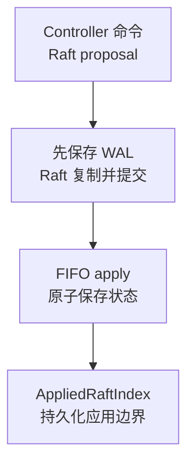
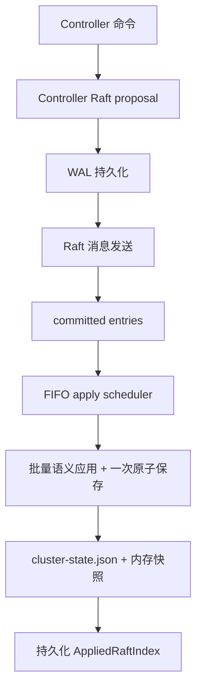
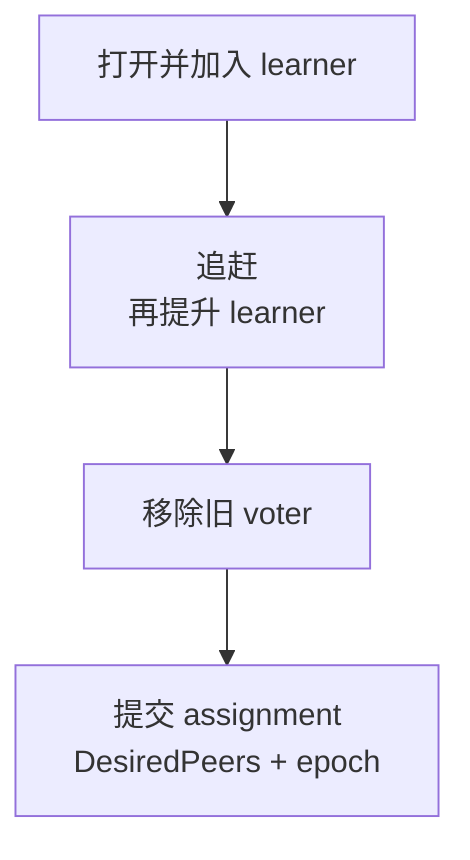

Controller 保存低频集群计划。变更先经 Raft 提交，再成为物化状态；逐条消息与用户心跳由其他层处理。

## Voter 与 Mirror

**voter** 参与 Controller Raft；**mirror** 同步 voter 的完整状态文件。加入的数据节点不会自动投票，提升要经过 learner 阶段、成员证明与最终状态命令。

  
完整节点角色与提升规则

Controller 是低频集群意图的权威：节点成员关系、逻辑 Slot Group 分配、期望副本、控制任务和少量集群级计划都在这里收敛。它不处理每条消息或每次用户心跳。

| 节点角色 | 行为 | 状态来源 |
| --- | --- | --- |
| Controller voter | 参与 Controller Raft、提交命令、应用状态机 | 本地 Raft WAL、快照和物化状态 |
| 非 Controller 数据节点 | 不加入 Controller Raft，镜像 voter 的完整状态文件 | Controller state sync |

只有明确提升为 Controller voter 的节点才参与该 Raft Group。动态加入的普通数据节点不会自动成为 voter；提升需要单独的 learner、成员证明和最终状态命令。

## 提交与物化顺序

先持久化 WAL，再发送 Raft 消息；已提交条目按 FIFO 批量应用，一次原子保存状态。WAL 是权威，`cluster-state.json` 是物化视图。恢复先加载视图或 snapshot，再重放应用边界之后的已提交后缀。

  
完整提交、物化与重放流程图

Controller Raft WAL 是已提交命令和应用边界的权威来源；`cluster-state.json` 是当前业务状态的物化快照。启动时先加载或从 Raft snapshot 恢复物化状态，再重放物化应用索引之后的已提交 WAL 后缀。

## Revision 与 AppliedRaftIndex

`Revision` 表示业务状态版本，用于计划/任务 fence；`AppliedRaftIndex` 表示已物化条目。健康/readiness 元数据可推进后者，不代表新的业务 Revision 或拓扑变化。

  
完整 Revision 与应用边界语义

- `Revision` 是逻辑集群状态版本，用于计划、任务和 compare-and-set fence。
- `AppliedRaftIndex` 是已经物化到状态文件的最新 Raft entry 边界。
- 健康报告或只读 readiness probe 可以推进 Raft 应用元数据，而不一定增加业务 `Revision`。

因此不能把“Raft index 增加”解释为拓扑发生变化，也不能把健康心跳写入当成一个新的资源计划。

## Controller 保存什么

保存节点、分配、版本化哈希槽映射与有界控制计划。Channel 消息正文、真实 Session、每次 Ping、无界审计和原始诊断制品由其他层保存。

  
完整状态存储与排除清单

- 节点 ID、地址、角色和生命周期；
- 逻辑 Slot Raft Group、期望成员、配置 epoch 和 preferred leader；
- 物理哈希槽到逻辑 Slot Group 的版本化映射；
- Slot 迁移、Controller voter 提升等有界任务；
- 经过边界限制的备份计划、Operations MCP 开关等低频集群状态。

它不会保存 Channel 消息正文、真实 TCP Session、每次用户 Ping、无限审计日志或原始诊断制品。高频或无界数据必须留在数据面、节点本地运行时或外部存储。

## 意图不等于实时事实

`DesiredPeers` 与 `PreferredLeader` 表示意图。实际 Leader、term、成员、commit 和进度来自实时 Slot 证据。

<Callout type="warn" title="不要用 PreferredLeader 替代 Leader">
  计划可能尚未收敛，目标节点也可能不活跃或落后。读路径和运维判断必须使用新鲜的实际 Raft 证据；缺失时保持 unknown。
</Callout>

  
完整控制意图与实时权威规则

Controller 中的 `DesiredPeers` 和 `PreferredLeader` 是期望状态。实际 Slot Raft 的 voter、learner、Leader、term、commit 和同步进度由 Slot 运行时观察决定。

## 任务与 fence

示例：迁移一个 Slot 副本。

每阶段携带 task/Slot/epoch/attempt/阶段 fence。最终 assignment 要有实时 voter/learner 证明，才能更新 `DesiredPeers` 与 epoch。缩容要先证明 Gateway、Slot、Channel 和任务全部排空，才将 `leaving` 改为 `removed`。

  
完整任务阶段、证明与缩容 fence

Controller 任务把高风险变更拆成可验证阶段。以 Slot replica move 为例，意图依次经历 learner 打开、加入、追赶、提升、旧 voter 移除和最终 assignment commit。每一步都携带 task ID、Slot ID、配置 epoch、attempt 和阶段索引等 fence。

最终提交只有在实时 voter/learner 证明匹配目标成员时才更新 `DesiredPeers` 并增加配置 epoch。节点缩容也必须先由更高层证明 Gateway、Slot、Channel 和任务全部排空，Controller 才能把 `leaving` 节点写成 `removed` tombstone。

## 失败与恢复

无 Leader 时写入返回错误，不能直接改状态文件。voter 从 snapshot + WAL 后缀恢复，mirror 同步完整状态文件；只裁剪物化状态已覆盖的边界。Manager 读到的仍是节点本地 Raft 证据。

  
完整失败与恢复边界

- 没有 Controller Leader 时，写入返回可重试的领导权/生命周期错误，而不是直接改本地状态文件。
- Voter 可以从 snapshot 加上 WAL 后缀恢复；mirror 通过完整状态文件同步追上。
- Snapshot 和 compaction 只裁剪已被物化状态覆盖的日志边界。
- Manager 查看某个节点的 Controller 日志或状态时，读到的是该节点本地 Raft 证据，不是一个虚构的全局日志视图。

## 源码入口

继续阅读 [Slot 元数据层](/zh/server/architecture/slots)，了解 Controller 的映射和期望成员如何变成实际元数据路由。

  
实现模块与源码路径

| 目标 | 入口 |
| --- | --- |
| Controller 公共运行时 | `pkg/controller` |
| 状态模型与校验 | `pkg/controller/state` |
| Raft WAL、apply 与 snapshot | `pkg/controller/raft` |
| 生产集群适配 | `pkg/cluster/control` |

