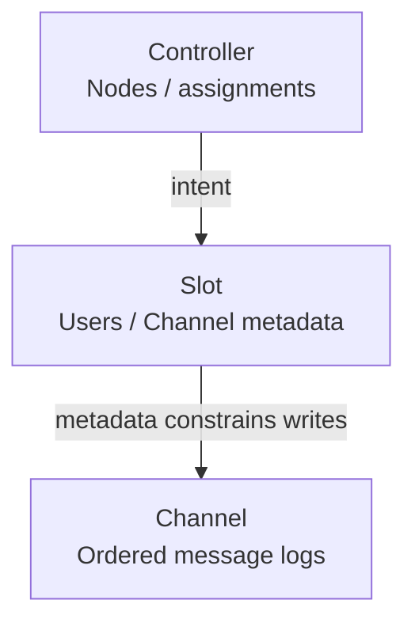
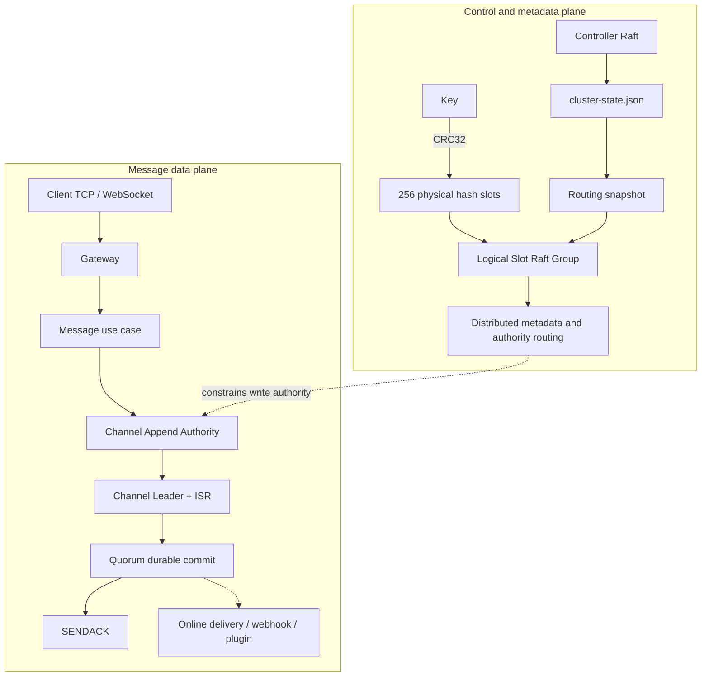

Start with three responsibilities: Controller plans the cluster, Slot owns metadata, and Channel owns ordered message logs. Gateway, online routing and Transport complete client communication.

<Callout type="warn" title="Every deployment is a cluster">
  A one-node deployment is a single-node cluster and still follows Controller, Slot, Channel, and routing semantics. The default route table keeps 256 stable physical hash-slot fences. They map onto a potentially different number of logical Slot Raft Groups and are not the same concept.
</Callout>

## Architecture map

These arrows show assignment and metadata constraints. The per-message SEND path is explained in [Message Send Flow](/en/server/architecture/message-flow); online delivery runs after commit.

  
Full architecture map and both planes

WuKongIM places low-frequency cluster intent, sharded metadata, ordered message logs, and high-frequency connection state behind different boundaries. Those boundaries matter more than memorizing one function or in-process call graph: failover, scaling, and diagnosis all depend on which component is authoritative for which state.

The diagram contains two distinct paths: Controller and Slot provide control and metadata authority, while Channel provides message-log authority. Online delivery runs after commit and is not part of Channel quorum commit.

## Five primary boundaries

<Cards>
<Card title="Controller: plans" href="/en/server/architecture/controller">Node assignments and controlled tasks.</Card>
<Card title="Slot: metadata" href="/en/server/architecture/slots">Users, Channels and subscriptions.</Card>
<Card title="Channel: messages" href="/en/server/architecture/channels">Order, replication and committed reads.</Card>
<Card title="Gateway and online routes" href="/en/server/architecture/user-routing">Sessions, presence and owner-node delivery.</Card>
<Card title="Transport: node traffic" href="/en/server/architecture/transport">Bounded Raft, RPC and replication transport.</Card>
</Cards>

  
Full responsibility and authority comparison

| Boundary | Authoritative state | Main responsibility | Does not own |
| --- | --- | --- | --- |
| Controller | committed Controller Raft log and applied boundary | nodes, Slot assignment, tasks, cluster-wide plans | high-frequency sessions or Channel payloads |
| Slot | metadata state machine under the current Slot Raft Leader | users, channels, subscribers, ordinary/CMD memberships, ChannelRuntimeMeta | Channel message logs |
| Channel | Channel Leader, ISR, and committed high watermark | per-channel order, durability, replication, committed visibility | global membership plans or concrete TCP sessions |
| Gateway and online runtime | connection owner node and the UID Presence Authority | client sessions, online endpoints, cross-node delivery | durable presence or message-commit decisions |
| Transport | bounded connections, queues, and service entry points | node Raft, RPC, replication, and notification transport | business authorization or unlimited retries |

## Four layers of authority in one route

Controller declares desired assignments; the live Slot Leader/term/configuration epoch governs metadata, while Channel Leader/ISR/epochs govern message writes. Only the owner of the concrete Session can write to that client. `PreferredLeader` is intent; missing live authority or freshness stays unknown.

  
All four authority layers and freshness rules

A business request can encounter four kinds of authority, and none substitutes for another:

1. **Controller intent** declares desired node and Slot assignments, tasks, and revisions.
2. **Live Slot authority** uses the observed Raft Leader, term, and configuration epoch to decide who can commit metadata.
3. **Live Channel authority** uses the Leader, ISR, Channel Epoch, and Leader Epoch in `ChannelRuntimeMeta` to fence message writes.
4. **Connection ownership** means only the node holding the concrete Session can perform the final client write.

`PreferredLeader` is Controller intent. The observed Raft Leader is the runtime authority. If Manager or diagnostics lack a live term, configuration epoch, or freshness evidence, preserve an unknown result instead of filling the gap from intent.

## Where data lives

Plans live in Controller Raft, metadata in Slot storage and messages in Channel replicas. Sessions/presence, queues and caches live in memory; they follow leases, bounded capacity and rebuildable lifecycles.

  
Complete storage and lifecycle table

| Data | Typical location | Lifecycle |
| --- | --- | --- |
| Cluster plans and tasks | Controller Raft plus materialized state file | low-frequency, durable, cluster-wide |
| Sharded business metadata | Slot Multi-Raft plus `pkg/db/meta` | durable and partitioned by physical hash slot |
| Channel messages | Channel replicas plus `pkg/db/message` | durable and ordered per channel |
| Connections and online endpoints | owner node and Presence Authority memory | high-frequency, lease- and Session-bound |
| Transport queues and runtime caches | node process memory | bounded, rebuildable, protected by backpressure |

## Continue reading

Follow a message in [Message Send Flow](/en/server/architecture/message-flow), find a Session in [User Connection Routing](/en/server/architecture/user-routing), or investigate an incident with [Troubleshooting](/en/server/operations/troubleshooting) and [Diagnostics](/en/server/tools/diagnostics).

  
Complete architecture reading list

- [Controller Layer](/en/server/architecture/controller): cluster intent, materialized state, and task fences.
- [Slot Metadata Layer](/en/server/architecture/slots): how 256 physical hash slots map to logical Raft Groups.
- [Channel Messaging Layer](/en/server/architecture/channels): Channel Leader, ISR, HW, and message order.
- [Transport Layer](/en/server/architecture/transport): client ingress versus node-to-node transport.
- [Message Send Flow](/en/server/architecture/message-flow): SEND through SENDACK and asynchronous delivery.
- [User Connection Routing](/en/server/architecture/user-routing): local Sessions, Presence Authority, and cross-node push.

To apply these boundaries to an incident, continue with [Troubleshooting](/en/server/operations/troubleshooting) and [Diagnostics](/en/server/tools/diagnostics).

