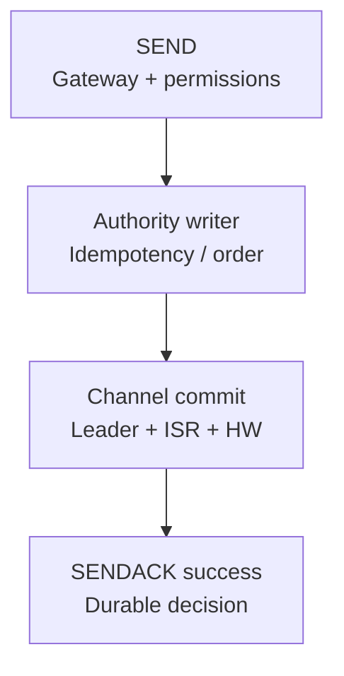
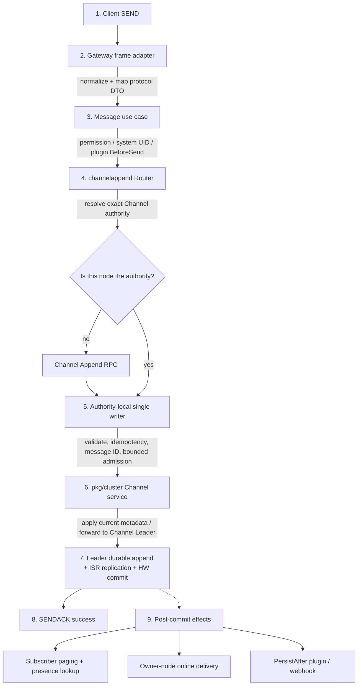
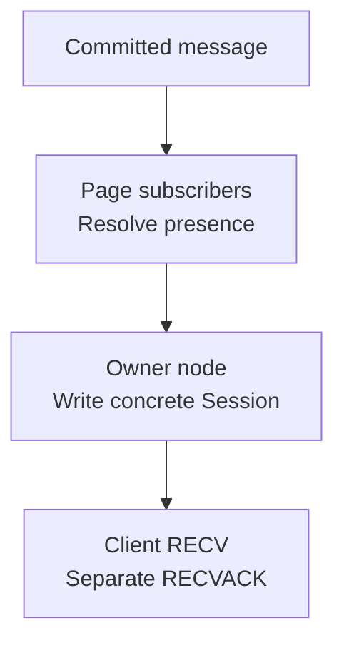

A durable SEND crosses entry adaptation, business permissions, Channel authority, Channel quorum, and post-commit effects. The critical boundary is that durable commit decides SENDACK success; online delivery and webhooks are not part of that synchronous transaction.

## Complete flow

This diagram covers default durable messages. Delivery is scheduled separately in [Post-commit effects](/en/server/architecture/message-flow#5-post-commit-effects); `NoPersist` follows the branch below.

  
Complete send and post-commit implementation flow

## 1. Gateway ingress

Gateway decodes TCP/WebSocket frames and admits work through bounded queues. A full queue, closed Session or invalid frame fails before the use case; Gateway neither chooses the Channel Leader nor writes message storage.

  
Full ingress, adapters and batching

A client TCP or WebSocket Session sends a WKProto `SEND`. `pkg/gateway` handles frame decoding, connection-level admission, same-channel micro-batching, and bounded asynchronous dispatch. `internal/access/gateway` maps protocol fields into an entry-independent send command.

Gateway does not choose the Channel Leader or write the message database. A full queue, closed connection, or invalid frame fails explicitly before business-usecase admission.

## 2. Permissions and normalization

Enforce current Channel/subscription/allow-deny/stranger permissions and optional `BeforeSend`, and normalize identities. Batch results remain item-aligned: rejected items never enter append.

  
Full permission and normalization rules

`internal/usecase/message` enforces current business permissions: system users, channel state, subscriptions, allowlists, denylists, stranger policy, and optional plugin `BeforeSend`. Direct or command-channel identities are normalized for the request, but the usecase imports no Gateway, Cluster, or Channel implementation type.

Batch send preserves item-aligned results. Rejected items never enter append; only allowed items reach the configured submitter.

## 3. Channel Append Authority

Only the resolved authority node creates the writer; other nodes forward the batch by RPC. The writer revalidates hash slot/Leader/epochs, deduplicates by sender + client message number + Channel, assigns IDs, and preserves order under backlog/worker/handoff limits.

  
Full writer ownership and admission rules

`internal/runtime/channelappend.Router` resolves a complete authority target for the canonical channel. Only that node creates the product-level append writer. Other nodes forward the whole batch over Channel Append RPC without creating a local proxy writer.

The authority writer:

- revalidates the channel against target hash slot, Leader, and epochs;
- applies idempotency by sender, client message number, and channel;
- assigns message ID and server timestamp;
- stays under per-channel backlog, global worker, and post-commit handoff capacity;
- preserves same-channel item commit and completion order.

## 4. Channel quorum commit

Apply current metadata and check `Epoch`, `LeaderEpoch` and `WriteFence`; forward to the Channel Leader as needed. Append succeeds only when HW covers the record, returning its durable ID and sequence.

<Callout type="info" title="What SENDACK means">
  A successful SENDACK for a default durable message means the authoritative channel path made a durable quorum-commit decision. It does not mean every recipient is online, every client has RECVACKed, a webhook completed, or a business database updated.
</Callout>

If the client disconnects before SENDACK, use a stable `client_msg_no` and query or sync evidence to determine the result. A network timeout alone does not prove the message was not committed.

  
Complete quorum append and result rules

The Cluster Channel service resolves and applies current `ChannelRuntimeMeta`. If the local node is not Channel Leader, it forwards append to the Leader. The Leader reactor checks `Epoch`, `LeaderEpoch`, and `WriteFence`, then performs local durable append and ISR replication.

The quorum append Future succeeds only when HW covers the records. Each result returns the durable message ID and channel sequence.

## 5. Post-commit effects

Paged subscribers and exact presence routes feed bounded owner-node delivery plans. Webhooks/PersistAfter receive best-effort events from the same commit; one recipient group's failure neither reverses SENDACK nor blocks unrelated targets.

SEND does not write recipient membership or conversations. Clients later page their UID-owned membership directory; Channel-head hydration constructs conversations.

  
Full subscriber, routing and side-effect steps

A new commit becomes an immutable `CommittedEnvelope` in the authority writer. The following work is scheduled independently of SENDACK:

1. Direct channels derive participants, ordinary channels load a versioned subscriber snapshot, and large groups page by cursor.
2. Recipient UIDs resolve under one route snapshot into exact presence targets.
3. A bounded `RecipientDeliveryPlan` groups by authority target and enters the online-delivery runtime.
4. Online routes coalesce by owner node; local owners write Sessions and remote owners receive owner-push RPC.
5. Optional PersistAfter plugins and webhooks receive best-effort events from the same committed boundary.

SEND performs no recipient membership or conversation write. Clients discover
ordinary conversations later by paging their UID-owned membership directory;
the server groups Channel-head hydration by Leader and constructs the response.

Failure in one recipient group does not change a successful SENDACK or block unrelated targets. Stage-specific logs and metrics expose the failure.

## 6. Receive and acknowledgement

Before RECV, revalidate UID, Boot/Session ID and owner fences and bind bounded ACK state. RECVACK removes only matching owner-local pending state; Session close clears that Session. Receive ACKs do not alter committed history or Channel order.

  
Full receive identity and ACK lifetime rules

Before writing `RECV`, the owner node revalidates UID, Boot ID, Session ID, and owner fences and binds bounded ACK state when acknowledgement is required. Client `RECVACK` removes only the matching owner-local pending identity; Session close removes state for that Session.

Durable committed history and whether one client has RECVACKed are separate dimensions. Receive acknowledgement cannot rewrite or change Channel commit order.

## NoPersist branch

**Ordinary:** without `SyncOnce` or a command ID, retain the source Channel and use a transient ID with sequence zero. **Command-style:** `SyncOnce` or a command ID maps the command Channel; success requires the online plan to be accepted, and missing delivery capability fails. Both still use authority/writer order, skip durable logs, membership mutation and PersistAfter, and offer no offline recovery or reliable replay.

  
Full ordinary and command NoPersist branches

An ordinary `NoPersist` send (without `SyncOnce` or a command-channel ID) passes validation and permissions, retains the source Channel, resolves its authority, allocates a transient message ID, and enters online delivery in writer order. Its sequence is zero; it skips the durable log, membership mutation, and PersistAfter.

A command-style `NoPersist` send (with `SyncOnce` or an existing command-channel ID) maps to the command channel, resolves authority, and enters online recipient routing in writer order. It skips the Channel durable log, membership state, and PersistAfter, and reports success only after the online delivery plan is accepted. If no online-delivery capability exists, it fails rather than fabricating success.

Neither `NoPersist` branch has a durable sequence or offline-recovery guarantee, so neither is suitable for business events that require reliable replay.

## Common failure boundaries

No SENDACK: inspect Gateway, permissions, authority and HW. SENDACK succeeded but nothing displayed: inspect subscribers, presence, owner push and Sessions. For device, webhook or duplicate symptoms, follow [Troubleshooting](/en/server/operations/troubleshooting) with stage evidence.

  
Full symptom-to-boundary table

| Symptom | Inspect first |
| --- | --- |
| No SENDACK | Gateway queue, permission, authority route, Channel append and HW |
| SENDACK succeeds but peer sees nothing | subscriber page, presence target, delivery plan, owner push, Session |
| Only some devices receive | exact routes, Boot/Session fences, device conflicts, local write error |
| Webhook fails but message exists | PersistAfter/webhook queue and receiver, not Channel rollback |
| Retry creates a duplicate | stable `client_msg_no`, idempotency scope, timeout-outcome handling |

Use the evidence ladder in [Troubleshooting](/en/server/operations/troubleshooting) to narrow the boundary. Do not infer failed Channel commit directly from a final UI that did not display a message.

## Source entry points

Continue with [User Connection Routing](/en/server/architecture/user-routing) to find the concrete Session after commit.

  
Full source entry-point table

| Stage | Entry point |
| --- | --- |
| Client frame and ingress adapter | `pkg/gateway`, `internal/access/gateway` |
| Permission and send usecase | `internal/usecase/message` |
| Product append authority | `internal/runtime/channelappend` |
| Cluster and Channel commit | `pkg/cluster/channels`, `pkg/channel` |
| Online delivery and ACK | `internal/runtime/delivery`, `internal/runtime/online` |

Continue with [User Connection Routing](/en/server/architecture/user-routing) to see how post-commit delivery finds a concrete Session.

