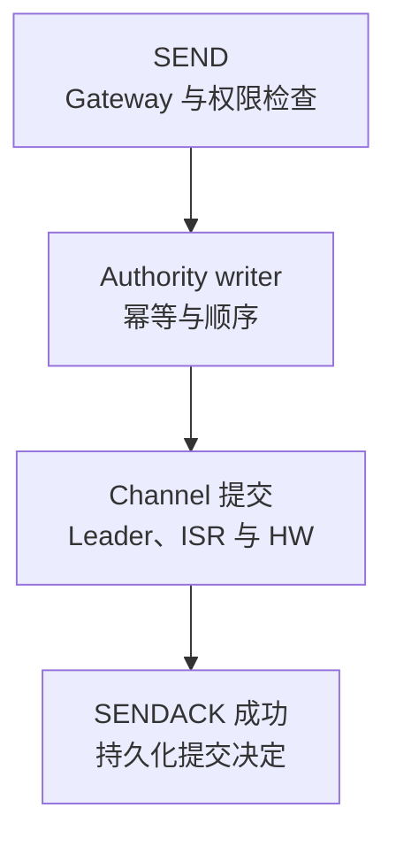
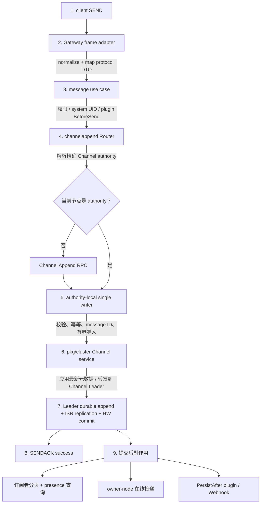
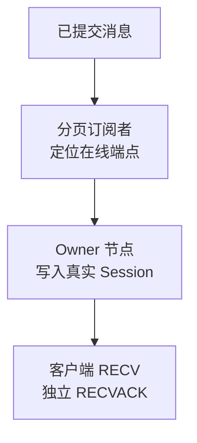

一条持久化 SEND 跨越入口适配、业务权限、频道 authority、Channel quorum 和提交后副作用。最重要的分界是：SENDACK 成功由持久化提交决定，在线投递和 Webhook 不在这个同步事务中。

## 完整链路

上图描述默认持久化消息。投递另走[提交后副作用](/zh/server/architecture/message-flow#5-提交后副作用)；`NoPersist` 的边界见下文。

  
完整发送与提交后实现链路

## 1. Gateway 入口

Gateway 解码 TCP/WebSocket frame，并通过有界队列准入。队列满、Session 关闭或 frame 无效时先失败；Gateway 不决定 Channel Leader，也不直接写消息库。

  
完整入口、适配与微批说明

客户端 TCP 或 WebSocket Session 发送 WKProto `SEND`。`pkg/gateway` 负责 frame 解码、连接级 admission、同频道微批和有界异步 dispatch；`internal/access/gateway` 把协议字段映射成入口无关的发送命令。

Gateway 不决定 Channel Leader，也不直接写消息数据库。队列已满、连接关闭或 frame 无效时在进入业务用例前显式失败。

## 2. 权限与标准化

执行标识标准化与当前频道、订阅、黑白名单、陌生人策略和可选 `BeforeSend` 检查。批量结果逐项返回，被拒绝的 item 不进入追加路径。

  
完整权限与标准化规则

`internal/usecase/message` 处理当前业务权限：系统用户、频道状态、订阅关系、黑白名单、陌生人策略和可选插件 `BeforeSend`。单聊或命令频道标识会按请求语义标准化，但用例不导入 Gateway、Cluster 或 Channel 类型。

批量发送保持逐项结果。被拒绝的 item 不进入追加路径，允许的 item 才交给配置好的 submitter。

## 3. Channel Append Authority

只有解析出的 authority 节点创建 writer，其他节点通过 RPC 转发批量请求。writer 复核 hash slot、Leader 与 epoch，按 sender + client message number + 频道处理幂等，分配 ID，并在 backlog/worker/handoff 上限内保持顺序。

  
完整 writer 所有权与准入规则

`internal/runtime/channelappend.Router` 根据规范化频道解析完整 authority target。只有目标节点创建该频道的产品级 append writer；其他节点通过 Channel Append RPC 转发整批请求，不创建本地代理 writer。

authority writer：

- 再次校验频道与 target 的 hash slot、Leader 和 epoch；
- 对 sender、client message number 和频道执行幂等处理；
- 分配消息 ID 和服务端时间；
- 受每频道 backlog、全局 worker 和 post-commit handoff capacity 限制；
- 保持同频道 item 的提交与完成顺序。

## 4. Channel quorum commit

应用当前元数据并检查 `Epoch`、`LeaderEpoch` 与 `WriteFence`，需要时转发到 Channel Leader。HW 覆盖本次记录才算追加成功，返回持久化 ID 与序号。

<Callout type="info" title="SENDACK 的含义">
  默认持久化消息的成功 SENDACK 表示频道权威路径作出了 durable quorum commit 决定。它不表示所有接收者在线、所有客户端已经 RECVACK、Webhook 已处理或业务数据库已经更新。
</Callout>

如果客户端在 SENDACK 前断线，应使用稳定 `client_msg_no` 和查询/同步能力判断结果；不能仅凭网络超时推断消息未提交。

  
完整 quorum 追加与结果规则

Cluster Channel service 读取并应用最新 `ChannelRuntimeMeta`。本节点不是 Channel Leader 时，追加会转发到 Leader；Leader 在 reactor 中检查 `Epoch`、`LeaderEpoch` 和 `WriteFence`，然后执行本地 durable append 与 ISR 复制。

只有 HW 覆盖本次记录，quorum append Future 才成功。每个结果返回已持久化的 message ID 和频道 sequence。

## 5. 提交后副作用

分页订阅者与精确 presence 路由形成有界 owner-node 投递计划。Webhook/PersistAfter 从同一提交边界获得尽力事件；一个接收者组失败不改变 SENDACK，也不阻塞无关目标。

SEND 不写接收者 membership 或会话；客户端之后分页同步 UID-owned membership，服务端读取频道 head 后构建会话。

  
完整订阅、路由与副作用步骤

新 commit 在 authority writer 中形成 immutable `CommittedEnvelope`。这些工作在 SENDACK 之外独立调度：

1. 单聊推导参与者；普通频道加载版本化订阅快照；大群按 cursor 分页。
2. 接收者 UID 在同一个路由快照下解析为 exact presence targets。
3. 有界 `RecipientDeliveryPlan` 按 authority target 分组进入在线投递 runtime。
4. 在线路由再按 owner node 合并；本地写 Session，远端通过 owner-push RPC。
5. 可选 PersistAfter plugin 和 Webhook 从同一已提交边界获得尽力而为事件。

SEND 不执行接收者 membership 或 conversation 写入。客户端之后分页同步自己的
UID-owned membership 目录；服务端按 Channel Leader 分组读取 head 并临时构建会话。

一个接收者组失败不会改变已成功的 SENDACK，也不应阻塞不相关 target。失败会以阶段化日志和指标暴露。

## 6. 接收与确认

RECV 前复核 UID、Boot/Session ID 与 owner fence，绑定有界 ACK 状态。RECVACK 只清理匹配的 owner-local pending，Session 关闭清理本会话；接收 ACK 不改变已提交历史或频道顺序。

  
完整接收标识与 ACK 生命周期

owner 节点在写 `RECV` 前重新验证 UID、Boot ID、Session ID 和 owner fence，并为需要确认的投递绑定有界 ACK 状态。客户端 `RECVACK` 只清理匹配的 owner-local pending identity；Session 关闭会清理该会话的状态。

消息历史的 durable committed 状态与某个客户端是否已经 RECVACK 是不同维度。接收 ACK 不能回写或改变 Channel commit 顺序。

## NoPersist 分支

**普通分支：** 无 `SyncOnce` 且非命令频道时保留源频道，使用瞬时 ID、序号为零。**命令分支：** `SyncOnce` 或命令 ID 映射命令频道，在线计划成功入队才返回成功，缺少投递能力则失败。两者仍经过 authority/writer 顺序，跳过持久日志、成员写入与 PersistAfter，没有离线恢复或可靠重放保证。

  
完整普通与命令 NoPersist 分支

普通非命令频道的 `NoPersist`（没有 `SyncOnce`，频道 ID 也不是命令频道）通过校验和发送权限检查后，保留源频道并解析其 authority，分配瞬时消息 ID，按 writer 顺序进入在线投递；消息序号为零，不写持久日志、不修改成员目录，也不触发 PersistAfter。

命令式 `NoPersist`（带 `SyncOnce` 或已经使用命令频道 ID）才会映射命令频道、解析 authority，并按 writer 顺序进入在线 recipient routing。它跳过 Channel durable log、membership state 和 PersistAfter，只有在线投递计划成功入队后才返回成功；没有在线投递能力时会失败，而不是伪造成功。

两种 `NoPersist` 都没有持久化 sequence 与离线恢复保证，不能用作必须可靠重放的业务事件。

## 常见失败定位

无 SENDACK：查 Gateway、权限、authority 与 HW。确认成功但未显示：查订阅、presence、owner push 与 Session。部分设备、Webhook 或重复消息问题，按[故障排查](/zh/server/operations/troubleshooting)收集阶段证据。

  
完整现象与失败边界表

| 现象 | 先看边界 |
| --- | --- |
| 没有 SENDACK | Gateway queue、权限、authority route、Channel append/HW |
| SENDACK 成功但对端未收到 | subscriber page、presence target、delivery plan、owner push、Session |
| 只有部分设备收到 | exact routes、Boot/Session fence、设备冲突与本地写错误 |
| Webhook 失败但消息存在 | PersistAfter/Webhook queue 与接收端，不回滚 Channel |
| 重试后出现重复 | `client_msg_no` 稳定性、幂等作用域和超时结果判断 |

使用[故障排查](/zh/server/operations/troubleshooting)的证据阶梯逐层缩小范围，不要从最终“未显示”直接推断 Channel 没有提交。

## 源码入口

继续读[用户连接路由](/zh/server/architecture/user-routing)，了解提交后如何找到真实 Session。

  
完整源码入口表

| 阶段 | 入口 |
| --- | --- |
| 客户端 frame 与接入适配 | `pkg/gateway`, `internal/access/gateway` |
| 权限与发送用例 | `internal/usecase/message` |
| 产品 append authority | `internal/runtime/channelappend` |
| Cluster/Channel 提交 | `pkg/cluster/channels`, `pkg/channel` |
| 在线投递与 ACK | `internal/runtime/delivery`, `internal/runtime/online` |

继续阅读[用户连接路由](/zh/server/architecture/user-routing)，深入理解提交后投递如何找到真实 Session。

