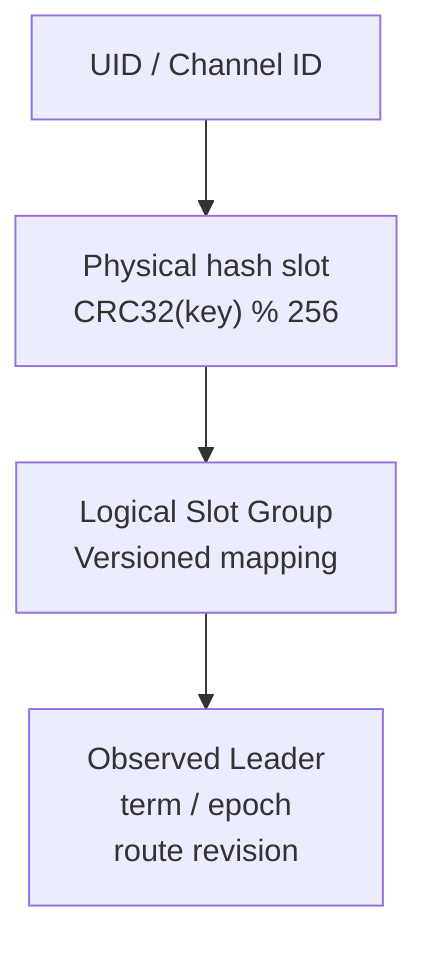
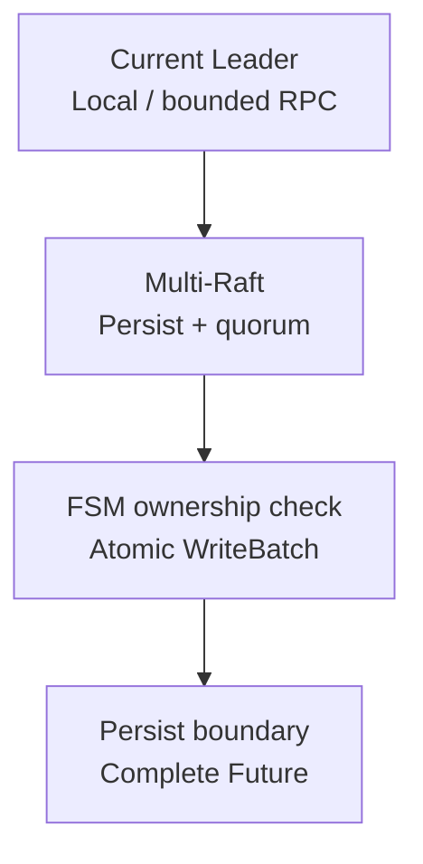

Slot partitions and replicates business metadata. Resolve a key to its logical Raft Group and observed Leader before reading or writing authoritative state.

## Do not mix the two Slot concepts

- **Physical hash slots: 256 by default.** Stable key-space fences.
- **Logical Slot Raft Groups: `initial_slot_count`.** Each replicates metadata for one or more physical hash slots.

Ordinary scaling moves Group replicas/Leaders; mapping changes require explicitly enabled, controlled hash-slot migration.

<details>
  <summary>Full physical/logical Slot comparison</summary>

The Slot layer is the distributed metadata store. Users, channel definitions, subscriptions, UID-owned ordinary/CMD memberships, and `ChannelRuntimeMeta` are partitioned by stable physical hash slot and replicated through logical Slot Raft Groups.

| Name | Default count | Purpose |
| --- | --- | --- |
| Physical hash slot | 256 | stable key-space fence; UIDs and Channel IDs hash here first |
| Logical Slot Raft Group | selected by `initial_slot_count` | Raft replication and metadata state machine for one or more physical hash slots |

Scaling normally moves replicas or Leaders of logical Slot Groups without changing the 256 physical hash slots. The mapping changes only through an explicitly enabled and controlled hash-slot migration.

</details>

## From a key to the authoritative Leader

<div className="tutorial-diagram">



</div>

Resolve keys under one immutable, atomically replaced route snapshot. Missing mapping or observed Leader returns not-ready/unknown, never an arbitrary node. The exact Leader identity and route revision fence routing.

<details>
  <summary>Full key routing and authority-target diagram</summary>

```mermaid
flowchart TD
  Key["key (UID / Channel ID / metadata key)"]
  Key -->|CRC32(key) % 256| Hash["physical hash slot"]
  Hash -->|versioned HashToSlot table| Group["logical Slot Raft Group"]
  Group -->|observed Raft status| Target["LeaderNodeID + LeaderTerm + ConfigEpoch + RouteRevision"]
```

The route table is an immutable snapshot replaced atomically, so hot paths can resolve many keys under one version. Missing routes, mappings, or observed Leaders return not-ready or unknown instead of falling back to an arbitrary node.

</details>

## Metadata stored by Slot

Store users/devices, channels/subscriptions, ordinary membership and separate CMD bindings, plus Channel runtime constraints. Message payloads stay in [Channel logs](/en/server/architecture/channels/).

<details>
  <summary>Complete metadata and membership list</summary>

- users, devices, and system UIDs;
- channel definitions, subscribers, allowlists, denylists, and membership;
- ordinary membership join/hide/badge/activation state and separate CMD bindings;
- Channel Leader, Replicas, ISR, epochs, write fences, and retention boundary;
- Channel migration tasks, plugin bindings, and bounded message-event projections.

Message payloads do not belong to Slot. The [Channel Messaging Layer](/en/server/architecture/channels) stores them in separate per-channel logs.

</details>

## Metadata writes

<div className="tutorial-diagram">



</div>

After quorum, the FSM verifies physical hash-slot ownership and commits a single metadata WriteBatch atomically. Advance the durable applied boundary before completing the Future. A single-node cluster uses one voter and keeps Raft/FSM.

<details>
  <summary>Complete routing, quorum, FSM and apply steps</summary>

1. The caller hashes the key to a physical hash slot and resolves its logical Slot Group from one route snapshot.
2. A local current Leader enters `Runtime.Propose`; otherwise a bounded RPC forwards to the resolved Leader.
3. Multi-Raft persists and replicates the entry, then gives committed entries to the Slot FSM after quorum.
4. The FSM verifies that each physical hash slot belongs to the logical Group and applies a batch into one `pkg/db/meta` WriteBatch.
5. The WriteBatch commits atomically, then the durable applied boundary advances and the Future completes.

A single-node cluster keeps this path. Its quorum is one voter; it does not bypass Raft or the FSM.

</details>

## Authoritative and local reads

Local reads expose only explicitly allowed node-local/applied state. Authoritative reads resolve the Group, try peers and follow fresh `not_leader` hints.

<Callout type="info" title="A local snapshot is not global truth">
  One node's Pebble data, Raft log, or Slot status describes that node's local boundary. Manager aggregation must retain node, term, configuration epoch, and freshness instead of presenting one node's read as a globally consistent snapshot.
</Callout>

<details>
  <summary>Full local and authoritative read boundaries</summary>

A local replica can serve explicitly node-local or applied-state reads. Reads requiring current authority resolve the logical Slot Group, try its peers, and follow a `not_leader` response toward the newest Leader hint.

</details>

## Preferred Leader and actual Leader

Preferred Leader is Controller intent; current Leader/term/membership/commit/progress come from live Multi-Raft status. Transfer needs fresh intent, exact membership, recent activity and catch-up through commit. Stale/joint/lagging/inactive state keeps the current assignment.

<details>
  <summary>Full preferred-Leader convergence gates</summary>

Controller stores desired peers, configuration epoch, and preferred leader for each logical Group. Live Slot Multi-Raft status supplies the current Leader, term, voters, learners, commit, and match progress.

Background preferred-leader convergence attempts a transfer only when intent is still current, membership matches exactly, the target is recently active, and it has caught up through commit. Stale intent, joint configuration, lag, or inactivity preserves the current state; the reconciler does not pick a different convenient candidate.

</details>

## Replica movement and recovery

Add a learner, catch up, promote, remove the old voter, then commit assignment/epoch. Retain live Raft proof at every stage; failure preserves current membership and observable state. Recovery installs the snapshot before replaying its committed suffix; do not edit state files or local metadata.

<details>
  <summary>Complete replica movement and snapshot recovery</summary>

A safe replica move adds the target as a learner, waits for catch-up, promotes it, removes the old voter, and finally lets Controller commit the new assignment and configuration epoch. Snapshots let a new learner cross compacted history; recovery installs the snapshot first and replays committed entries after its index.

Every stage retains live Raft proof. A failed task preserves current membership and observable state instead of editing `cluster-state.json` or local metadata directly.

</details>

## Capacity and backpressure

Schedulers, workers and queues remain bounded; batches limit records, bytes and wait. Large snapshots are chunked and reassembled. Queue saturation, Leader change or route-revision mismatch returns explicit failure or bounded retry, never silent loss.

<details>
  <summary>Complete scheduler, batch and backpressure limits</summary>

- Multi-Raft uses a bounded scheduler and workers across Groups; a hot Group does not receive an unbounded queue.
- FSM batching amortizes storage commits while preserving record, byte, and wait limits.
- Large snapshots are chunked in cluster transport and reassembled before entering the Slot runtime.
- Queue saturation, Leader changes, and route-revision mismatch return explicit errors or bounded retries instead of silently losing metadata writes.

</details>

## Source entry points

Continue with the [Channel Messaging Layer](/en/server/architecture/channels) to see how Slot metadata fences each channel's message replicas.

<details>
  <summary>Implementation modules and source paths</summary>

| Goal | Entry point |
| --- | --- |
| Route table | `pkg/cluster/routing` |
| Slot Multi-Raft | `pkg/slot/multiraft` |
| Metadata FSM and proxy | `pkg/slot/fsm`, `pkg/slot/proxy` |
| Local metadata database | `pkg/db/meta` |
| Controller-to-Slot composition | `pkg/cluster/slots`, `pkg/cluster/propose` |

</details>
