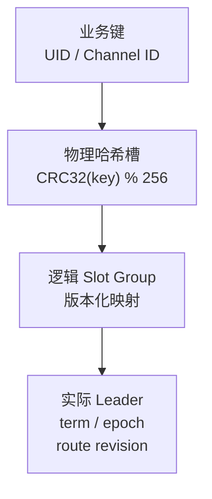
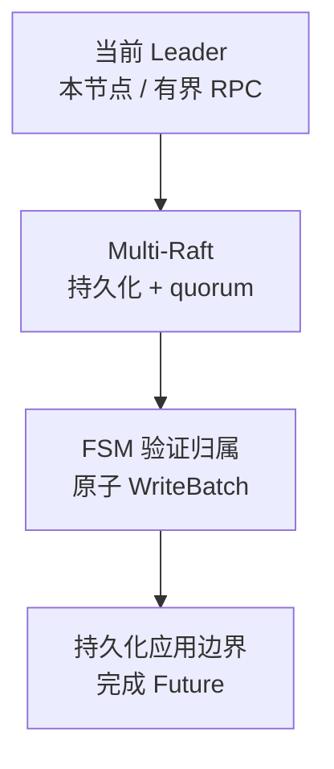

Slot 负责业务元数据的分片与复制。读写权威状态前，先把业务键定位到逻辑 Raft Group 与实际 Leader。

## 两种 Slot 不要混用

- **物理哈希槽：默认 256 个。** 稳定的键空间 fence。
- **逻辑 Slot Raft Group：由 `initial_slot_count` 设置。** 一个 Group 复制一个或多个物理槽的元数据。

通常扩容只迁移 Group 副本/Leader；映射变更需要显式启用受控 Hash Slot migration。

<details>
  <summary>完整物理槽与逻辑 Group 对照</summary>

Slot 层是分布式元数据存储。用户、频道定义、订阅关系、UID-owned 普通/CMD membership 和 `ChannelRuntimeMeta` 等状态按稳定物理哈希槽分片，再由逻辑 Slot Raft Group 复制和提交。

| 名称 | 默认数量 | 作用 |
| --- | --- | --- |
| 物理 Hash Slot | 256 | 稳定的键空间 fence；UID、Channel ID 等先哈希到这里 |
| 逻辑 Slot Raft Group | 由 `initial_slot_count` 决定 | 承载一个或多个物理哈希槽的 Raft 复制与元数据状态机 |

扩容通常迁移逻辑 Slot Group 的副本或 Leader，不改变 256 个物理哈希槽。只有显式启用并执行受控 Hash Slot migration 时，物理哈希槽到逻辑 Group 的映射才会变化。

</details>

## 从键到权威 Leader

<div className="tutorial-diagram">



</div>

同一不可变路由快照下解析键，快照原子替换。缺失映射或实际 Leader 返回 not-ready/unknown，不回退到任意节点；精确 Leader 身份与 route revision 约束路由。

<details>
  <summary>完整键路由与权威 target 图</summary>

```mermaid
flowchart TD
  Key["key（UID / Channel ID / 业务元数据键）"]
  Key -->|CRC32(key) % 256| Hash["physical hash slot"]
  Hash -->|versioned HashToSlot table| Group["logical Slot Raft Group"]
  Group -->|observed Raft status| Target["LeaderNodeID + LeaderTerm + ConfigEpoch + RouteRevision"]
```

路由表是不可变快照并原子替换，热路径可以在同一个版本下批量解析多个键。路由失败、映射缺失或没有实际 Leader 时返回 not-ready/unknown，而不是回退到任意节点。

</details>

## Slot 保存哪些元数据

保存用户/设备、频道/订阅、普通 membership 与独立 CMD binding，以及 Channel runtime 约束。消息正文另存[Channel 日志](/zh/server/architecture/channels/)。

<details>
  <summary>完整元数据与成员关系清单</summary>

- 用户、设备和系统 UID；
- 频道定义、订阅者、黑白名单与成员关系；
- 普通 membership 的 join/hide/badge/activation 状态与独立 CMD binding；
- Channel Leader、Replicas、ISR、epoch、写 fence 与 retention 边界；
- Channel migration task、插件绑定和有界消息事件投影。

消息正文不属于 Slot；它们由 [Channel 消息层](/zh/server/architecture/channels) 的独立频道日志保存。

</details>

## 元数据写入

<div className="tutorial-diagram">



</div>

quorum 后 FSM 验证物理哈希槽归属，以一个元数据 WriteBatch 原子提交；先更新 durable applied boundary，再完成 Future。单节点集群由一个 voter 满足 quorum，仍走 Raft/FSM。

<details>
  <summary>完整路由、quorum、FSM 与应用步骤</summary>

1. 调用方用 key 计算物理哈希槽，并从路由快照取得逻辑 Slot Group。
2. 本地是当前 Leader 时进入 `Runtime.Propose`；否则通过有界 RPC 转发到解析出的 Leader。
3. Multi-Raft 持久化并复制日志，在 quorum 后把已提交 entry 交给 Slot FSM。
4. FSM 验证物理哈希槽确实归属该逻辑 Group，将一批命令写入一个 `pkg/db/meta` WriteBatch。
5. WriteBatch 一次原子 commit，之后更新 durable applied boundary 并完成 Future。

这条路径在单节点集群中仍然存在；区别只是 quorum 由一个 voter 满足，而不是绕过 Raft 和 FSM。

</details>

## 权威读取与本地读取

本地读取只暴露明确允许的节点本地/已应用状态。权威读取解析 Group、遍历 peers，并跟随新鲜 `not_leader` 提示。

<Callout type="info" title="本地快照不是全局真相">
  一个节点的 Pebble 数据、Raft 日志或 Slot 状态只说明该节点本地看到的边界。Manager 汇总视图必须保留节点、term、配置 epoch 和新鲜度，不能把单节点读取包装成全局一致快照。
</Callout>

<details>
  <summary>完整本地与权威读取边界</summary>

本地副本可以提供明确允许的节点本地或已应用读取。需要当前权威的用户、频道或运行时元数据时，代理会定位逻辑 Slot Group，遍历其 peers 并跟随 `not_leader` 返回的最新 Leader 提示。

</details>

## Preferred Leader 与实际 Leader

Preferred Leader 属于 Controller 意图；实际 Leader/term/成员/commit/进度来自实时 Multi-Raft status。transfer 必须满足意图新鲜、成员完全匹配、最近活跃且追到 commit；stale/joint/落后/不活跃时保持现状。

<details>
  <summary>完整 preferred-Leader 协调条件</summary>

Controller 为每个逻辑 Group 保存 desired peers、配置 epoch 和 preferred leader。Slot Multi-Raft 的实时 status 才提供当前 Leader、term、voters、learners、commit 和 match 进度。

后台 preferred-leader 协调只有在意图仍然新鲜、成员完全匹配、目标最近活跃且追到 commit 时才尝试 transfer。任何 stale intent、joint config、落后或不活跃都保持现状，不会选择另一个候选节点“凑合”。

</details>

## 副本迁移与恢复

learner 加入、追赶、提升、移除旧 voter 后，才提交 assignment/epoch。每阶段保留实时 Raft 证明，失败保留现有成员与可观察状态。恢复先安装 snapshot，再重放其后的 committed 后缀，不能直接改状态文件或本地元数据。

<details>
  <summary>完整副本迁移与 snapshot 恢复</summary>

安全的副本迁移先把目标作为 learner 加入，等待其 catch-up，再提升并移除旧 voter，最后由 Controller 提交新的 assignment 和配置 epoch。Snapshot 允许新 learner 跨越已压缩日志；恢复时先安装 snapshot，再重放 snapshot index 之后的 committed entries。

每个阶段都必须保留实际 Raft 证明。任务失败时保留现有成员和可观察状态，不直接编辑 `cluster-state.json` 或节点本地元数据。

</details>

## 容量与背压

scheduler、worker 与队列保持有界，batch 限制记录数、字节和等待。大 snapshot 分块传输后重组；队列满、Leader 变化或 route revision 不匹配都明确失败或有界重试，不静默丢弃。

<details>
  <summary>完整调度、批次与背压限制</summary>

- Multi-Raft 用有界 scheduler 和 worker 处理多个 Group；一个热 Group 不应获得无界队列。
- FSM 批量应用以摊薄存储 commit，但 batch 仍受记录数、字节和等待时间限制。
- 大 snapshot 在集群 transport 层分块，接收端重组后再交给 Slot runtime。
- 队列满、Leader 变化或路由 revision 不匹配都应显式失败或重试，不能静默丢弃元数据写入。

</details>

## 源码入口

下一步阅读 [Channel 消息层](/zh/server/architecture/channels)，理解 Slot 元数据如何约束每个频道的消息副本。

<details>
  <summary>实现模块与源码路径</summary>

| 目标 | 入口 |
| --- | --- |
| 路由表 | `pkg/cluster/routing` |
| Slot Multi-Raft | `pkg/slot/multiraft` |
| 元数据状态机与代理 | `pkg/slot/fsm`, `pkg/slot/proxy` |
| 本地元数据库 | `pkg/db/meta` |
| Controller 到 Slot 的组合 | `pkg/cluster/slots`, `pkg/cluster/propose` |

</details>
