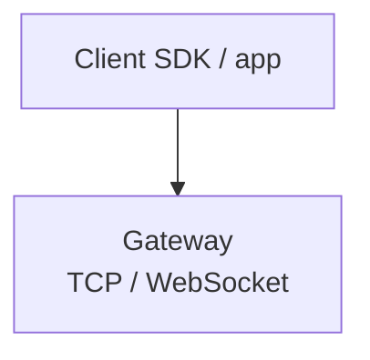
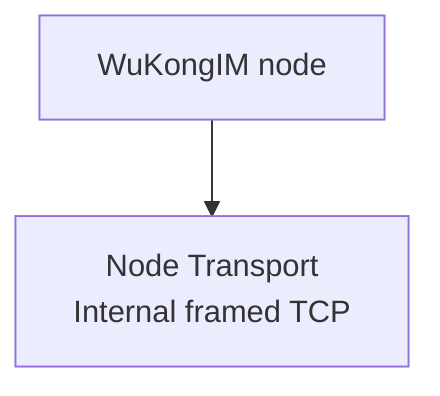
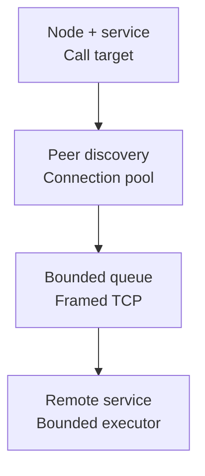

Clients use Gateway; cluster nodes use Transport. Their ports, protocols, identities and capacity limits are separate.

## Two network planes

<div className="tutorial-diagram">



</div>

<div className="tutorial-diagram">



</div>

Gateway and node Transport have separate ports, protocols, identities and capacity limits. HTTP API and Manager are additional service entries; client tokens, Manager JWTs, Join Tokens and discovery addresses serve different purposes.

<details>
  <summary>Full network-plane and protocol comparison</summary>

WuKongIM has two easily confused network boundaries. Clients enter through Gateway TCP/WebSocket, while cluster nodes use a separate node Transport for Controller, Slot, Channel, and internal RPC traffic. They have different ports, protocols, identities, and capacity limits.

| Plane | Peer | Primary protocol | Entry point |
| --- | --- | --- | --- |
| Client Gateway | SDK, Chat Demo, terminal application | WKProto over TCP/WebSocket | `pkg/gateway`, `pkg/gateway/transport/gnet` |
| Node Transport | WuKongIM nodes | framed TCP, typed RPC/notify/Raft | `pkg/transport`, `pkg/cluster/net` |

HTTP API and Manager are separate service entries again. Do not treat client tokens, Manager JWTs, Join Tokens, and node discovery addresses as one authentication mechanism.

</details>

## Node transport structure

<div className="tutorial-diagram">



</div>

`Call` uses request/response; `Send` is one-way, and Raft uses ordered lanes. Fixed service IDs select the cluster capability; generic Transport does not interpret business payloads. Delivery to a remote service does **not** prove state-machine commit.

<details>
  <summary>Full RPC, notification and ordered-lane diagram</summary>

```mermaid
flowchart TD
  Caller["Caller"] -->|Call(node, service, payload)| RPC["RPC request / response"]
  Caller -->|Send(node, service, payload)| Notify["One-way notification"]
  Caller -->|Raft / replication adapter| Lane["Ordered service lane"]
  RPC --> Pool["Peer discovery + connection pool"]
  Notify --> Pool
  Lane --> Pool
  Pool --> Scheduler["Bounded per-connection scheduler"]
  Scheduler --> TCP["Framed TCP connection"]
  TCP --> Executor["Remote service queue + bounded executor"]
```

Each frame carries kind, priority, service ID, request ID, and body length. Cluster adapters assign fixed service IDs to Controller Raft, Slot Raft, state sync, Channel replication, foreground append, online owner push, and other bounded capabilities. Generic Transport does not interpret business payloads.

</details>

## Listen and advertised addresses

`listen_addr` binds this node; `advertise_addr` or static peer addresses must be stable and reachable by other nodes. Discovery maps node IDs to bounded connection pools. Seed/static addresses aid startup; Controller snapshots provide the continuing membership view. See [Networking & Client Access](/en/server/configuration/networking).

<details>
  <summary>Full bind, advertisement and discovery rules</summary>

- `listen_addr` controls the local bind and can use `0.0.0.0` or `[::]` to accept connections.
- `advertise_addr`, or an address in the static node table, must be a stable endpoint reachable by every peer.
- Discovery resolves node IDs to remote addresses and opens a limited connection pool per peer.
- Controller mirrors, dynamic join, and early startup can use seed or static addresses, while Controller snapshots provide the continuing membership view.

Publishing a bind address produces a node that can listen locally but cannot be reached by peers. See [Networking & Client Access](/en/server/configuration/networking) for configuration details.

</details>

## Bounded queues are correctness boundaries

Frame size, queued items/bytes, batches, handler concurrency and write timeouts are bounded. Saturation returns backpressure or closes a failed connection, waking waiting RPCs.

<Callout type="warn" title="There is no infinite buffer">
  Increasing a network queue absorbs a larger burst but also raises memory and worst-case queue time. Sustained overload requires lower input, more capacity, or a fixed slow service; it must not be hidden behind an unbounded queue.
</Callout>

<details>
  <summary>Complete queue, batch and write limits</summary>

Transport limits frame body size, queued items and bytes per connection, batch frames and bytes, service queues, handler concurrency, and write timeouts. Saturation returns backpressure or closes a failed connection so waiting RPCs wake explicitly.

</details>

## Priority and ordering

Raft/control traffic keeps low wait and Raft handlers preserve order. Append concurrency and same-target Pull batches remain bounded and retain item results and fences. Priority changes scheduling, never authority checks or the outcome of a timeout.

<details>
  <summary>Full priority, batching and ordering rules</summary>

- Raft and control messages keep low wait and do not join the short coalescing window used by ordinary RPC traffic.
- Foreground Channel append services can use higher bounded concurrency while retaining payload and queue limits.
- Raft protocol services use an ordered handler lane so concurrent handlers cannot reorder peer messages.
- Channel Pull and PullHint can form small same-target batches while preserving item-aligned results and channel fences.

Priority affects scheduling only. It does not bypass authority checks or turn a timed-out request into a known non-execution.

</details>

## Failure semantics

Backpressure calls for throttling or bounded retry. RPC timeout leaves the result potentially unknown: retry only with the operation's idempotency/fence contract. Unknown services or version mismatches require compatibility checks; Slot/Channel re-resolve authority, while Transport does not guess another Leader.

<details>
  <summary>Complete failure semantics and caller actions</summary>

| Failure | Caller behavior |
| --- | --- |
| node absent from discovery | preserve route-not-ready and refresh the control view |
| dial or connection failure | reconnect inside a bounded budget and retain node/service context |
| queue backpressure | throttle or retry later without unbounded accumulation |
| RPC context timeout | outcome may be unknown; retry only operations with idempotency and fences |
| service not found or version mismatch | stop and check artifact compatibility rather than selecting an arbitrary service |
| peer closes | reader shutdown wakes pending RPCs instead of leaving them blocked |

Slot and Channel layers re-resolve Leader or epoch before deciding whether to retry. Transport does not guess a new authority node.

</details>

## Security boundary

Node Transport belongs on a controlled cluster network, with addresses supplied by trusted configuration or Controller state. The current node transport is internal framed TCP and should not be exposed directly to the internet. Crossing an untrusted network requires a reviewed private network, tunnel, or equivalent outer protection.

Browsers and clients must not access node Transport. WuKongIM HTTP API, Manager, Gateway, Operations MCP, and Debug each require separate entry and least-privilege controls; see [Security & Access](/en/server/configuration/security).

## What to observe

Observe peer connections, queue items/bytes and wait, RPC latency/timeouts, executor capacity and layered Raft/replication errors. Use [Diagnostics](/en/server/tools/diagnostics). Remote service delivery is a transport observation; state-machine commit requires separate evidence.

<details>
  <summary>Complete layered signals and diagnostic boundary</summary>

- peer connection count, reconnects, and dial failures;
- scheduler queued items and bytes, batch size, and wait;
- typed RPC latency, timeout, and result;
- service queue, running/capacity, and handler duration;
- layered Channel replication and Raft errors instead of aggregate network throughput alone.

During diagnosis, distinguish "Transport delivered to the remote service" from "the remote state machine committed." The former does not prove the latter.

</details>

## Source entry points

Continue with [Message Send Flow](/en/server/architecture/message-flow) to see foreground append and post-commit delivery cross these network boundaries.

<details>
  <summary>Implementation modules and source paths</summary>

| Goal | Entry point |
| --- | --- |
| Generic bounded node Transport | `pkg/transport` |
| Cluster typed RPC and discovery | `pkg/cluster/net` |
| Gateway client Transport | `pkg/gateway/transport` |
| Controller, Slot, and Channel adapters | `pkg/cluster/control`, `pkg/cluster`, `pkg/cluster/channels` |

</details>
