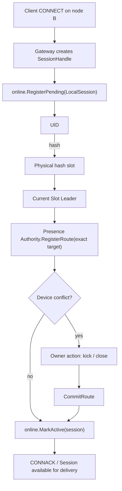

A client connection lives on the Gateway node that accepted it, while post-commit delivery can run on a different Channel Leader node. User routing locates a UID's concrete connection owner through bounded, expiring memory state and prevents old Leaders, processes, or Sessions from receiving new traffic.

## Two layers of connection state

| Layer | Stored state | Authority scope |
| --- | --- | --- |
| `internal/runtime/online` | this node's pending/active Sessions, OwnerRoutes, and concrete write/close handles | a real client connection belongs only to its owner node |
| `internal/runtime/presence` | in-memory UID to virtual owner-route directory | only physical hash slots currently led by this node |

Presence Authority does not hold concrete TCP Sessions or write online routes into Slot Raft. It is a high-frequency memory view rebuilt from Gateway activity and client reconnects.

## Connection activation



Activation registers a local pending Session before registering its route with the current UID authority. Registration failure rolls back local state. Device conflicts require acknowledged old-owner actions before the pending route can commit. The final `MarkActive` rechecks that the Session still exists, closing the race where authority accepted a route after the local connection disappeared.

## Authority target fence

Every registration, touch, lookup, and unregister carries an exact target:

```text
(HashSlot, SlotID, LeaderNodeID, LeaderTerm, ConfigEpoch)
```

The routing revision accompanies the target as freshness evidence. When a node gains authority for a physical hash slot, it installs a fresh identity. A changed Leader term or configuration epoch clears old active and pending state. A route-revision-only update under the same Raft identity can retain the directory while advancing its observed revision.

Losing authority removes all memory state for that hash slot. Old calls receive not-leader or stale-target instead of serving expired routes.

## Route identity

An online endpoint carries at least:

- `UID`, `DeviceID`, Device Flag, and Device Level;
- owner `NodeID` and process `BootID`;
- `SessionID` and listener;
- monotonic `OwnerSeq`, connection time, and last activity.

`BootID` separates processes that reuse a node ID, `SessionID` separates connections, and `OwnerSeq` prevents delayed register or touch from overwriting a newer unregister tombstone. UID plus node ID alone could deliver into a restarted or replaced connection.

## Touch and TTL

Each client Ping marks dirty activity in the owner-local registry instead of producing an authority RPC. An app worker drains a bounded set, groups by current authority target, and sends `TouchRoutes` batches. Failed routes are requeued only when the same owner route remains current.

Authority uses activity-second buckets and an expiry index, scanning only due buckets instead of every online user. TTL expiry removes an active route but preserves explicit unregister tombstones and monotonic owner sequence.

<Callout type="info" title="Online is a lease view">
  An online result means authority still sees a route under the current fence and TTL. It does not prove a recent business action or guarantee the next network write. The final owner node still validates the concrete Session.
</Callout>

## Lookup and delivery

Post-commit delivery finds recipients as follows:

1. Channel append hashes UIDs in one subscriber page across the 256 physical hash slots.
2. One route snapshot aligns UIDs with complete authority targets and groups by target.
3. `EndpointsByTargets` validates each group fence; one stale group does not erase successful siblings.
4. Returned routes coalesce by owner node into bounded local or remote push batches.
5. A remote owner-push RPC transports routes and frame only; the target owner revalidates UID, Boot ID, Session ID, and owner sequence.
6. The concrete Session writes `RECV` through an entry-independent handle and binds owner-local ACK state when required.

Only the sender's exact SEND Session is suppressed; its other devices can still receive synchronization. Duplicate recipient rows can preserve duplicate-write semantics, while endpoint lookup stays within a bounded plan.

## Device conflicts

A new connection with the same UID and Device Flag can conflict with an old route. A Master level can replace same-kind device connections, while a Slave level generally replaces only the same Device ID. Authority retains the old active route and creates a pending candidate until owner action succeeds, avoiding two advertised conflicting routes before the old connection is actually closed.

## Failure behavior

| Scenario | Behavior |
| --- | --- |
| Authority Leader changes | new authority clears and rebuilds memory routes; old targets are fenced |
| Gateway node crashes | touches stop, routes expire after TTL, and clients reconnect with new routes |
| Session closes during activation | `MarkActive` fails and queues an exact unregister |
| Unregister RPC fails temporarily | owner removes the local Session first and retries the tombstone in background |
| One authority group is stale | that group returns an error while other exact-target groups continue |
| Final Session does not match | owner-local push rejects the route without writing another connection |

Presence is in memory, so failover has a route-rebuild window. Callers must tolerate temporary unknown or offline state and recover through client reconnect plus durable message sync instead of turning online presence into a high-frequency global Raft log.

## Source entry points

| Goal | Entry point |
| --- | --- |
| Connection orchestration | `internal/usecase/presence` |
| Owner-local Sessions | `internal/runtime/online` |
| Target-fenced authority | `internal/runtime/presence` |
| Plan execution and owner push | `internal/runtime/delivery` |
| Gateway Session adapter | `internal/access/gateway`, `pkg/gateway` |

Read [Message Send Flow](/en/server/architecture/message-flow) together with this page to separate commit from delivery. For incidents, begin with [Health & Monitoring](/en/server/operations/health-and-monitoring).
