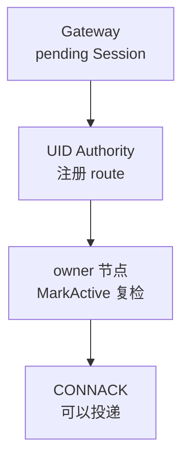
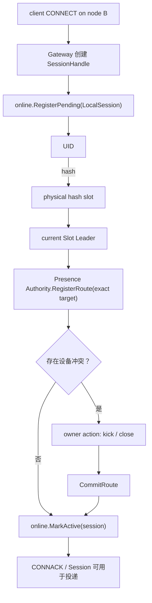
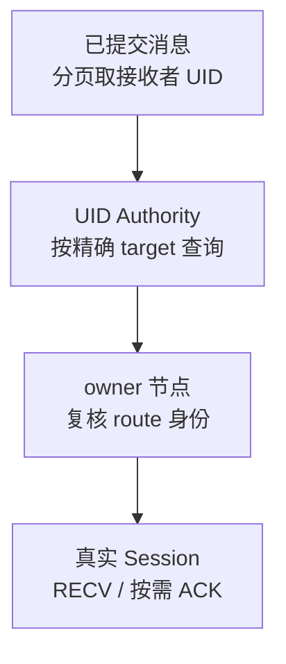
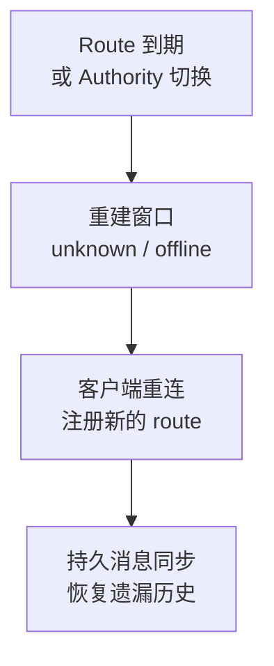

真实客户端连接只属于接入它的 Gateway owner。Presence Authority 用有界、可过期的内存目录找到连接；消息提交与在线投递是不同阶段。

## 两层连接状态

**owner 节点**持有真实 Session；**Presence Authority**保存当前领导的物理哈希槽内的 route 目录。在线路由保存在内存，由 Gateway 活动与重连重建，不写入 Slot Raft。

<details>
  <summary>完整状态归属与内存边界</summary>

客户端连接存在于接受它的 Gateway 节点，而消息提交后的投递可能发生在另一个 Channel Leader 节点。用户路由的任务是用有界、可失效的内存状态把 UID 定位到真实连接 owner，同时防止旧 Leader、旧进程或旧 Session 接收新流量。

| 层级 | 保存内容 | 权威范围 |
| --- | --- | --- |
| `internal/runtime/online` | 本节点 pending/active Session、OwnerRoute、具体写/关连接 handle | 真实客户端连接只归 owner 节点 |
| `internal/runtime/presence` | UID 到虚拟 owner routes 的内存目录 | 仅本节点当前领导的物理哈希槽 |

Presence Authority 不保存真实 TCP Session，也不把在线路由写入 Slot Raft。它是可由 Gateway 活动和用户重连重建的高频内存视图。

</details>

## 连接激活

<div className="tutorial-diagram">



</div>

先注册本地 pending Session，再注册 route；失败回滚。有设备冲突时，旧 owner action 必须确认后才提交候选 route。最后 `MarkActive` 复检真实 Session 仍存在。

<details>
  <summary>完整激活与设备冲突流程图</summary>



激活先注册本地 pending Session，再向当前 UID authority 注册 route。注册失败会回滚本地状态；有设备冲突时，旧 owner action 必须被确认，pending route 才能 commit。最后 `MarkActive` 再检查 Session 仍存在，避免 authority 已注册但本地连接已关闭的竞态。

</details>

## Authority target fence

注册、touch、查询和注销都验证精确的物理哈希槽、Slot Group、Leader、term 与配置 epoch。term/epoch 变化会清空旧状态；同一 Raft 身份仅 revision 更新可保留目录。失去 authority 后拒绝旧 target。

<details>
  <summary>精确 target 字段与新鲜度规则</summary>

每次注册、touch、查询和注销都携带精确目标：

```text
(HashSlot, SlotID, LeaderNodeID, LeaderTerm, ConfigEpoch)
```

路由快照 revision 随目标一起用于判断视图新鲜度。节点获得某个物理哈希槽 authority 时安装新的身份；Leader term 或配置 epoch 改变会清空旧 active/pending 状态。仅 route revision 更新且 Raft 身份相同，可以保留目录并推进所见 revision。

节点失去 authority 后会删除该哈希槽的完整内存状态，旧调用收到 not-leader/stale-target，而不是继续服务过期 route。

</details>

## Route 身份

`BootID` 区分进程，`SessionID` 区分连接，单调 `OwnerSeq` 防止延迟 register/touch 覆盖更新的 unregister tombstone。只用 UID + node ID 不能安全定位投递目标。

<details>
  <summary>完整 route 身份字段</summary>

一个在线端点至少包含：

- `UID`、`DeviceID`、Device Flag 与 Device Level；
- owner `NodeID` 和节点进程 `BootID`；
- `SessionID` 与 listener；
- 单调 `OwnerSeq`、连接时间和最后活动时间。

`BootID` 区分同一 node ID 的不同进程启动，`SessionID` 区分连接，`OwnerSeq` 防止延迟的 register/touch 覆盖更新的 unregister tombstone。只用 UID + node ID 定位会把消息写到已经重启或替换的连接。

</details>

## Touch 与 TTL

Ping 标记 owner-local 活动，再用有界批次续租；失败 route 仍是当前 route 才重新排队。只扫描到期 bucket，移除 active route 时保留 unregister tombstone 与单调 owner sequence。

<Callout type="info" title="在线状态是租约视图">
  在线查询表示 authority 在当前 fence 和 TTL 下仍看到 route，不表示客户端刚刚完成业务动作，也不保证下一次网络写入一定成功。最终 owner 节点仍会校验真实 Session。
</Callout>

<details>
  <summary>完整续租批次、过期索引与租约行为</summary>

每次客户端 Ping 只在 owner-local registry 标记 dirty activity，不立即产生一次 authority RPC。App worker 有界地 `DrainTouched`，按当前 authority target 分组批量 `TouchRoutes`；失败的仍然是当前 route 才会重新排队。

Authority 使用按 activity second 分桶的过期索引，只扫描到期 bucket，而不是周期性遍历所有在线用户。TTL 到期会移除 active route，但不会抹掉显式 unregister tombstone 或单调 owner sequence。

</details>

## 查询与投递

<div className="tutorial-diagram">



</div>

这是提交后的在线投递：订阅者 UID 在同一快照下经 256 个物理哈希槽定位 authority，按精确 target 查询，并形成有界 owner-node push 批次。一组 stale 不影响其他成功组。最终 owner 校验 UID、Boot ID、Session ID 与 owner sequence；发送者只跳过发起 SEND 的精确 Session，其他设备仍可同步。

<details>
  <summary>完整接收者查询、push 与 ACK 步骤</summary>

提交后投递按以下步骤找到接收者：

1. Channel append 对订阅者页中的 UID 计算 256 个物理哈希槽。
2. 在一个 route snapshot 下把 UID 对齐到完整 authority target，并按 target 分组。
3. `EndpointsByTargets` 对每组验证 fence；一组 stale 不会抹掉其他成功组。
4. 返回 routes 按 owner node 合并，形成有界本地或远端 push batch。
5. 远端 owner-push RPC 只运输 route 与 frame；目标 owner 再验证 UID、Boot ID、Session ID 和 owner sequence。
6. 真实 Session 通过 entry-agnostic handle 写入 `RECV`，需要时绑定 owner-local ACK 状态。

发送者只跳过发起 SEND 的精确 Session，其他设备仍可收到同步消息。重复 recipient rows 可以保留重复写语义，但在线 endpoint 查询会按有界计划执行。

</details>

## 设备冲突

同一 UID 与 Device Flag 下，Master 可替换同类设备，Slave 通常只替换相同 Device ID。先保留旧 active route，等旧 owner action 成功，再提交 pending candidate。

<details>
  <summary>完整设备冲突规则</summary>

相同 UID 与 Device Flag 的新连接可能与旧 route 冲突。Master 级别可以替换同类设备连接，Slave 级别通常只替换相同 Device ID。Authority 先保留旧 active route 并创建 pending candidate，直到 owner action 成功后再 commit，避免未确认踢下线就同时宣布两条冲突 route。

</details>

## 故障行为

<div className="tutorial-diagram">



</div>

Gateway 故障后停止 touch，route 在 TTL 后过期；新 authority 重建内存目录。激活时 Session 已关闭则排队精确 unregister；注销失败在本地删除后重试，最终 Session 不匹配则拒绝 push。接受重建窗口，以重连和持久消息同步恢复。

<details>
  <summary>完整故障行为与恢复限制</summary>

| 场景 | 行为 |
| --- | --- |
| Authority Leader 切换 | 新 authority 清空并重新建立内存 route；旧 target 被 fence |
| Gateway 节点宕机 | touch 停止，route 在 TTL 后过期；客户端重连建立新 route |
| 激活中 Session 关闭 | `MarkActive` 失败并排队精确 unregister |
| 注销 RPC 暂时失败 | owner 已先删除本地 Session；tombstone 后台重试 |
| 一组 authority stale | 该组返回错误，其他 exact-target 组继续 |
| 最终 Session 不匹配 | owner-local push 拒绝该 route，不写入其他连接 |

Presence 是内存状态，所以故障切换存在重新注册/续租窗口。调用方必须接受短暂 unknown/offline，并通过客户端重连和持久消息同步恢复，而不是把在线目录改成一个高频全局 Raft 日志。

</details>

## 源码入口

结合[消息发送链路](/zh/server/architecture/message-flow)理解 commit 与 delivery 的分界；实际排障从[健康检查与监控](/zh/server/operations/health-and-monitoring)开始。

<details>
  <summary>实现模块与源码路径</summary>

| 目标 | 入口 |
| --- | --- |
| 连接编排 | `internal/usecase/presence` |
| owner-local Session | `internal/runtime/online` |
| target-fenced authority | `internal/runtime/presence` |
| 计划执行与 owner push | `internal/runtime/delivery` |
| Gateway Session 适配 | `internal/access/gateway`, `pkg/gateway` |

</details>
