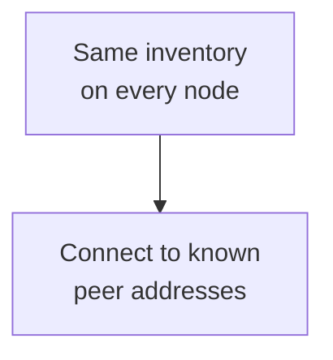
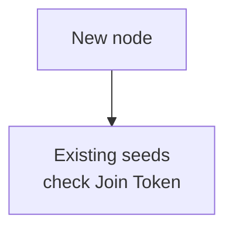
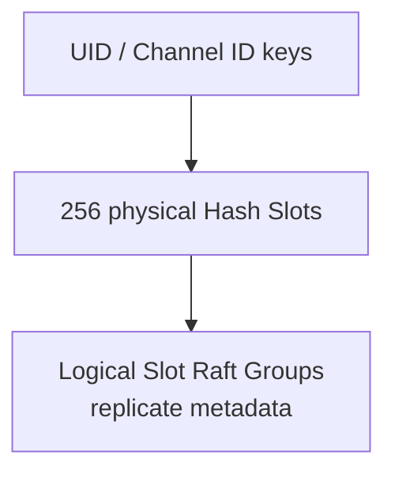

Set identity and joining first, then Slots and replicas. Every deployment follows cluster semantics, including a single-node cluster.

## Required at startup

Every topology requires these three settings:

| <span className="whitespace-nowrap">Purpose</span> | Setting and constraint |
| --- | --- |
| <span className="whitespace-nowrap">Identity</span> | `node.id`: non-zero, unique in the cluster, and stable |
| <span className="whitespace-nowrap">Disk</span> | `node.data_dir`: durable directory owned exclusively by this node |
| <span className="whitespace-nowrap">Transport</span> | `cluster.listen_addr`: local inter-node listener |

**Example scope:** `12` logical groups is a development baseline for the single-node cluster example. Physical hash slots stay at `256`.

<details>
  <summary>Complete required settings and single-node cluster TOML</summary>

Every WuKongIM deployment is a cluster. A one-process deployment is a **single-node cluster** and does not bypass cluster semantics. Establish identity and discovery before setting replicas or workload controls.

These three fields are required for every topology:

| TOML | Constraint |
| --- | --- |
| `node.id` | A non-zero, stable node ID that is unique in the cluster |
| `node.data_dir` | A durable data directory owned exclusively by this node |
| `cluster.listen_addr` | The local listener for inter-node Transport |

A minimal single-node cluster can start here:

```toml
[node]
id = 1
data_dir = "/var/lib/wukongim"

[cluster]
listen_addr = "127.0.0.1:7000"
nodes = [{ id = 1, addr = "127.0.0.1:7000" }]
initial_slot_count = 12
hash_slot_count = 256
slot_replica_n = 1
channel_replica_n = 1
```

The `initial_slot_count = 12` value is a development baseline, not a universal recommendation. The `hash_slot_count = 256` value is the stable physical hash-slot fence.

</details>

## Choose one join model

<div className="grid gap-4 sm:grid-cols-2">

<div>

### Static inventory

<div className="tutorial-diagram">



</div>

Use `cluster.nodes` when addresses are known in advance.

</div>

<div>

### Seed joining

<div className="tutorial-diagram">



</div>

Use `cluster.seeds` with a reachable `cluster.advertise_addr` and a non-empty `cluster.join_token`.

</div>

</div>

**Choose one.** Static inventory cannot mix with seed-join configuration. A listener may bind `0.0.0.0`; remote peer addresses cannot be wildcard, host-only loopback, or short-lived addresses. Replace a single-node cluster's loopback address before adding a remote node.

<details>
  <summary>Complete join fields and address constraints</summary>

| Model | Configuration | Boundary |
| --- | --- | --- |
| Static inventory | `cluster.nodes` | Node addresses are known in advance and every node uses the same inventory |
| Seed joining | `cluster.seeds`, `cluster.advertise_addr`, `cluster.join_token` | A new node joins through existing nodes and advertises an address peers can reach |

`cluster.nodes` cannot be combined with seed-join configuration. Seed joining requires an advertised address and a non-empty join token. `cluster.listen_addr` may bind `0.0.0.0`. Any `cluster.advertise_addr` or `nodes[].addr` that remote peers must reach cannot use wildcard, host-only loopback, or short-lived addresses. A single-node cluster may use `127.0.0.1`, but it must change to a remotely reachable address before adding a remote node.

</details>

## Slots and replicas

<div className="tutorial-diagram">



</div>

- Keep `hash_slot_count=256`. `initial_slot_count` creates logical groups only in the first Controller snapshot: initialization and examples use `12`; omitted or `0` uses `1`.
- Existing clusters use the persisted count. Editing configuration does not resize groups; increasing it may block readiness.
- `slot_replica_n` and `channel_replica_n` must fit available nodes. Fault tolerance requires independent machines, disks, and failure domains; processes on one host do not qualify.

After data exists, cluster ID, node IDs, hash-slot count, and replica policy require controlled changes.

<details>
  <summary>Complete Slot counts and replica boundaries</summary>

- `initial_slot_count` is the logical Slot Raft Group count created by the first Controller snapshot. `wukongim init` and shipped examples set it to `12`; omitting it or setting it to `0` still uses `1`. Existing clusters retain the persisted count; changing this setting does not resize Slots and increasing it may block readiness.
- `hash_slot_count` is the physical hash-slot fence that routes keys to logical groups; keep it at `256`.
- `slot_replica_n` and `channel_replica_n` must fit the available node count and failure-domain objective.
- Replicas provide the intended fault tolerance only when they span independent machines, disks, and failure domains. Multiple processes on one host are not independent failure domains.

After data exists, do not treat cluster ID, node IDs, hash-slot count, or replica policy as ordinary rolling settings. Joining, migration, and scaling require controlled operations.

</details>

## Tuning fields

1. Keep a measured baseline; test production-like users, message rates, channels, and 100,000-member groups.
2. Change one parameter family at a time. Some `0` values derive from hardware or topology; examples do not define every effective value.
3. Compare throughput, P99, queues, CPU, memory, disk, and network, including allocation, contention, and backpressure costs.

<details>
  <summary>Complete tuning fields and workload evidence</summary>

`channel_reactor_count`, worker pools, RPC and append batches, commit coordination, and recovery probes affect CPU, memory, allocations, contention, queueing, backpressure, and tail latency. Some zero values are derived from hardware or topology at runtime, so the example does not reveal every effective value.

Keep a measured baseline first. Test with production-like online users, message rates, channel counts, and 100,000-member groups; change one parameter family at a time and record throughput, P99, queues, CPU, memory, disk, and network together.

</details>

## Change safely

Configuration loads at startup. Hot reload requires explicit subsystem support. For each node:

1. Remove traffic and stop the node.
2. Update configuration and restart.
3. Wait for `/readyz` to return `200` with `ready: true`, restore traffic, then continue to the next node.

<details>
  <summary>Complete safe changes and reading paths</summary>

Configuration is loaded at node startup; do not assume general hot reload unless a subsystem explicitly documents it. Change cluster configuration one node at a time: remove traffic, stop the node, update configuration, start it, wait for `/readyz`, restore traffic, and only then continue.

Read [Slot Architecture](/en/server/architecture/slots) to see how 256 physical hash slots route into logical Slot Raft Groups, then continue with [Networking & Client Access](/en/server/configuration/networking) to separate listen, peer-advertised, and client-advertised addresses.

</details>

<Cards>
  <Card title="Understand Slots" description="Follow physical hash slots into logical groups." href="/en/server/architecture/slots" />
  <Card title="Check access addresses" description="Separate listen and advertised addresses." href="/en/server/configuration/networking" />
</Cards>
