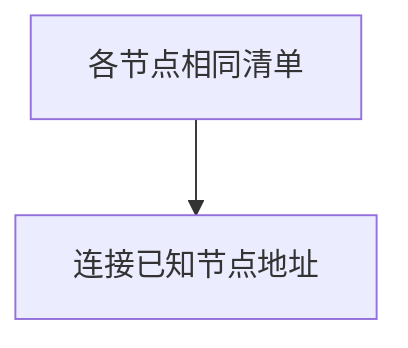
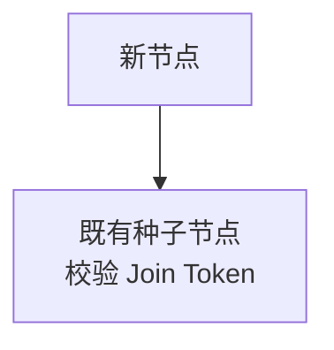
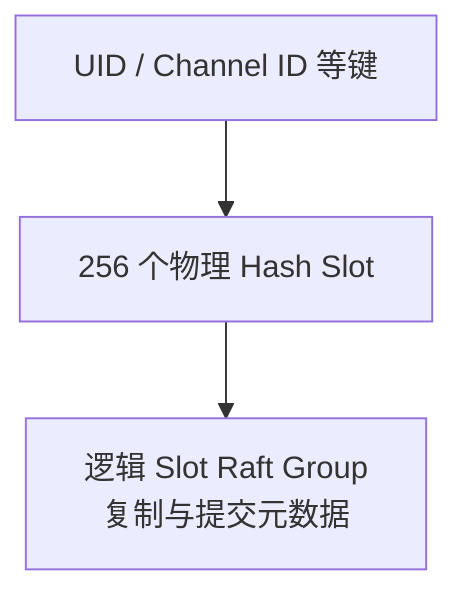

先确定身份和加入方式，再设置 Slot 与副本；每种部署都遵循集群语义，包括单节点集群。

## 启动必填项

所有拓扑都要填写以下三项：

| <span className="whitespace-nowrap">用途</span> | 配置与约束 |
| --- | --- |
| <span className="whitespace-nowrap">身份</span> | `node.id`：非零、集群内唯一，长期稳定 |
| <span className="whitespace-nowrap">磁盘</span> | `node.data_dir`：节点独占的持久目录 |
| <span className="whitespace-nowrap">互连</span> | `cluster.listen_addr`：本机 Transport 监听 |

**示例边界：** 单节点集群的逻辑组示例为 `12`，是开发基线；物理哈希槽保持 `256`。

<details>
  <summary>完整必填约束与单节点集群 TOML</summary>

WuKongIM 的每种部署都是集群：单进程部署是**单节点集群**，不会绕过集群语义。先确定节点身份和发现方式，再设置副本与工作负载参数。

以下三个字段在任何拓扑中都必须提供：

| TOML | 约束 |
| --- | --- |
| `node.id` | 集群内唯一、非零且长期稳定的节点 ID |
| `node.data_dir` | 当前节点独占的持久数据目录 |
| `cluster.listen_addr` | 节点间 Transport 的本机监听地址 |

最小单节点集群可以从这里开始：

```toml
[node]
id = 1
data_dir = "/var/lib/wukongim"

[cluster]
listen_addr = "127.0.0.1:7000"
nodes = [{ id = 1, addr = "127.0.0.1:7000" }]
initial_slot_count = 12
hash_slot_count = 256
slot_replica_n = 1
channel_replica_n = 1
```

示例中的 `initial_slot_count = 12` 是开发基线，不是所有负载的推荐值；`hash_slot_count = 256` 则是稳定的物理 Hash Slot 边界。

</details>

## 选择一种加入方式

<div className="grid gap-4 sm:grid-cols-2">

<div>

### 静态清单

<div className="tutorial-diagram">



</div>

使用 `cluster.nodes`；适合地址预先确定的集群。

</div>

<div>

### 种子加入

<div className="tutorial-diagram">



</div>

使用 `cluster.seeds`，同时提供可达的 `cluster.advertise_addr` 和非空 `cluster.join_token`。

</div>

</div>

**二选一。** 静态清单不能混用种子加入配置。监听可绑定 `0.0.0.0`；远端连接地址不能用通配、仅本机回环或短生命周期地址。增加远端节点前，更换单节点集群的回环地址。

<details>
  <summary>完整加入字段与地址限制</summary>

| 方式 | 配置 | 适用边界 |
| --- | --- | --- |
| 静态清单 | `cluster.nodes` | 节点地址预先确定，所有节点使用同一清单 |
| 种子加入 | `cluster.seeds`、`cluster.advertise_addr`、`cluster.join_token` | 新节点通过既有节点加入，广告地址必须能被其他节点访问 |

`cluster.nodes` 不能与种子加入配置组合。使用种子加入时，广告地址和非空 Join Token 是必需的。`cluster.listen_addr` 可以绑定 `0.0.0.0`；任何需要被远端节点访问的 `cluster.advertise_addr` 或 `nodes[].addr` 都不能使用通配、仅本机回环或短生命周期地址。单节点集群可以使用 `127.0.0.1`，但加入远端节点前必须改为其实际可达的地址。

</details>

## Slot 与副本

<div className="tutorial-diagram">



</div>

- `hash_slot_count` 保持 `256`。`initial_slot_count` 只在首次 Controller 快照创建逻辑组：初始化与样例为 `12`，省略或 `0` 为 `1`。
- 已有集群使用持久化组数；改配置不会扩组，调大可能阻塞就绪。
- `slot_replica_n`、`channel_replica_n` 不超过可用节点数；容错需独立机器、磁盘与故障域，同机多进程不算独立故障域。

已有数据后，集群 ID、节点 ID、Hash Slot 数和副本策略必须走受控变更。

<details>
  <summary>完整 Slot 数量与副本说明</summary>

- `initial_slot_count` 是首次 Controller 快照创建的逻辑 Slot Raft Group 数量。`wukongim init` 和随仓库提供的示例配置设为 `12`；省略或设为 `0` 时仍使用 `1`。已有集群以持久化数量为准，修改配置不会调整 Slot 数，调大还可能阻塞节点就绪。
- `hash_slot_count` 是将键路由到逻辑组的物理 Hash Slot 栅栏，保持为 `256`。
- `slot_replica_n` 与 `channel_replica_n` 必须不大于可用节点数，并与故障域目标一致。
- 多副本只有分布在独立机器、磁盘和故障域上才提供预期容错；同一主机上的多个进程不是独立故障域。

已有数据后，不要把集群 ID、节点 ID、Hash Slot 数或副本策略当作普通滚动配置。节点加入、迁移和扩缩容属于受控运维流程。

</details>

## 调优字段

1. 保留已测基线，用接近生产的用户数、消息率、频道数和十万成员群组压测。
2. 一次只改一组参数；某些 `0` 值由硬件或拓扑推导，样例不代表全部有效值。
3. 对比吞吐、P99、队列、CPU、内存、磁盘和网络，同时关注分配、锁竞争与反压。

<details>
  <summary>完整调优字段与压测依据</summary>

`channel_reactor_count`、各类 worker、RPC/append 批量、提交协调器和恢复探测字段会改变 CPU、内存、分配、锁竞争、排队、反压与尾延迟。某些 `0` 值由运行时根据硬件或拓扑推导，不能仅凭示例推断有效值。

先保留经过测试的基线，用接近生产的在线用户、消息速率、频道数和十万成员群组压测；一次只改变一组参数，并同时记录吞吐、P99、队列、CPU、内存、磁盘和网络。

</details>

## 安全变更

配置在启动时加载；热更新仅以子系统明确声明为准。逐节点执行：

1. 移出流量，停止节点。
2. 更新配置，重新启动。
3. `/readyz` 返回 `200` 且 `ready: true` 后恢复流量，再处理下一个节点。

<details>
  <summary>完整安全变更与阅读路径</summary>

配置在节点启动时加载，除明确声明的子系统外不要假设支持热更新。集群配置变更应逐节点执行：移出流量、停止节点、更新配置、启动并等待 `/readyz` 返回就绪，再恢复流量并处理下一个节点。

阅读 [Slot 架构](/zh/server/architecture/slots)，理解 256 个物理哈希槽如何路由到逻辑 Slot Raft Group；再阅读[网络与客户端接入](/zh/server/configuration/networking)，区分监听地址、节点广告地址和客户端广告地址。

</details>

<Cards>
  <Card title="理解 Slot" description="查看物理哈希槽到逻辑组的路由。" href="/zh/server/architecture/slots" />
  <Card title="核对接入地址" description="区分监听与广告地址。" href="/zh/server/configuration/networking" />
</Cards>
