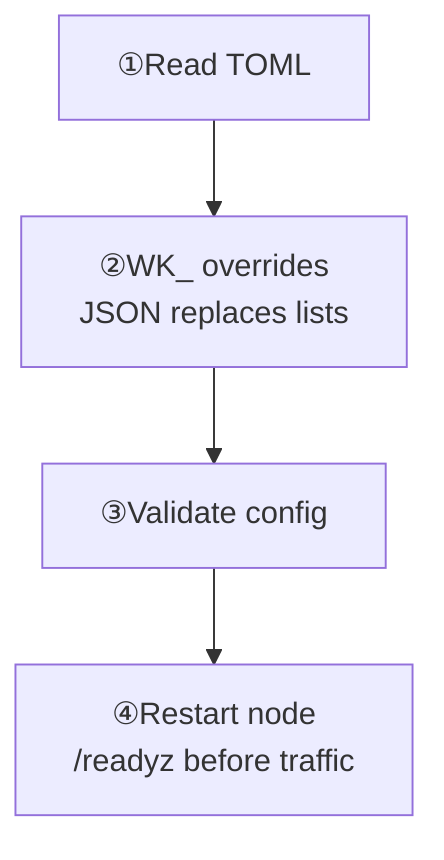

The configuration file is `wukongim.toml`. Start with [Common Configurations](/en/server/configuration/common-configurations) to choose the fields for your task.

<div className="tutorial-diagram">



</div>

## Select a configuration file

Use `-config` to select an explicit path. Otherwise, search in order and **stop at the first match**:

1. `./wukongim.toml`
2. `./conf/wukongim.toml`
3. `/etc/wukongim/wukongim.toml`

<details>
  <summary>Copy the example, start, and inspect lookup rules</summary>

WuKongIM uses TOML as its primary configuration format. Start by copying `wukongim.toml.example` from the repository root, and keep the example file as the commented reference.

An explicit path is the easiest option to reproduce:

```bash
cp wukongim.toml.example wukongim.toml
GOWORK=off go run ./cmd/wukongim -config ./wukongim.toml
```

Without `-config`, the server searches these locations in order and stops at the first match:

1. `./wukongim.toml`
2. `./conf/wukongim.toml`
3. `/etc/wukongim/wukongim.toml`

</details>

## Environment overrides

Use uppercase underscore names with the `WK_` prefix. Scalars override TOML; valid JSON lists **replace the whole list, never append**. Audit both sources and the effective value.

<details>
  <summary>Complete scalar and list override commands</summary>

Environment variables use the `WK_` prefix with uppercase underscore-separated names and override the matching file values. For example:

```bash
WK_API_LISTEN_ADDR=127.0.0.1:6001 \
WK_LOG_LEVEL=debug \
GOWORK=off go run ./cmd/wukongim -config ./wukongim.toml
```

List values must use JSON to replace the complete list; they cannot append one item:

```bash
WK_CLUSTER_NODES='[{"id":1,"addr":"127.0.0.1:7001"}]' \
GOWORK=off go run ./cmd/wukongim -config ./wukongim.toml
```

<Callout type="info" title="Replacement rule">
  An environment-supplied list replaces the whole list. Deployment tooling should write the complete target list as one valid JSON string.
</Callout>

</details>

## Configuration areas used by the quick start

<Cards>
  <Card title="Startup and nodes" description="Identity, storage, and peers." href="/en/server/configuration/common-configurations#startup" />
  <Card title="Client access" description="Listeners and token checks." href="/en/server/configuration/common-configurations#client-access" />
  <Card title="Manager" description="Private access, login, and permissions." href="/en/server/configuration/common-configurations#manager-access" />
  <Card title="Logging" description="Adjust levels for diagnosis." href="/en/server/configuration/common-configurations#logging" />
</Cards>

<details>
  <summary>All TOML sections and their responsibilities</summary>

| TOML section | Responsibility |
| --- | --- |
| `[node]` | Node ID and data directory |
| `[cluster]` | Cluster ID, node addresses, Slots, replication, and inter-node listener |
| `[api]` | HTTP API and external TCP/WebSocket addresses |
| `[manager]` | Manager listener, authentication, JWT, and administrative users |
| `[gateway]` | TCP/WebSocket listeners, CONNECT token authentication, and asynchronous queues |
| `[observability]`, `[log]` | Metrics switches and logs |
| `[diagnostics]` | Diagnostic sampling, buffering, and slow-request thresholds |

</details>

<Callout type="warn" title="CONNECT token authentication is enabled by default">
  `gateway.token_auth_on` defaults to `true`. A trusted backend first stores the token for a UID and device category through `/user/token`; later CONNECT requests must carry the exact value. Do not disable it in production merely to simplify integration. See [Security & Access](/en/server/configuration/security) for the full boundary.
</Callout>

Restart the node after changing configuration. Node IDs and advertised addresses must be unique in a multi-node cluster. `0.0.0.0` is a listen address only and must not be advertised for other nodes to connect to.

## Local security check

Examples are for development. Replace credentials, configure TLS, restrict management and diagnostics, use independent persistent disks, and validate real workloads. Wrong, missing, and revoked tokens must fail CONNECT.

**Done:** run `wukongim config validate --config <path>`, then restart using your deployment method. Admit each node only after `/readyz` returns `200` with `ready: true`, then verify business behavior.

<details>
  <summary>Full pre-production checks and domain references</summary>

The example configuration is for development only. Before production use, at minimum:

- Replace Manager accounts, JWT secrets, cluster join tokens, and other fixed capability credentials.
- Keep `gateway.token_auth_on=true`, and prove that wrong, missing, and revoked tokens cannot CONNECT.
- Restrict Manager, metrics, debug, benchmark, and diagnostic surfaces to trusted networks.
- Configure TLS and access policies for client and administrative traffic.
- Put each node's data on independent, durable, monitored storage.
- Tune queues, concurrency, retention, and capacity against real traffic, group sizes, and online-user counts.

If you are unsure which fields to change first, start with [Common Configurations](/en/server/configuration/common-configurations). Then continue through [Nodes & Cluster](/en/server/configuration/cluster), [Networking & Client Access](/en/server/configuration/networking), [Messages & Storage](/en/server/configuration/storage), [Security & Access](/en/server/configuration/security), and [Logs & Observability](/en/server/configuration/observability). See [Configuration Reference](/en/server/configuration/reference) for every public TOML and environment mapping.

</details>
