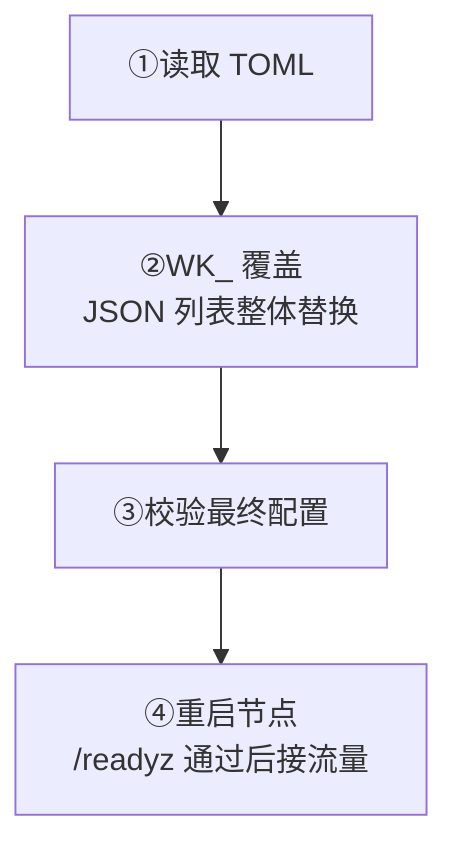

配置文件是 `wukongim.toml`。不确定先改哪些字段，从[常用配置](/zh/server/configuration/common-configurations)选择任务。

<div className="tutorial-diagram">



</div>

## 指定配置文件

推荐用 `-config` 显式指定路径。未指定时按顺序查找，**找到第一份就停止**：

1. `./wukongim.toml`
2. `./conf/wukongim.toml`
3. `/etc/wukongim/wukongim.toml`

<details>
  <summary>复制示例、启动命令与查找规则</summary>

WuKongIM 的主配置文件使用 TOML。建议从仓库根目录的 `wukongim.toml.example` 复制一份本地配置，并保持示例文件作为带注释的参考。

显式指定路径最容易复现：

```bash
cp wukongim.toml.example wukongim.toml
GOWORK=off go run ./cmd/wukongim -config ./wukongim.toml
```

未传入 `-config` 时，程序按以下顺序查找，找到第一份后停止：

1. `./wukongim.toml`
2. `./conf/wukongim.toml`
3. `/etc/wukongim/wukongim.toml`

</details>

## 环境变量覆盖

使用 `WK_` 前缀和大写下划线名称。单值覆盖对应 TOML 值；列表用合法 JSON **替换整个列表，不是追加**。审计时检查两种来源与最终值。

<details>
  <summary>单值与列表覆盖的完整命令</summary>

环境变量使用 `WK_` 前缀和大写下划线名称，并覆盖配置文件中的对应值。例如：

```bash
WK_API_LISTEN_ADDR=127.0.0.1:6001 \
WK_LOG_LEVEL=debug \
GOWORK=off go run ./cmd/wukongim -config ./wukongim.toml
```

列表值必须使用 JSON 整体替换，不能只追加一个元素：

```bash
WK_CLUSTER_NODES='[{"id":1,"addr":"127.0.0.1:7001"}]' \
GOWORK=off go run ./cmd/wukongim -config ./wukongim.toml
```

<Callout type="info" title="覆盖规则">
  环境变量中的列表会替换完整列表。部署系统生成环境变量时，应把整个目标列表作为一个合法 JSON 字符串写入。
</Callout>

</details>

## 快速开始涉及的配置领域

<Cards>
  <Card title="启动与节点" description="身份、目录和集群互连。" href="/zh/server/configuration/common-configurations#startup" />
  <Card title="客户端接入" description="监听与 Token 校验。" href="/zh/server/configuration/common-configurations#client-access" />
  <Card title="Manager" description="管理地址、登录与权限。" href="/zh/server/configuration/common-configurations#manager-access" />
  <Card title="日志" description="按需调级别，排障后恢复。" href="/zh/server/configuration/common-configurations#logging" />
</Cards>

<details>
  <summary>全部 TOML 分区与作用</summary>

| TOML 分区 | 作用 |
| --- | --- |
| `[node]` | 节点 ID 与数据目录 |
| `[cluster]` | 集群 ID、节点地址、Slot、复制和节点间监听 |
| `[api]` | HTTP API 与对外 TCP/WebSocket 地址 |
| `[manager]` | Manager 监听、认证、JWT 和管理用户 |
| `[gateway]` | TCP/WebSocket Listener、CONNECT Token 鉴权与异步队列 |
| `[observability]`、`[log]` | 指标开关与日志 |
| `[diagnostics]` | 诊断采样、缓冲和慢请求阈值 |

</details>

<Callout type="warn" title="CONNECT Token 鉴权默认开启">
  `gateway.token_auth_on` 默认为 `true`。受信后端应先通过 `/user/token` 保存 UID 与设备类别对应的 Token；后续 CONNECT 必须携带完全匹配的值。不要为方便联调而在生产关闭它，完整语义见[安全与权限](/zh/server/configuration/security)。
</Callout>

修改配置后需要重启节点。多节点集群中的节点 ID 和广告地址必须唯一；`0.0.0.0` 只能作为监听地址，不能作为其他节点连接的广告地址。

## 本地安全检查

示例只用于开发。上线前更换凭据，配置 TLS，限制管理与诊断入口；各节点使用独立持久磁盘，并按真实负载验证容量。错误、缺失、已撤销的 Token 都应无法 CONNECT。

**完成标准：** 用 `wukongim config validate --config <path>` 校验，通过后按部署方式重启。逐节点 `/readyz` 返回 `200` 且 `ready: true`，再接流量并验证业务。

<details>
  <summary>完整上线前检查与分领域参考</summary>

示例配置只用于开发。在生产使用前至少应：

- 替换 Manager 账号、JWT Secret、集群 Join Token 和其他固定能力凭据。
- 保持 `gateway.token_auth_on=true`，并验证错误、缺失、已撤销 Token 都不能 CONNECT。
- 只向受信任网络开放 Manager、指标、Debug、Benchmark 和诊断接口。
- 为客户端和管理流量配置 TLS 与访问策略。
- 把每个节点的数据放在独立、持久且可监控的存储上。
- 根据真实流量、大群规模和在线用户数校准队列、并发、保留与容量配置。

不确定先改哪些字段时，从[常用配置](/zh/server/configuration/common-configurations)开始。再按[节点与集群](/zh/server/configuration/cluster)、[网络与客户端接入](/zh/server/configuration/networking)、[消息与存储](/zh/server/configuration/storage)、[安全与权限](/zh/server/configuration/security)和[日志与可观测性](/zh/server/configuration/observability)继续配置。全部公开 TOML 与环境变量映射见[配置参考](/zh/server/configuration/reference)。

</details>
