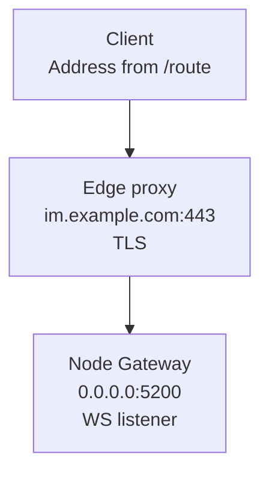

**Listen address: where this node accepts connections. Published address: where others connect.** Match domains, ports, and TLS to the actual network path.

<div className="tutorial-diagram">



</div>

This example terminates WSS at a TLS proxy and forwards WS upstream. Route the external `/ws` path correctly. The trusted backend accesses the WuKongIM HTTP API to obtain client routing.

## Traffic planes

| Who connects | Entry to use |
| --- | --- |
| Clients | Controlled TCP / WS / WSS edge; reachable from client networks |
| Business backend | WuKongIM HTTP API on a trusted network or behind external auth |
| Peer nodes | Private Transport with bidirectional reachability |
| Admins and collectors | SSH / private Manager access; metrics and diagnostics restricted |

<details>
  <summary>Complete traffic, field, and production-boundary reference</summary>

| Traffic | Primary configuration | Consumer | Production boundary |
| --- | --- | --- | --- |
| Inter-node Transport | `cluster.listen_addr`, static `nodes[].addr`, or `cluster.advertise_addr` | Other WuKongIM nodes | Restrict to the cluster network and require bidirectional reachability |
| WuKongIM HTTP API | `api.listen_addr` | Business backends, health checks, observability collectors | Place on a trusted network or behind external authentication |
| Client Gateway | `gateway.listeners` | TCP and WebSocket clients | Expose through a controlled edge and enforce connection capacity |
| Client discovery | `api.external_tcp_addr`, `external_ws_addr`, `external_wss_addr` | Callers of `/route` | Reachable from every target client network |
| Manager | `manager.listen_addr` | Administrators and automation | Loopback or management network only; use SSH tunneling or a private HTTPS proxy and keep authentication enabled |
| Prometheus | `prometheus.listen_addr` or an external service | Manager and collectors | Never expose directly to the Internet |

</details>

## Listen is not advertise

| Address purpose | Value in this example |
| --- | --- |
| Node WS listener | `0.0.0.0:5200` |
| Client WSS address | `wss://im.example.com/ws` |
| Peer address | Real private host and port; never wildcard or loopback |

Static peers use `nodes[].addr`; seed joining uses `cluster.advertise_addr`. Client fields `api.external_*` may point to a proxy; configure its reachable ports and TLS separately.

<details>
  <summary>Complete TOML example and TLS forwarding notes</summary>

`0.0.0.0` and `[::]` are useful wildcard listeners, but they are not routable peer or client destinations. Static clusters use `nodes[].addr` for peer connections; seed joining uses `cluster.advertise_addr`. Those values need stable, resolvable, reachable hosts and ports.

Client-advertised fields describe the address clients ultimately use, which may be a load balancer or edge proxy:

```toml
[api]
listen_addr = "0.0.0.0:5001"
external_tcp_addr = "im.example.com:5100"
external_wss_addr = "wss://im.example.com/ws"

[gateway]
listeners = [
  { name = "tcp", network = "tcp", address = "0.0.0.0:5100", transport = "gnet", protocol = "wkproto" },
  { name = "ws", network = "websocket", address = "0.0.0.0:5200", transport = "gnet", protocol = "wsmux" }
]
```

The names and ports are structural examples. If a load balancer, reverse proxy, or service mesh terminates TLS, still verify the external WSS address, certificate, host and path forwarding, and upstream protocol together.

</details>

## Exposure policy

<Callout type="warn" title="WuKongIM HTTP API needs an external trust boundary">
  WuKongIM HTTP API routes do not validate general business identity. Use a trusted network or external auth. Public ingress contains only required client ports and a protected API. Keep Manager auth on; use loopback, private networking, or SSH.
</Callout>

Restrict Transport, metrics, debug, benchmark, and diagnostics separately. A shared HTTP listener does not imply equal trust.

<details>
  <summary>Full exposure policy and health-check distinction</summary>

- Public ingress should contain only required client ports and a protected WuKongIM HTTP API.
- Give node Transport, Manager, `/metrics`, `/top/v1/*`, `/debug/pprof/*`, Benchmark, and diagnostics separate network policies. Sharing an HTTP listener does not give them the same trust level.
- WuKongIM HTTP API routes do not provide general business identity validation. Establish that boundary with a trusted network, API gateway, or external authentication proxy.
- Load balancers must use `/readyz` for traffic admission. `/healthz` only proves process liveness and cannot prove the node is ready to serve.

</details>

## Validate before publishing

| Check | Required result |
| --- | --- |
| Peer network | Every peer-advertised address is reachable both ways |
| Backend and client networks | Backend reaches the API; clients reach every `/route` result |
| Handshake and proxy | TCP / WS / WSS, TLS chain, host / path, and idle timeouts work |
| Unauthorized networks | Manager, metrics, debug, benchmark, and diagnostics stay unreachable |
| Each node | `/readyz` returns `200` with `ready: true` before pool admission |

`/healthz` proves only process liveness; it cannot replace readiness checks.

<details>
  <summary>Full validation steps before publishing</summary>

1. Test bidirectional Transport connections from each node to every peer-advertised address.
2. Reach the HTTP API from the business network and every `/route` result from the target client network.
3. Verify TCP, WS/WSS handshakes, the TLS chain, timeouts, and proxy idle-connection policy.
4. Confirm Manager, metrics, debug, benchmark, and diagnostic endpoints are unreachable from unauthorized networks.
5. Check `/readyz` per node and admit only nodes returning `200` with `ready: true`.

</details>

Once paths are explicit, use [Security & Access](/en/server/configuration/security) to constrain credentials and administrative surfaces.

<Cards>
  <Card title="Deploy a multi-node cluster" description="Check configuration, readiness, and ingress per node." href="/en/server/deployment/multi-node" />
  <Card title="Troubleshoot a failed connection" description="Follow symptoms to inspect routing and connectivity." href="/en/server/operations/troubleshooting" />
</Cards>
