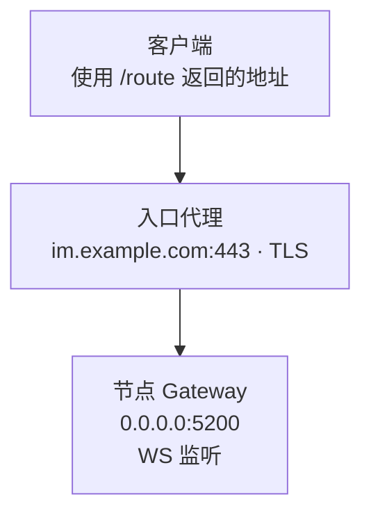

**监听地址：本机在哪接连接。对外地址：其他系统连哪里。** 域名、端口和 TLS 代理必须与实际网络路径一致。

<div className="tutorial-diagram">



</div>

图中展示 WSS 经 TLS 代理转为 WS 的例子；代理需将外部 `/ws` 路径正确转发到上游。业务后端在受信任网络访问产品 API，为客户端取得路由。

## 流量面

| 谁要连接 | 应走哪个入口 |
| --- | --- |
| 客户端 | 受控 TCP / WS / WSS 入口；地址从目标客户端网络可达 |
| 业务后端 | 受信任网络或外部鉴权代理后的产品 API |
| 其他节点 | 内网 Transport，节点间双向可达 |
| 管理与采集 | SSH / 管理内网访问 Manager；指标与诊断限制授权来源 |

<details>
  <summary>全部流量面、字段与生产边界</summary>

| 流量 | 主要配置 | 消费者 | 生产建议 |
| --- | --- | --- | --- |
| 节点间 Transport | `cluster.listen_addr`，静态 `nodes[].addr` 或 `cluster.advertise_addr` | 其他 WuKongIM 节点 | 只开放给集群网络，保证双向可达 |
| 产品 HTTP API | `api.listen_addr` | 业务后端、健康检查、观察采集 | 放在受信任网络或外部鉴权代理后 |
| 客户端 Gateway | `gateway.listeners` | TCP、WebSocket 客户端 | 通过受控入口暴露并实施连接容量限制 |
| 客户端发现地址 | `api.external_tcp_addr`、`external_ws_addr`、`external_wss_addr` | `/route` 的调用者 | 必须能从目标客户端网络访问 |
| Manager | `manager.listen_addr` | 管理员和自动化 | 仅回环或管理内网；使用 SSH 转发或内网 HTTPS 代理，保持认证开启 |
| Prometheus | `prometheus.listen_addr` 或外部服务 | Manager、采集系统 | 不直接暴露到互联网 |

</details>

## 监听不等于广告

| 地址用途 | 本例应填写 |
| --- | --- |
| 节点 WS 监听 | `0.0.0.0:5200` |
| 客户端 WSS 地址 | `wss://im.example.com/ws` |
| 节点互连地址 | 真实内网主机与端口；不能是 `0.0.0.0`、`[::]` 或回环 |

静态互连配置 `nodes[].addr`；种子加入配置 `cluster.advertise_addr`。客户端对外字段 `api.external_*` 可以指向代理，但不会替你开放端口或部署 TLS。

<details>
  <summary>完整 TOML 示例与 TLS 转发说明</summary>

`0.0.0.0` 和 `[::]` 适合监听所有接口，却不是其他节点或客户端可路由的目标。静态集群使用 `nodes[].addr` 作为节点互连地址；种子加入使用 `cluster.advertise_addr`。它们必须包含稳定、可解析、可达的主机与端口。

客户端广告字段描述客户端最终连接的位置，可以是负载均衡器或边缘代理地址：

```toml
[api]
listen_addr = "0.0.0.0:5001"
external_tcp_addr = "im.example.com:5100"
external_wss_addr = "wss://im.example.com/ws"

[gateway]
listeners = [
  { name = "tcp", network = "tcp", address = "0.0.0.0:5100", transport = "gnet", protocol = "wkproto" },
  { name = "ws", network = "websocket", address = "0.0.0.0:5200", transport = "gnet", protocol = "wsmux" }
]
```

这里的域名和端口只是结构示例。若 TLS 在负载均衡器、反向代理或 Service Mesh 终止，仍需验证外部 WSS 地址、证书、Host/路径转发和上游协议一致。

</details>

## 暴露策略

<Callout type="warn" title="产品 API 需要外部信任边界">
  产品 HTTP API 不提供通用业务身份校验。使用受信任网络或外部鉴权代理；公网只开放所需客户端端口与受保护 API。Manager 保持认证，仅通过回环、管理内网或 SSH 访问。
</Callout>

Transport、指标、Debug、Benchmark 与诊断端点各自限制网络来源；共用 HTTP 监听不代表拥有相同权限。

<details>
  <summary>完整暴露策略与健康检查区别</summary>

- 公网入口只应包含业务需要的客户端端口和经过保护的产品 API。
- 节点 Transport、Manager、`/metrics`、`/top/v1/*`、`/debug/pprof/*`、Benchmark 与诊断能力分别设置网络策略，不要因共用 HTTP Listener 就赋予相同信任。
- WuKongIM 的产品 HTTP API 不提供通用业务身份校验；应由受信任网络、API Gateway 或外部鉴权代理建立安全边界。
- 负载均衡器用 `/readyz` 决定流量准入。`/healthz` 只说明进程存活，不能证明节点已经具备服务条件。

</details>

## 发布前验证

| 验证动作 | 必须看到的结果 |
| --- | --- |
| 节点互连 | 所有节点的广告地址双向可达 |
| 业务与客户端网络 | 后端能访问 API；客户端能访问每个 `/route` 结果 |
| 握手与代理 | TCP / WS / WSS、TLS 链、Host / 路径和空闲超时正确 |
| 非授权网络 | 无法访问 Manager、指标、Debug、Benchmark 与诊断端点 |
| 逐节点就绪 | `/readyz` 返回 `200` 且 `ready: true`，再加入后端池 |

`/healthz` 只说明进程存活，不能代替就绪验收。

<details>
  <summary>完整发布前验证步骤</summary>

1. 从每个节点测试到所有节点广告地址的双向 Transport 连接。
2. 从业务网络访问 HTTP API，从目标客户端网络访问 `/route` 返回的每个地址。
3. 验证 TCP、WS/WSS 握手、TLS 链、超时和代理空闲连接策略。
4. 确认 Manager、指标、Debug、Benchmark 和诊断端点无法从非授权网络访问。
5. 对每个节点单独检查 `/readyz`，只把返回 `200` 且 `ready: true` 的节点加入后端池。

</details>

网络路径明确后，再按[安全与权限](/zh/server/configuration/security)收紧凭据和管理面。

<Cards>
  <Card title="部署多节点集群" description="按节点检查配置、就绪与入口。" href="/zh/server/deployment/multi-node" />
  <Card title="连接失败时排查" description="根据症状检查路由和连接。" href="/zh/server/operations/troubleshooting" />
</Cards>
