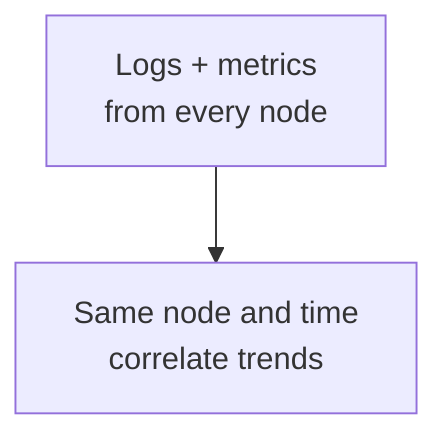
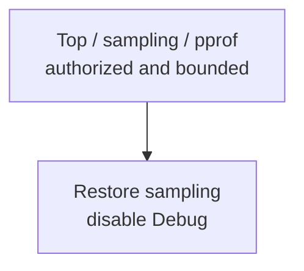

Establish node, time, and resource baselines first; add diagnostics with expiry and capture limits when needed.

## Capability layers

<div className="grid gap-4 sm:grid-cols-2">

<div>

### Baseline monitoring

<div className="tutorial-diagram">



</div>

Collect continuously with bounded retention; expose metrics only to collector networks.

</div>

<div>

### Temporary diagnostics

<div className="tutorial-diagram">



</div>

Use administrative networks and raise cost gradually. pprof is off by default.

</div>

</div>

**Acceptance:** correlate logs and metrics by node and time. Collection success does not prove readiness; traffic admission still checks every node's `/readyz` for `200` with `ready: true`.

<details>
  <summary>Complete capabilities, sections, and exposure boundaries</summary>

Build a baseline that can answer which node, when, and which resource or queue changed before enabling expensive diagnostics. Observability consumes CPU, memory, disk, and network, and may expose topology or request information.

| Capability | Section | Purpose | Exposure boundary |
| --- | --- | --- | --- |
| Logs | `[log]` | Level, format, console, and rolling files | Central collection with bounded retention and reads |
| Prometheus metrics | `[observability]` | Controls whether `/metrics` is available | Collector network only, never public Internet |
| Prometheus service | `[prometheus]` | Optional app-managed child process or an external query address | Plan ownership and capacity separately from the node |
| Top | `[top]` | Real-time node snapshots with bounded history | Administrative network and restricted callers |
| Diagnostic sampling | `[diagnostics]` | Buffer, normal/error/deep sampling, and slow thresholds | Raise gradually with cost and expiry controls |
| Debug/pprof | `observability.debug_api_enable` | Expensive process diagnostics | Off by default and temporarily exposed only to authorized operators |

</details>

## Logs

Use parseable logs with node identity and time, collected centrally. Bound disk use with `log.max_size`, `max_age`, `max_backups`, and `compress`, and alert on log storage.

Before temporary `debug` logging, assess volume, sensitive data, and performance. Restore the level afterward; record who changed it, the time window, and incident.

<details>
  <summary>Complete log retention and diagnostic records</summary>

Production logs should use a parseable format, carry node identity and time, and be collected centrally. `log.max_size`, `max_age`, `max_backups`, and `compress` bound local use together. Alert on the log directory anyway so logs cannot crowd out message data.

Before raising the level to `debug`, evaluate write volume, sensitive data, and performance cost. Restore the original level afterward and retain who changed it, the time window, and the related incident.

</details>

## Metrics and Prometheus

Set `observability.metrics_enable=true` for node metrics and keep `observability.debug_api_enable=false`.

- **Existing Prometheus:** `prometheus.enable=false`; Manager queries the external service through `prometheus.query_base_url`.
- **App-managed:** `prometheus.enable=true` starts a child process. Define ownership, TSDB, retention, scrape interval, and availability.

Example `127.0.0.1:9099` is for development; it does not define production listening or retention policy.

<details>
  <summary>Complete metrics TOML and Prometheus ownership</summary>

Enable node metrics with:

```toml
[observability]
metrics_enable = true
debug_api_enable = false
```

`prometheus.enable = true` starts an app-managed Prometheus child process. If an external Prometheus already exists, keep it `false` and use `prometheus.query_base_url` for Manager queries. Do not treat both modes as the same ownership model.

The repository example reserves `127.0.0.1:9099` for local app-managed Prometheus to avoid common port conflicts. It is a development example, not a production listener or retention policy. The observability owner must define production scrape targets, TSDB directory, time and size retention, interval, and availability.

Load balancers still use `/readyz` for admission. Metrics and logs explain why a node is not ready; they do not replace the readiness gate.

</details>

## Top, diagnostics, and Debug

Start with Top and low-cost sampling. Bound intervals, history, buffers, and sampling rates. At high traffic and with 100,000-member groups, excessive sampling raises CPU, memory, and contention.

pprof requires `debug_api_enable=true`: authorize operators, restrict sources, record start/end times, bound captures, and disable it afterward. Treat artifacts as internal sensitive data even after redaction.

<details>
  <summary>Complete Top, sampling, and Debug costs</summary>

Top collection interval and history window create sampling and memory cost. Start diagnostic `buffer_size`, rates, slow thresholds, deep sampling, and debug matches at low cost. At high traffic and with 100,000-member groups, excessive sampling can amplify CPU, memory, and contention.

pprof is available only with `debug_api_enable = true`. During temporary access, restrict sources, record start and end times, bound captures, and disable it afterward. Treat diagnostic artifacts as internal sensitive data even after configured fields are redacted.

</details>

## Minimum production evidence

- Establish per-node resource, request-latency, queue, and error baselines.
- Assign owners and alerts for readiness failure, disk pressure, sustained backlog, and critical errors.
- Collector failure cannot block messaging. Load-test retention and sampling costs; one peak does not establish sustained capacity.

<details>
  <summary>Complete production evidence and alert checklist</summary>

- Logs, metrics, and identity labels correlate for every node.
- CPU, memory, file descriptors, goroutines, disk, network, request latency, queues, and errors have baselines.
- `/readyz` failure, disk pressure, sustained queue backlog, and critical errors have alerts and owners.
- Collector failure cannot block the message path.
- Retention and sampling costs are load-tested; one peak result is not sustainable capacity evidence.

Continue with [Health & Monitoring](/en/server/operations/health-and-monitoring) to establish alert boundaries.

</details>

<Cards>
  <Card title="Verify monitoring" description="Check per-node readiness, collection, and alerts." href="/en/server/operations/health-and-monitoring" />
  <Card title="Continue diagnosis" description="Choose bounded evidence for an exact question." href="/en/server/tools/diagnostics" />
</Cards>
