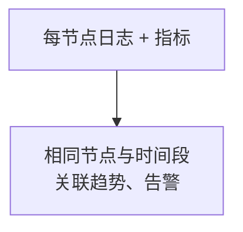
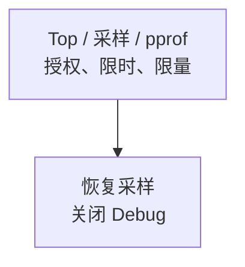

先建立节点、时间与资源基线，遇到问题再增加有期限、有上限的诊断。

## 能力分层

<div className="grid gap-4 sm:grid-cols-2">

<div>

### 基础监控

<div className="tutorial-diagram">



</div>

持续采集并限制保留；指标只开放给采集网络。

</div>

<div>

### 临时诊断

<div className="tutorial-diagram">



</div>

使用管理网络，按成本提升；pprof 默认关闭。

</div>

</div>

**验收：** 日志与指标能按节点、时间关联。采集成功不代表就绪；业务准入仍检查每个节点 `/readyz` 的 `200` 与 `ready: true`。

<details>
  <summary>完整能力、配置分区与暴露边界</summary>

先建立能回答“哪个节点、何时、哪个资源或队列发生变化”的基础观察面，再增加高成本诊断。观察能力本身也消耗 CPU、内存、磁盘与网络，并可能暴露拓扑或请求信息。

| 能力 | 配置分区 | 作用 | 暴露边界 |
| --- | --- | --- | --- |
| 日志 | `[log]` | 级别、格式、控制台、滚动文件 | 集中采集，限制保留和读取 |
| Prometheus 指标 | `[observability]` | 控制 `/metrics` 是否可用 | 仅采集网络，不对公网开放 |
| Prometheus 服务 | `[prometheus]` | 可选应用托管子进程或外部查询地址 | 与节点生命周期和容量分开规划 |
| Top | `[top]` | 有界历史的实时节点快照 | 管理网络，限制调用方 |
| 诊断采样 | `[diagnostics]` | 缓冲、普通/错误/深度采样与慢阈值 | 按成本逐步提升并设置到期时间 |
| Debug/pprof | `observability.debug_api_enable` | 高成本进程诊断 | 默认关闭，只临时开放给授权人员 |

</details>

## 日志

生产使用可解析格式、节点身份与时间，集中采集。用 `log.max_size`、`max_age`、`max_backups`、`compress` 限制占用，并对日志磁盘告警。

临时提高到 `debug` 前评估写入量、敏感信息与性能；结束后恢复级别，记录变更人、时间和事件。

<details>
  <summary>完整日志保留与诊断记录</summary>

生产日志应使用可解析格式，包含节点身份和时间，并集中采集。`log.max_size`、`max_age`、`max_backups` 与 `compress` 共同限制本地占用；仍需为日志目录设置磁盘告警，避免日志与消息数据相互挤压。

提高到 `debug` 前评估写入量、敏感信息和性能成本。完成诊断后恢复原级别，并保留变更人、时间范围和关联事件。

</details>

## 指标与 Prometheus

节点指标设 `observability.metrics_enable=true`；`observability.debug_api_enable=false` 保持关闭。

- **已有 Prometheus：** `prometheus.enable=false`，Manager 用 `prometheus.query_base_url` 查询外部服务。
- **应用托管：** `prometheus.enable=true` 会启动子进程；明确负责人、TSDB、保留、抓取间隔与高可用。

样例 `127.0.0.1:9099` 用于开发，不能当作生产监听或保留策略。

<details>
  <summary>完整指标 TOML 与 Prometheus 所有权</summary>

启用节点指标：

```toml
[observability]
metrics_enable = true
debug_api_enable = false
```

`prometheus.enable = true` 会启动应用托管的 Prometheus 子进程；已有独立 Prometheus 时保持为 `false`，使用 `prometheus.query_base_url` 让 Manager 查询外部服务。不要同时把两种模式当成同一个所有权模型。

仓库示例为本地应用托管模式预留 `127.0.0.1:9099`，只是避免常见端口冲突的开发样例，不是生产监听或保留策略。生产采集目标、TSDB 目录、保留时间/容量、抓取间隔和高可用由观察平台负责人确定。

负载均衡器继续使用 `/readyz` 进行准入；`/metrics` 和日志用于解释为何未就绪，但不能代替就绪门槛。

</details>

## Top、诊断与 Debug

先用 Top 与低成本采样；限制采集间隔、历史窗口、缓冲和采样率。高流量与十万成员群组下，过量采样会增加 CPU、内存与锁竞争。

pprof 仅在 `debug_api_enable=true` 时开放：授权并限制来源，记录开始 / 结束时间，设置抓取上限，完成后关闭。即使脱敏，制品仍按内部敏感数据处理。

<details>
  <summary>完整 Top、采样与 Debug 成本</summary>

Top 的采集间隔和历史窗口形成内存与采样成本。诊断的 `buffer_size`、采样率、慢阈值、深度采样与调试匹配项需要从低成本开始；大流量和十万成员群组下，过高采样可能放大 CPU、内存与锁竞争。

pprof 仅在 `debug_api_enable = true` 时开放。临时开启时应限制来源、记录开始/结束时间、设置抓取上限，并在完成后关闭。诊断制品即使经过字段脱敏，也应按内部敏感数据存储和共享。

</details>

## 最小生产验证

- 每节点建立资源、请求延迟、队列与错误基线。
- 就绪失败、磁盘压力、持续积压与关键错误有告警和负责人。
- 采集系统故障不阻塞消息主路径；保留与采样成本经过压测，一次峰值不代表持续容量。

<details>
  <summary>完整生产证据与告警清单</summary>

- 每个节点的日志、指标和身份标签可以关联；
- CPU、内存、FD、Goroutine、磁盘、网络、请求延迟、队列和错误有基线；
- `/readyz` 失败、磁盘压力、持续队列积压和关键错误存在告警与负责人；
- 采集系统故障不会阻塞消息主路径；
- 保留和采样成本经过压测，不把一次峰值结果当作持续容量。

继续阅读[健康检查与监控](/zh/server/operations/health-and-monitoring)建立告警边界。

</details>

<Cards>
  <Card title="验证监控" description="检查逐节点就绪、采集与告警。" href="/zh/server/operations/health-and-monitoring" />
  <Card title="继续诊断" description="按精确问题选择有界证据。" href="/zh/server/tools/diagnostics" />
</Cards>
