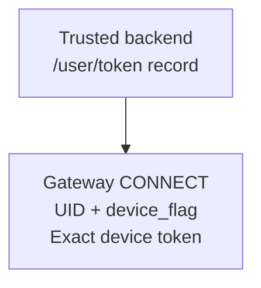
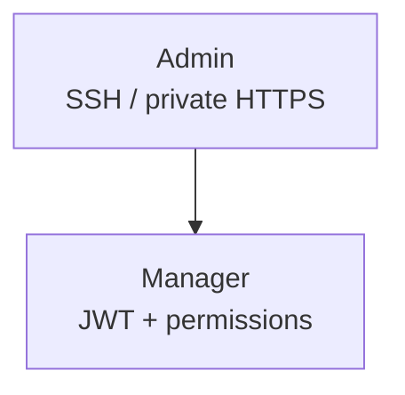
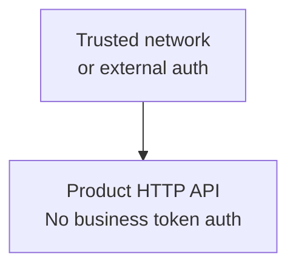

Separate three entries: CONNECT uses device tokens, Manager uses its own JWT, and Product HTTP relies on trusted networking or external business auth.

## Values to protect

Replace example users, JWT secrets, and join tokens. Inject from a secret system and restrict reads; redaction does not replace log review or least privilege.

<details>
  <summary>Complete credentials, risks, and handling</summary>

Configuration security starts with who can reach each traffic plane, not merely with moving passwords into environment variables. Give clients, product APIs, node Transport, Manager, and observability separate trust boundaries.

| Configuration | Risk | Production handling |
| --- | --- | --- |
| `gateway.token_auth_on` | Disabling it bypasses CONNECT device-token validation | Keep the default `true`; disable only for a time-bounded compatibility migration with rollback |
| `cluster.join_token` | Grants seed-join capability | Inject from a secret system, restrict reads, and support rotation |
| `manager.jwt_secret` | Signs Manager sessions | Use an independent high-entropy secret and audit rotation |
| `manager.users` | Administrative accounts, passwords, and permissions | Remove example users and grant least privilege |
| `bench.api_token` | Authorizes a high-load benchmark API | Disable by default; require a capability token whenever remotely reachable |
| External URLs and match configuration | May reveal internal topology or diagnostic targets | Treat as sensitive in diagnostic artifacts and support bundles |

The startup snapshot redacts fields declared sensitive, and diagnostic output also redacts diagnostic-sensitive fields. This does not replace log review, a secret store, or least-read permissions.

</details>

## Client CONNECT token authentication

<div className="tutorial-diagram">



</div>

<Callout type="warn" title="Enabled by default; keep it enabled for new deployments">
  `gateway.token_auth_on` defaults to `true`. Gateway reads the device record persisted by `/user/token` for the same `UID + device_flag` and compares the token exactly. An empty token, missing or cleared record, or mismatch returns `ReasonAuthFail`; after a match, the Session adopts the stored Device Level.
</Callout>

**Verify:** the startup snapshot shows `gateway.token_auth_on=true`; `WK_GATEWAY_TOKEN_AUTH_ON` overrides TOML. Valid device tokens pass this check; wrong, missing, or revoked tokens return `ReasonAuthFail`. This switch does not protect Product HTTP.

<details>
  <summary>Explicit TOML, environment override, and migration constraints</summary>

Keep the secure default explicit in deployment configuration so upgrades and environment differences are unambiguous:

```toml
[gateway]
token_auth_on = true
```

The equivalent environment variable is `WK_GATEWAY_TOKEN_AUTH_ON=true`, and it overrides TOML. Audit the effective value in the startup configuration snapshot. Setting it to `false` lets new CONNECT requests bypass this device-token check and is only for a time-bounded compatibility migration with a rollback plan; it does not add authentication to Product HTTP.

</details>

## Manager and product APIs

<div className="grid gap-4 sm:grid-cols-2">

<div>

### Manager

<div className="tutorial-diagram">



</div>

Enable `manager.auth_on`, replace JWT secrets and users, and grant only needed resources/actions. Use loopback SSH or private/VPN HTTPS. Restrict node `5301` and proxy upstream sources; never public access or production wildcard grants.

</div>

<div>

### Product API

<div className="tutorial-diagram">



</div>

**No general business token validation.** Manager login does not protect Product HTTP; use trusted networking or an external proxy with business identity checks.

</div>

</div>

<details>
  <summary>Full Manager permissions and Product API boundaries</summary>

Enable `manager.auth_on` in production and replace example JWT secrets and users. Access Manager through an SSH tunnel to loopback, or an HTTPS proxy on a management network/VPN. Do not expose node port `5301` publicly; restrict sources on the proxy-to-node path too. Grant only required resources and actions; the example global wildcard is not a production baseline. See [Manager](/en/server/operations/manager) for access steps.

WuKongIM product HTTP routes do not provide general business token validation. Manager authentication does not protect the product API. Put business routes on a trusted network or behind an API gateway, reverse proxy, and business identity check.

</details>

## TLS and endpoint exposure

Match TCP/TLS and WS/WSS addresses to certificates; protect proxy-to-node links. Disable unused Benchmark and Debug. Restrict metrics, Top, diagnostics, pprof, and Transport separately, with authorization and access expiry.

<details>
  <summary>Complete TLS and endpoint-exposure notes</summary>

Production TLS is commonly terminated by a load balancer, reverse proxy, or service mesh. Verify that client TCP/TLS and WS/WSS addresses match certificates, and protect the upstream link from the proxy to each node.

Disable unused Benchmark and Debug capabilities. `/metrics`, Top, diagnostics, pprof, Manager, and node Transport need their own network policy, authorization, audit, and temporary-access expiry even when they share a host.

</details>

## TOML, environment, and validation

Unknown TOML paths or `WK_*` fail startup. Environment values override TOML; JSON replaces whole lists. Audit both sources. Never commit real secrets; environment variables are only an injection channel.

<details>
  <summary>Full secret-storage and configuration-validation boundaries</summary>

- TOML files and deployment templates may enter artifacts, backups, or code review; never commit real secrets.
- Environment variables may appear in process inspection, crash reports, or a platform control plane. Treat them as an injection channel, not a complete secret-management system.
- Unknown TOML paths and unknown `WK_*` environment variables fail startup, preventing misspellings from silently doing nothing.
- Environment values override TOML. List values are JSON and replace the complete list, so deployment audits must inspect both sources.

</details>

## Rotation

Check what the field affects and whether it explicitly supports old/new overlap. Otherwise, plan per-node restarts with interruption and rollback.

**Verify:** each node returns `200` with `ready: true` from `/readyz`; peer connections, Manager login, messaging, and collection pass before restoring traffic.

<details>
  <summary>Full rotation process and implementation ownership</summary>

Before rotation, determine whether a field affects peer trust, sessions, or external clients. Prepare an overlap window that accepts old and new values, or schedule a controlled rolling restart with an explicit interruption and rollback. Wait for `/readyz` before returning each node to traffic, then verify peer connections, Manager login, product messaging, and observability collection.

See [Configuration Reference](/en/server/configuration/reference) for redaction flags. Secret distribution, certificates, and firewall implementation remain responsibilities of the deployment platform.

</details>

<Cards>
  <Card title="Open Manager" description="Verify login and permissions." href="/en/server/operations/manager" />
  <Card title="Check network access" description="Test TLS and ingress from target networks." href="/en/server/configuration/networking" />
</Cards>
