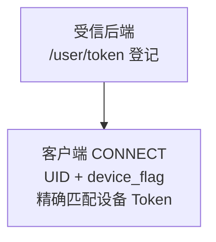
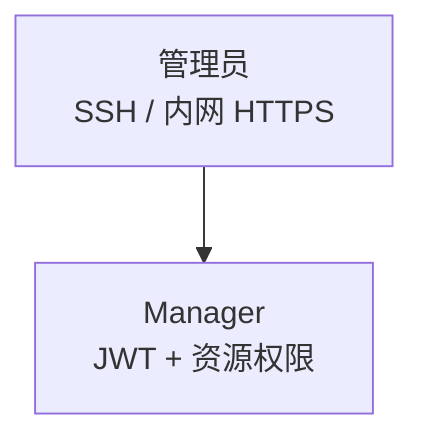
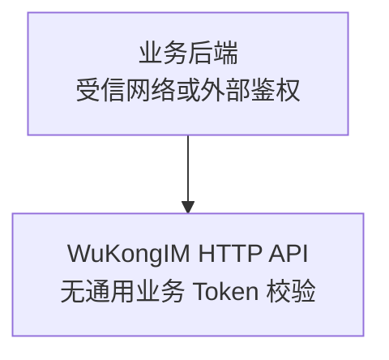

先区分三个入口：客户端 CONNECT 用设备 Token，Manager 用独立 JWT，WuKongIM HTTP API 依赖受信任网络或外部业务鉴权。

## 需要保护的值

更换示例账号、JWT 密钥和 Join Token；从秘密系统注入并限制读取。脱敏不能代替日志审查、秘密存储与最小权限。

<details>
  <summary>完整凭据、风险与处理方式</summary>

配置安全从“谁能连接哪一个流量面”开始，而不只是把密码放进环境变量。为客户端、WuKongIM HTTP API、节点 Transport、Manager 和观察面分别建立信任边界。

| 配置 | 风险 | 生产处理 |
| --- | --- | --- |
| `gateway.token_auth_on` | 关闭后跳过 CONNECT 设备 Token 校验 | 保持默认 `true`；仅在有期限、有回滚的兼容迁移中临时关闭 |
| `cluster.join_token` | 赋予种子加入能力 | 从秘密系统注入，限制读取并可轮换 |
| `manager.jwt_secret` | 签发或伪造 Manager 会话 | 使用高熵独立秘密，审计轮换 |
| `manager.users` | 管理账号、密码和权限 | 移除示例账号，按最小权限分配 |
| `bench.api_token` | 调用高负载 Benchmark API | 默认禁用；远程可达时必须设置能力 Token |
| 外部 URL 与匹配配置 | 可能泄露内部拓扑或诊断目标 | 诊断制品和支持包中按敏感信息处理 |

启动配置快照会对声明为敏感的字段进行脱敏，诊断输出还会脱敏诊断敏感字段，但这不能替代日志审查、秘密存储和最小读取权限。

</details>

## 客户端 CONNECT Token 鉴权

<div className="tutorial-diagram">



</div>

<Callout type="warn" title="默认开启，不要在新部署中关闭">
  `gateway.token_auth_on` 默认为 `true`。Gateway 会按 `UID + device_flag` 读取 `/user/token` 持久化的设备记录并精确比较 Token；Token 为空、记录不存在、已被清空或不匹配时返回 `ReasonAuthFail`。匹配成功后，Session 使用该记录保存的 Device Level。
</Callout>

**验收：** 检查启动快照中 `gateway.token_auth_on=true`；`WK_GATEWAY_TOKEN_AUTH_ON` 会覆盖 TOML。正确设备 Token 通过此项校验，错误、缺失或已撤销的 Token 返回 `ReasonAuthFail`。此开关不保护 WuKongIM HTTP API。

<details>
  <summary>显式 TOML、环境变量与迁移限制</summary>

建议在配置中显式保留安全默认值，避免升级或环境差异造成误解：

```toml
[gateway]
token_auth_on = true
```

等价环境变量为 `WK_GATEWAY_TOKEN_AUTH_ON=true`，并会覆盖 TOML。部署审计应检查启动配置快照中的最终值。设为 `false` 会让新 CONNECT 绕过这项设备 Token 校验，只应用于有明确截止时间和回滚方案的兼容迁移；它不会为 WuKongIM HTTP API 增加鉴权。

</details>

## 管理面与 WuKongIM HTTP API

<div className="grid gap-4 sm:grid-cols-2">

<div>

### Manager

<div className="tutorial-diagram">



</div>

启用 `manager.auth_on`，更换 JWT 和账号，仅授予所需资源与动作。使用回环 SSH、管理内网或 VPN HTTPS；节点 `5301` 和代理上游限制来源，禁止公网访问。全局通配权限不是生产基线。

</div>

<div>

### WuKongIM HTTP API

<div className="tutorial-diagram">



</div>

**不提供通用业务 Token 校验。** Manager 登录不会保护 WuKongIM HTTP API；业务 API 放在受信任网络或带业务身份校验的外部代理后。

</div>

</div>

<details>
  <summary>完整 Manager 权限与 WuKongIM HTTP API 边界</summary>

生产环境启用 `manager.auth_on`，替换示例 JWT Secret 和账号。Manager 仅通过回环地址上的 SSH 转发，或管理内网/VPN 中的 HTTPS 代理访问；节点 `5301` 不直接暴露公网，代理到节点的链路也应限制来源。权限条目只授予所需资源和动作，不使用示例中的全局通配权限作为生产基线。操作步骤见 [Manager 管理后台](/zh/server/operations/manager)。

WuKongIM HTTP API 路由不提供通用业务 Token 校验。不要因为 Manager 已启用认证就认为 WuKongIM HTTP API 同样受保护；业务 API 应位于受信任网络，或置于 API Gateway、反向代理和业务身份校验之后。

</details>

## TLS 与端点暴露

验证 TCP/TLS、WS/WSS 地址与证书匹配，并保护代理到节点的链路。不用的 Benchmark、Debug 默认关闭；指标、Top、诊断、pprof 和 Transport 单独限制来源、授权与开放期限。

<details>
  <summary>完整 TLS 与端点暴露说明</summary>

生产 TLS 通常由负载均衡器、反向代理或 Service Mesh 终止。验证客户端使用的 TCP/TLS、WS/WSS 地址与证书匹配，并保护代理到节点的上游链路。

默认关闭不需要的 Benchmark 与 Debug 能力。`/metrics`、Top、诊断、pprof、Manager 和节点 Transport 即使共享主机，也应使用独立的网络策略、授权、审计和临时开放期限。

</details>

## TOML、环境变量与验证

未知 TOML 路径或 `WK_*` 会让启动失败。环境变量覆盖 TOML，JSON 列表整体替换；同时审计两种来源。真实秘密不入库，环境变量只是注入渠道。

<details>
  <summary>完整秘密存储与配置验证边界</summary>

- TOML 文件和部署模板可能进入制品、备份或代码评审；不要提交真实秘密。
- 环境变量也可能出现在进程检查、崩溃报告或平台控制面；只把它作为注入通道，不把它当作完整秘密管理方案。
- 未知 TOML 路径和未知 `WK_*` 环境变量会导致启动失败，这能防止拼写错误静默失效。
- 环境变量覆盖 TOML；列表值使用 JSON，并替换整个列表。部署审计必须同时检查两种来源。

</details>

## 轮换过程

先确认字段影响，以及是否明确支持新旧值并行；没有明确支持时，安排有中断与回滚的逐节点重启。

**验收：** 每个节点 `/readyz` 返回 `200` 且 `ready: true`；节点互连、Manager 登录、消息收发和观察采集通过，再恢复流量。

<details>
  <summary>完整轮换过程与实施职责</summary>

轮换前确认字段是否影响节点互信、会话或外部客户端。准备同时接受新旧值的阶段，或安排有明确中断和回滚的逐节点重启。每个节点重新加入流量前等待 `/readyz`，并验证节点互连、Manager 登录、产品消息和观察采集。

字段对应的脱敏标记见[配置参考](/zh/server/configuration/reference)。完整的密钥分发、证书和防火墙实施属于部署平台职责。

</details>

<Cards>
  <Card title="打开 Manager" description="按登录与权限步骤验证。" href="/zh/server/operations/manager" />
  <Card title="核对网络接入" description="从目标网络验证 TLS 与入口。" href="/zh/server/configuration/networking" />
</Cards>
