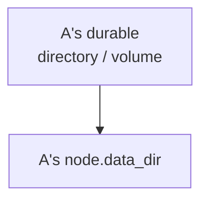
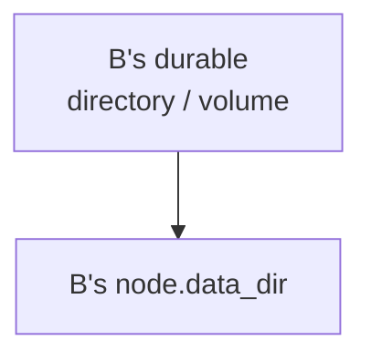
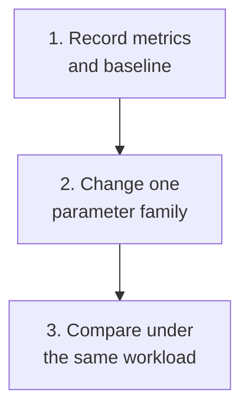

Give each node exclusive durable storage, then compare retention, queues, batches, and concurrency under the same workload.

## Data directories

### Node A

Exclusive directory retaining node state.

### Node B

Exclusive directory preserving failure isolation.

`node.data_dir` is required at startup and cannot be shared across nodes. The diagram shows ownership; additional log, Prometheus, and plugin paths are configured separately. After replacement or rollout, required directories must survive with correct UID/GID, permissions, capacity, and mounts.

  
Complete directories, additional paths, and persistence rules

Storage settings affect data safety, throughput, and tail latency together. Give every node independent durable storage first, then tune retention, queues, batches, and concurrency from observed evidence.

`node.data_dir` is required at startup and owns node state. Every node needs its own directory or persistent volume; sharing one directory across nodes breaks ownership and failure isolation.

Related paths include:

- `log.dir` for rolling logs;
- `prometheus.data_dir` for generated configuration and TSDB data only when app-managed Prometheus is used;
- `plugin.dir`, `plugin.state_dir`, `plugin.sandbox_dir`, and `plugin.socket_path` for plugin artifacts, state, sandboxing, and the local socket.

Directories that must survive need to remain available after container replacement, process restart, or artifact rollout, with the correct UID/GID, permissions, capacity, and mount options.

## Message retention

Before enabling physical GC through `channel.message_retention_*`:

1. Define retention, recovery objectives, and backup boundaries.
2. Test scan interval, channels per batch, and message/byte limits at representative data scale.
3. Confirm required history remains readable.

Larger batches also raise IO bursts, lock duration, memory, and foreground tail latency.

  
Complete retention and physical trimming boundaries

`channel.message_retention_*` controls scanning and physical trimming. Before enabling physical GC, define the business retention period, recovery objectives, and backup boundary, then verify trimming preserves required historical reads.

Scan interval, channels per batch, and per-run message and byte limits bound background work together. Larger batches may improve throughput while increasing IO bursts, lock duration, memory, and foreground tail latency. Validate production values at representative data scale.

## Queues, batches, and concurrency

Observe queues, workers, and batches together. Larger queues increase memory and worst-case wait, and may hide sustained overload. Some `0` values are derived at runtime; they do not mean unlimited or disabled.

The Manager startup snapshot covers only a bounded set of critical fields: inspect source and effective value where available; use runtime state, metrics, and pre-production tests elsewhere. Explicit examples are not defaults for omitted fields.

  
Complete tuning domains, fields, and costs

| Domain | Representative fields | Main cost |
| --- | --- | --- |
| Gateway | async workers, queue capacity, session batches | Connection memory, queue delay, send throughput |
| Channel append | shards, pools, batches, dispatch concurrency | CPU contention, commit latency, allocations, disk batches |
| Delivery | page and push batches, event queue, recipient workers | Large-group fanout, pending acknowledgements, backpressure |
| Membership directory/Presence | paged sync and hydration batches, touch batches | Candidate bounds, DB reads, remote batch calls |
| Webhook | queue, workers, batches, timeout, retry | Downstream failure amplification, memory, drop boundaries |

Queue capacity is not capacity planning. A larger queue absorbs a larger transient burst, but also consumes more memory, increases worst-case wait, and may hide sustained overload. Worker and batch limits must be observed with it.

Some `0` values mean derive from CPU, topology, or an internal default; they do not mean unlimited or disabled. The Manager startup snapshot resolves a bounded set of critical fields: use its source and effective value where available, and confirm other fields through subsystem runtime state, metrics, and pre-production load tests. Do not treat explicit values in `wukongim.toml.example` as defaults for every omitted field.

## Capacity and alerts

Record disk space/inodes, IO and sync latency, queues/rejections, P95/P99, CPU/RSS/FD/goroutines, network, and large-group fanout per node. Retain artifact, configuration, hardware, users, message rate, channels, and group size with each test.

**Acceptance:** roll one node at a time; `/readyz` must return `200` with `ready: true` before restoring traffic. Compare latency, queues, resources, and errors. Keep rollback configuration; a binary downgrade does not guarantee data-format rollback.

  
Complete capacity, changes, and production validation

At minimum, monitor disk space and inodes, IOPS and latency, write and sync latency, queue depth and rejection, P95/P99, CPU, RSS, file descriptors, goroutines, network, and large-group fanout per node. Capacity tests must record artifact, configuration, hardware, online users, message rate, channel count, and group size.

Roll every setting change one node at a time, wait for `/readyz` before restoring traffic, and compare latency, queues, resources, and errors before and after. Retain rollback configuration, but do not assume a binary downgrade proves data-format rollback is safe.

Before production, validate an archive with [Backup & Restore](/en/server/operations/backup-and-restore) and use [`wkcli bench`](/en/server/tools/wkbench) to test capacity with a representative workload.

<Cards>
  <Card title="Verify backups" description="Confirm an archive can be restored first." href="/en/server/operations/backup-and-restore" />
  <Card title="Verify capacity" description="Test real workloads with wkcli bench." href="/en/server/tools/wkbench" />
</Cards>
