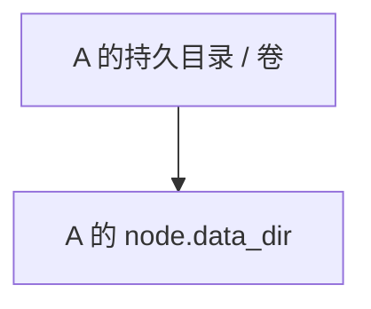
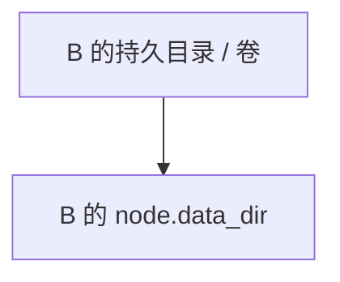
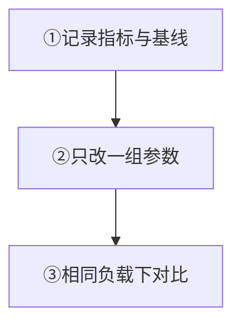

先保证节点独占持久存储，再用相同负载验证保留、队列、批量和并发的调整。

## 数据目录

### 节点 A

独占目录，保留节点状态。

### 节点 B

独占目录，保持故障隔离。

`node.data_dir` 是启动必填项，多个节点不能共享。图示表示独占关系；附加日志、Prometheus 和插件路径分别配置。重建或发布后，需保留的目录仍应可用，并核对 UID/GID、权限、容量与挂载。

  
完整目录、附加路径与持久化要求

存储配置同时影响数据安全、吞吐和尾延迟。先确保每个节点拥有独立持久存储，再根据观测证据调整保留、队列、批处理和并发。

`node.data_dir` 是启动必填项，并承载节点状态。每个节点必须使用独立目录或持久卷；多个节点共享一个目录会破坏所有权和故障隔离。

与数据相关的附加路径还包括：

- `log.dir`：滚动日志目录；
- `prometheus.data_dir`：仅在使用应用托管 Prometheus 时保存其配置和 TSDB；
- `plugin.dir`、`plugin.state_dir`、`plugin.sandbox_dir` 与 `plugin.socket_path`：插件制品、状态、沙箱和本地套接字。

容器重建、进程重启或发布新制品后，这些需要保留的目录必须仍然存在，并保持正确的 UID/GID、权限、容量和挂载选项。

## 消息保留

启用 `channel.message_retention_*` 物理 GC 前：

1. 明确保留期、恢复目标与备份边界。
2. 在真实数据规模下验证扫描间隔、每批频道数、消息数与字节上限。
3. 确认所需历史仍可读取。

批量增大也会增加 IO 突发、锁持有、内存与前台尾延迟。

  
完整消息保留与物理裁剪说明

`channel.message_retention_*` 控制扫描与物理裁剪。启用物理 GC 前，先定义业务保留期、恢复目标和备份边界，并验证裁剪不会破坏所需的历史读取。

扫描间隔、每批频道数、单次最大消息数与字节数共同约束后台工作。更大的批次可能提高吞吐，也会增加 IO 突发、锁持有、内存和前台尾延迟；生产值必须通过真实数据规模验证。

## 队列、批处理与并发

队列、Worker 与批量一起观察；扩大队列会增加内存与最坏等待，可能掩盖持续过载。某些 `0` 值由运行时推导，不表示无限或关闭。

Manager 启动快照仅覆盖一组关键字段：查看其来源与有效值；其余结合运行状态、指标和预生产压测。样例显式值不等于省略字段的默认值。

  
完整调优领域、字段与代价

| 领域 | 典型字段 | 主要代价 |
| --- | --- | --- |
| Gateway | async worker、queue capacity、session batch | 连接内存、排队时间、发送吞吐 |
| Channel append | shard、pool、batch、dispatch concurrency | CPU 竞争、提交延迟、分配和磁盘批量 |
| Delivery | page、push batch、event queue、recipient workers | 大群 Fanout、待确认状态、反压 |
| Membership directory/Presence | 分页同步和 hydration batch、touch batch | 候选上限、DB 读取、远端批次数 |
| Webhook | queue、workers、batch、timeout、retry | 下游故障放大、内存和丢弃边界 |

队列容量不是容量规划本身。扩大队列会增加可吸收的短时突发，也会增加内存和最坏等待时间，并可能延迟暴露持续过载。Worker 和批量上限也必须一起观察。

部分 `0` 值表示由运行时根据 CPU、拓扑或内部默认推导，而不是“无限”或“关闭”。Manager 启动配置快照只解析一组关键字段；对它覆盖的字段可查看来源和有效值，其余字段应结合对应子系统的运行状态、指标与预生产压测确认。不要把 `wukongim.toml.example` 的显式样例误当成所有省略字段的默认值。

## 容量与告警

逐节点记录磁盘空间 / inode、IO 与同步延迟、队列 / 拒绝、P95/P99、CPU / RSS / FD / Goroutine、网络与大群 Fanout。压测保留制品、配置、硬件、用户数、消息率、频道数与群规模。

**验收：** 逐节点滚动，`/readyz` 返回 `200` 且 `ready: true` 后恢复流量；对比延迟、队列、资源与错误。保留回滚配置，二进制降级不保证数据格式可回滚。

  
完整容量、变更与生产验证

至少按节点监控：磁盘空间与 inode、IOPS/延迟、写入与同步延迟、队列深度/拒绝、P95/P99、CPU、RSS、FD、Goroutine、网络和大群 Fanout。容量测试必须记录制品、配置、硬件、在线用户、消息速率、频道数和群规模。

任何字段变更都应逐节点滚动，在恢复流量前等待 `/readyz`，并比较变更前后的延迟、队列、资源和错误。保留回滚配置，但不要把二进制降级等同于数据格式可安全回滚。

生产上线前，按[备份与恢复](/zh/server/operations/backup-and-restore)验证归档，并使用 [`wkcli bench`](/zh/server/tools/wkbench)按真实负载验证容量。

<Cards>
  <Card title="验证备份" description="先确认归档可恢复。" href="/zh/server/operations/backup-and-restore" />
  <Card title="验证容量" description="用 wkcli bench 测真实负载。" href="/zh/server/tools/wkbench" />
</Cards>
