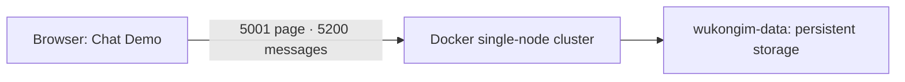

Start a single-node cluster on your computer, then open the Chat Demo. You need Docker and a browser.

<Callout type="warn" title="The default is for a quick local evaluation">
  The example pins image `WK_CURRENT_IMAGE_TAG`. To use another release, replace the image tag directly and read that release's upgrade notes first. Before serving production traffic, replace the example credentials and complete [Security & Access](/en/server/configuration/security) and [Health & Monitoring](/en/server/operations/health-and-monitoring).
</Callout>



## 1. Create the configuration file

```bash
mkdir -p wukongim-docker
cd wukongim-docker
```

Create `wukongim.toml`:

```toml
[node]
id = 1
data_dir = "/var/lib/wukongim"

[cluster]
listen_addr = "127.0.0.1:7001"

[api]
listen_addr = "0.0.0.0:5001"

[gateway]
token_auth_on = true

[manager]
listen_addr = "0.0.0.0:5301"
auth_on = true
jwt_secret = "replace-with-a-random-64-character-secret"
users = [{ username = "admin", password = "replace-with-a-strong-password", permissions = [{ resource = "*", actions = ["*"] }] }]

[log]
dir = "/var/lib/wukongim/logs"
```

Replace `jwt_secret` and the administrator password. Defaults use 256 hash slots; keep `gateway.token_auth_on=true`.

<details>
<summary>Configuration fields and token checks</summary>

This file explicitly keeps the important `gateway.token_auth_on=true` setting: a client CONNECT token must exactly match the token stored through `/user/token` for the same UID and device category, or Gateway returns `ReasonAuthFail`. Do not disable it in production merely to simplify integration; see [Security & Access](/en/server/configuration/security) for the full boundary. The remaining fields cover only container startup, the API, Manager authentication, and a writable log directory. Single-node topology, 256 hash slots, the `5100/5200` Gateway listeners, and other settings use runtime defaults. Replace at least `jwt_secret` and the administrator password. When accessing the Demo through matching host ports, `api.external_tcp_addr` and `api.external_ws_addr` can be omitted; see the address rules below. See the [Configuration Reference](/en/server/configuration/reference) for every field and its default.

</details>

<details>
<summary>Linux hosts: set file permissions before starting</summary>

The official image runs as the non-root user `10001:10001`. With a bind mount, that user must be able to read the host's `wukongim.toml`. Keep write access for the user who created the file and grant read-only access to the container's group:

```bash
sudo chown "$(id -u):10001" wukongim.toml
chmod 0640 wukongim.toml
```

Do not leave the file as root-only `0600`; the container will repeatedly restart after failing to read its configuration with `permission denied`. The file contains the Manager password and JWT secret, so making it world-readable with `0644` is also discouraged. If you change the image user or use rootless Docker or user-namespace UID/GID mappings, grant read access according to the effective mapping instead.

</details>

## 2. Start and verify

Official images are published to both GHCR and Alibaba Cloud Container Registry with identical image contents for the same version. Users in mainland China should use the Alibaba Cloud image:

| Registry | Image address |
| --- | --- |
| GHCR | `ghcr.io/wukongim/wukongim:WK_CURRENT_IMAGE_TAG` |
| Alibaba Cloud (recommended for mainland China) | `registry.cn-shanghai.aliyuncs.com/wukongim/wukongim:WK_CURRENT_IMAGE_TAG` |

The examples below use GHCR. If the pull fails, replace the image address on the last line of `docker run` or the `image` value in `compose.yaml` with the Alibaba Cloud address above, keeping the same version tag.

Start with `docker run` below; Docker Compose is an alternative.

### Use `docker run`

```bash
docker run -d --name wukongim --restart unless-stopped \
  -p 127.0.0.1:5001:5001 -p 5100:5100 -p 5200:5200 -p 127.0.0.1:5301:5301 \
  -v "$PWD/wukongim.toml:/etc/wukongim/wukongim.toml:ro" \
  -v wukongim-data:/var/lib/wukongim \
  ghcr.io/wukongim/wukongim:WK_CURRENT_IMAGE_TAG
```

<details>
<summary>Use Docker Compose instead</summary>

Create `compose.yaml`:

```yaml
services:
  wukongim:
    image: ghcr.io/wukongim/wukongim:WK_CURRENT_IMAGE_TAG
    container_name: wukongim
    restart: unless-stopped
    ports: ["127.0.0.1:5001:5001", "5100:5100", "5200:5200", "127.0.0.1:5301:5301"]
    volumes: ["./wukongim.toml:/etc/wukongim/wukongim.toml:ro", "wukongim-data:/var/lib/wukongim"]

volumes:
  wukongim-data:
    name: wukongim-data
```

```bash
docker compose up -d
```

</details>

Both methods create `wukongim-data` automatically on the first run, so no separate volume command is needed.

Wait for the container to become healthy, then verify the node:

```bash
docker ps --filter name=wukongim
docker exec wukongim wget -q --spider -T 5 http://127.0.0.1:5001/readyz
```

After readiness succeeds, open [Chat Demo](http://127.0.0.1:5001/demo/) and [send the first message](/en/guide/quick-start/first-message).

Manager is at [http://127.0.0.1:5301](http://127.0.0.1:5301); sign in as `admin` with the configured password. See [Quick Start](/en/guide/quick-start) for the full learning path.

<details>
<summary>How do I open Manager and the Demo from my computer after deploying on a server?</summary>

Manager and the WuKongIM HTTP API are mapped only to the server loopback address. Create an SSH tunnel including the Demo WebSocket port, then open the same Manager URL or the [Chat Demo](http://127.0.0.1:5001/demo/) on your computer:

```bash
ssh -N \
  -L 5001:127.0.0.1:5001 \
  -L 5200:127.0.0.1:5200 \
  -L 5301:127.0.0.1:5301 \
  user@server
```

</details>

<details>
<summary>Connection addresses, port mappings, and remote access</summary>

When `api.external_*` is omitted, default external `/route` and `/route/batch` replace a listener host of `0.0.0.0`, `[::]`, or an empty host with the hostname from the current request Host, preserving the Gateway port, scheme, and path. Opening `http://127.0.0.1:5001/demo/` therefore yields `ws://127.0.0.1:5200`; accessing the API directly through a server IP or domain yields that host with port `5200`.

This applies only to the default external route. Explicit published addresses, concrete listener hosts (including Linux initialization's `127.0.0.1`), intranet requests, and explicit node selectors stay unchanged. Proxies must preserve the original Host; the server does not use `X-Forwarded-Host` or infer WSS from the HTTP scheme.

For a mapping such as `15200:5200`, a separate WebSocket domain or TLS proxy, or a backend calling `/route` through an internal host unreachable by clients, set a browser-reachable `api.external_ws_addr` or `api.external_wss_addr`. Use `api.external_tcp_addr` for a non-default TCP ingress. Completion does not open ports or create TLS listeners.

</details>

<details>
<summary>Enable bundled Prometheus when needed</summary>

Use an image whose release notes include the Docker bundled Prometheus fix. Add the following to `wukongim.toml`, then restart the container:

```toml
[prometheus]
enable = true

[observability]
metrics_enable = true
```

`metrics_enable` exposes WuKongIM's `/metrics`; `prometheus.enable` starts a Prometheus child process managed by WuKongIM. Images carry the matching binary for `linux/amd64` and `linux/arm64`, so `binary_path` can stay empty and startup needs no download.

By default, Prometheus scrapes `127.0.0.1:5001/metrics` inside the container and listens on `127.0.0.1:9099`. Manager automatically queries that address. The bundled process provides collection and query APIs; view metrics through Manager. The image does not include Prometheus's own web UI. Data lives in `/var/lib/wukongim/prometheus` on the existing `wukongim-data` Volume. Retention defaults to 15 days; adjust `prometheus.retention_time` and `prometheus.retention_size` as needed.

```bash
docker restart wukongim
docker exec wukongim wget -qO- http://127.0.0.1:9099/-/ready
docker exec wukongim wget -qO- 'http://127.0.0.1:9099/api/v1/query?query=up%7Bjob%3D%22wukongim%22%7D'
```

After readiness, allow one default 15-second scrape interval. The query result's `value` should contain `"1"`. These checks run inside the container and need no additional host port mapping. WuKongIM stops the child process when the container stops. Reuse the same data volume when recreating the container to retain historical metrics.

If an older image reports `embedded prometheus binary missing`, upgrade to an image containing this fix and recreate the container; restarting the old image cannot supply the missing binary. With an external Prometheus service, keep `prometheus.enable=false` and set `prometheus.query_base_url` as needed.

</details>

<details>
<summary>Common operations</summary>

```bash
docker logs --follow --tail 100 wukongim
docker restart wukongim
docker stop wukongim
docker start wukongim
```

Removing the container does not remove `wukongim-data`. Before upgrading, read [Upgrades and Migration](/en/server/operations/upgrade-and-migration), confirm compatibility, and then recreate the container with the new image.

</details>

<details>
<summary>Remove the evaluation deployment completely</summary>

For a Docker Compose deployment, after confirming that the data is no longer needed, run:

```bash
docker compose down --volumes
rm -f wukongim.toml compose.yaml
```

For a `docker run` deployment, run:

```bash
docker rm --force wukongim
docker volume rm wukongim-data
rm wukongim.toml
```

These commands permanently remove message data and deployment credentials.

</details>

A production deployment also needs TCP/TLS and WSS endpoints, restricted access to ports `5001` and `5301`, plus backup and rollback procedures. Continue to [Multi-node Cluster](/en/server/deployment/multi-node) when you need replication and failure recovery.
