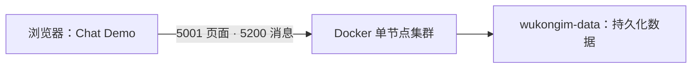

在自己的电脑上启动单节点集群，然后打开 Chat Demo。只需要 Docker 和浏览器。

<Callout type="warn" title="默认用于本机快速体验">
  示例固定使用 `WK_CURRENT_IMAGE_TAG` 镜像。使用其他版本时直接替换镜像 tag，并先阅读对应版本的升级说明。承载生产流量前，请更换示例凭据并完成[安全配置](/zh/server/configuration/security)和[健康监控](/zh/server/operations/health-and-monitoring)。
</Callout>



## 1. 创建配置文件

```bash
mkdir -p wukongim-docker
cd wukongim-docker
```

创建 `wukongim.toml`：

```toml
[node]
id = 1
data_dir = "/var/lib/wukongim"

[cluster]
listen_addr = "127.0.0.1:7001"

[api]
listen_addr = "0.0.0.0:5001"

[gateway]
token_auth_on = true

[manager]
listen_addr = "0.0.0.0:5301"
auth_on = true
jwt_secret = "replace-with-a-random-64-character-secret"
users = [{ username = "admin", password = "replace-with-a-strong-password", permissions = [{ resource = "*", actions = ["*"] }] }]

[log]
dir = "/var/lib/wukongim/logs"
```

替换 `jwt_secret` 和管理员密码。默认使用 256 Hash Slots，保留 `gateway.token_auth_on=true`。

<details>
<summary>配置字段与 Token 校验说明</summary>

这份配置显式保留重要的 `gateway.token_auth_on=true`：客户端 CONNECT Token 必须与 `/user/token` 按相同 UID、设备类别保存的 Token 精确匹配，否则返回 `ReasonAuthFail`。不要为了简化联调而在生产关闭它；完整边界见[安全配置](/zh/server/configuration/security)。其余只保留容器启动、API、Manager 认证和可写日志目录所需字段；单节点拓扑、256 Hash Slots、`5100/5200` Gateway Listener 和其他参数使用运行时默认值。至少替换 `jwt_secret` 和管理员密码。使用相同宿主机端口访问 Demo 时，无需填写 `api.external_tcp_addr` 和 `api.external_ws_addr`；地址推导规则见下文。全部字段及其默认值见[配置参考](/zh/server/configuration/reference)。

</details>

<details>
<summary>Linux 主机：启动前设置配置文件权限</summary>

官方镜像以非 root 用户 `10001:10001` 运行。使用 bind mount 时，容器内的这个用户必须能读取宿主机上的 `wukongim.toml`。保留创建者的写权限，并将只读权限授予容器所属组：

```bash
sudo chown "$(id -u):10001" wukongim.toml
chmod 0640 wukongim.toml
```

不要将配置文件保留为仅 root 可读的 `0600`，否则容器会因读取配置时出现 `permission denied` 而反复重启。配置文件包含 Manager 密码和 JWT 密钥，也不建议使用所有用户可读的 `0644`。如果镜像运行用户、rootless Docker 或 user namespace 的 UID/GID 映射有调整，请按实际映射授予只读权限。

</details>

## 2. 启动并验证

官方镜像同时发布到 GHCR 和阿里云镜像仓库，同一版本的镜像内容一致。中国大陆用户建议使用阿里云镜像地址：

| 镜像仓库 | 镜像地址 |
| --- | --- |
| GHCR | `ghcr.io/wukongim/wukongim:WK_CURRENT_IMAGE_TAG` |
| 阿里云（中国大陆推荐） | `registry.cn-shanghai.aliyuncs.com/wukongim/wukongim:WK_CURRENT_IMAGE_TAG` |

下方示例使用 GHCR。如果无法拉取，将 `docker run` 最后一行的镜像地址或 `compose.yaml` 中的 `image` 值替换为上表中的阿里云镜像地址，保持版本 tag 一致即可。

先用下面的 `docker run` 启动；Docker Compose 是可选方式。

### 使用 `docker run`

```bash
docker run -d --name wukongim --restart unless-stopped \
  -p 127.0.0.1:5001:5001 -p 5100:5100 -p 5200:5200 -p 127.0.0.1:5301:5301 \
  -v "$PWD/wukongim.toml:/etc/wukongim/wukongim.toml:ro" \
  -v wukongim-data:/var/lib/wukongim \
  ghcr.io/wukongim/wukongim:WK_CURRENT_IMAGE_TAG
```

<details>
<summary>改用 Docker Compose</summary>

创建 `compose.yaml`：

```yaml
services:
  wukongim:
    image: ghcr.io/wukongim/wukongim:WK_CURRENT_IMAGE_TAG
    container_name: wukongim
    restart: unless-stopped
    ports: ["127.0.0.1:5001:5001", "5100:5100", "5200:5200", "127.0.0.1:5301:5301"]
    volumes: ["./wukongim.toml:/etc/wukongim/wukongim.toml:ro", "wukongim-data:/var/lib/wukongim"]

volumes:
  wukongim-data:
    name: wukongim-data
```

```bash
docker compose up -d
```

</details>

两种方式都会在首次启动时自动创建 `wukongim-data`，无需提前创建 Volume。

等待容器健康后验证节点：

```bash
docker ps --filter name=wukongim
docker exec wukongim wget -q --spider -T 5 http://127.0.0.1:5001/readyz
```

就绪检查成功后，打开 [Chat Demo](http://127.0.0.1:5001/demo/)，进入[发送第一条消息](/zh/guide/quick-start/first-message)。

Manager 地址是 [http://127.0.0.1:5301](http://127.0.0.1:5301)，使用 `admin` 和配置文件中的密码登录。完整入门路线见[快速开始](/zh/guide/quick-start)。

<details>
<summary>服务器部署后，如何从自己电脑打开 Manager 和 Demo？</summary>

Manager 和 Product API 仅映射到服务器回环地址。建立 SSH 隧道并同时转发 Demo 的 WebSocket 端口后，在自己电脑打开相同的 Manager 地址或 [Chat Demo](http://127.0.0.1:5001/demo/)：

```bash
ssh -N \
  -L 5001:127.0.0.1:5001 \
  -L 5200:127.0.0.1:5200 \
  -L 5301:127.0.0.1:5301 \
  user@server
```

</details>

<details>
<summary>连接地址、端口映射与远程访问规则</summary>

未显式配置 `api.external_*` 时，默认公网 `/route` 和 `/route/batch` 会将监听地址中的 `0.0.0.0`、`[::]` 或空主机名替换为本次请求 `Host` 中的主机名，保留 Gateway 的端口、协议和路径。例如从 `http://127.0.0.1:5001/demo/` 访问时，默认 WebSocket 地址为 `ws://127.0.0.1:5200`；通过服务器 IP 或域名直接访问 API 时，返回相应主机名及 `5200` 端口。

该规则只处理默认公网路由。显式对外地址、具体监听地址（包括 Linux 初始化的 `127.0.0.1`）、内网查询和指定节点路由保持原样。代理需要保留原始 `Host`；服务端不会使用 `X-Forwarded-Host` 或根据 HTTP 协议推测 WSS。

如果将端口映射为 `15200:5200`、使用独立 WebSocket 域名或 TLS 代理，或由业务后端通过客户端不可达的内网地址请求 `/route`，需要设置浏览器可达的 `api.external_ws_addr` 或 `api.external_wss_addr`。TCP 的非默认入口同样使用 `api.external_tcp_addr` 覆盖。自动补全不会开放端口，也不会创建 TLS 入口。

</details>

<details>
<summary>按需启用内置 Prometheus</summary>

使用发布说明包含 Docker 内置 Prometheus 修复的镜像，在 `wukongim.toml` 中增加以下配置，然后重启容器：

```toml
[prometheus]
enable = true

[observability]
metrics_enable = true
```

`metrics_enable` 开启 WuKongIM 的 `/metrics`；`prometheus.enable` 启动由 WuKongIM 管理的 Prometheus 子进程。镜像为 `linux/amd64` 和 `linux/arm64` 携带对应二进制，无需设置 `binary_path`，启动时无需下载。

默认抓取容器内部的 `127.0.0.1:5001/metrics`，Prometheus 监听 `127.0.0.1:9099`，Manager 自动使用该地址查询指标。内置进程提供采集和查询 API，指标通过 Manager 查看，镜像不包含 Prometheus 自带的网页界面。数据保存在 `/var/lib/wukongim/prometheus`，随现有 `wukongim-data` Volume 持久化；默认保留 15 天，可通过 `prometheus.retention_time` 和 `prometheus.retention_size` 调整。

```bash
docker restart wukongim
docker exec wukongim wget -qO- http://127.0.0.1:9099/-/ready
docker exec wukongim wget -qO- 'http://127.0.0.1:9099/api/v1/query?query=up%7Bjob%3D%22wukongim%22%7D'
```

就绪后等待一次默认 15 秒的抓取周期，查询结果中的 `value` 应包含 `"1"`。上述检查在容器内执行，无需增加宿主机端口映射。停止容器时，WuKongIM 会停止 Prometheus 子进程；重新创建容器时继续挂载同一数据卷即可保留历史指标。

若旧镜像报 `embedded prometheus binary missing`，需要先升级到包含该修复的镜像并重新创建容器；单独重启旧镜像无法补齐二进制。使用外部 Prometheus 时保持 `prometheus.enable=false`，按需配置 `prometheus.query_base_url`。

</details>

<details>
<summary>常用运维命令</summary>

```bash
docker logs --follow --tail 100 wukongim
docker restart wukongim
docker stop wukongim
docker start wukongim
```

删除容器不会删除 `wukongim-data`。升级前先阅读[升级与迁移](/zh/server/operations/upgrade-and-migration)，确认兼容性后再用新镜像重新创建容器。

</details>

<details>
<summary>彻底删除测试部署</summary>

使用 Docker Compose 部署时，确认数据不再需要后执行：

```bash
docker compose down --volumes
rm -f wukongim.toml compose.yaml
```

使用 `docker run` 部署时执行：

```bash
docker rm --force wukongim
docker volume rm wukongim-data
rm wukongim.toml
```

这些命令会永久删除消息数据和部署凭据。

</details>

生产部署还需要配置 TCP/TLS 与 WSS 入口、限制 `5001` 和 `5301` 的访问，并建立备份和回滚方案。需要复制和故障恢复时，继续阅读[多节点集群](/zh/server/deployment/multi-node)。
