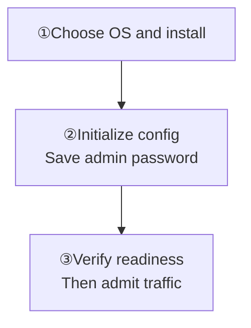

Install a single-node cluster with APT or DNF, then start it with systemd. Current preview: `WK_CURRENT_RELEASE_TAG` · amd64/x86_64.

<Callout type="warn" title="Preview is a prerelease channel">
  Validate it outside production before serving production traffic.
</Callout>

<details>
  <summary>Supported distributions and architecture</summary>

The preview repository supports amd64/x86_64. It is verified on Ubuntu 24.04, Debian 13, Rocky Linux 9, and AlmaLinux 9; RHEL 9 can use the same EL9 repository.

</details>

<div className="tutorial-diagram">



</div>

## 1. Install

Choose your distribution and expand its commands.

### Debian / Ubuntu

<details>
  <summary>APT installation commands</summary>

```bash
curl -fsSL https://packages.githubim.com/repo | sudo sh
sudo apt update
sudo apt install -y wukongim
```

</details>

### RHEL / Rocky / AlmaLinux 9

<details>
  <summary>DNF installation commands</summary>

```bash
curl -fsSL https://packages.githubim.com/repo | sudo sh
sudo dnf -y --disablerepo='*' --enablerepo=wukongim-preview makecache --refresh
sudo dnf install -y wukongim
```

</details>

**Expected:** `wukongim` and `wkcli` have matching `version`, `commit`, and `build_source`; the service has not started yet.

<details>
  <summary>Verify binary identities and installation paths</summary>

The same package installs the server and the unified operator CLI. Their `version`, `commit`, and `build_source` fields must match. See [wkcli](/en/server/tools/wkcli) for command usage. If `wkcli` is missing or its identity differs, check `command -v wkcli` for an older binary on `PATH` and update to the matching package.

```bash
wukongim version --output json
wkcli version --output json
```

The package creates the service account, systemd service, `/etc/wukongim`, `/var/lib/wukongim`, and `/var/log/wukongim`. It does not create a configuration or start the service.

</details>

## 2. Initialize the configuration

Run `sudo wukongim init`, **save the password shown only once**, then validate the config. Listeners use loopback by default; configure the firewall, TLS, and ingress before exposing them.

**Expected:** `/etc/wukongim/wukongim.toml` exists and configuration validation succeeds.

<details>
  <summary>Initialize, validate, automate, and forward Demo ports</summary>

```bash
sudo wukongim init
# For automation:
sudo wukongim init \
  --admin-password-stdin < /secure/path/manager-password
```

Save the administrator password, which is shown only once. Existing automation may keep using `wukongim config init --config /etc/wukongim/wukongim.toml`. Then validate the configuration:

```bash
sudo wukongim config validate --config /etc/wukongim/wukongim.toml
```

Services bind to loopback by default. Configure the firewall, TLS, and ingress policy before exposing them.

Initialization binds WebSocket to `127.0.0.1:5200`, which `/route` preserves as a concrete listener address. Forward `5001`, `5200`, and `5301` as shown in [Quick Start](/en/guide/quick-start/single-node-cluster) to use the Demo without `api.external_ws_addr`. If the listener is changed to a wildcard, default external routing can complete its host from the request. Remapped external ports, separate domains, and TLS proxies still require explicit published addresses; see the [Docker address rules](/en/server/deployment/docker).

</details>

## 3. Start and verify

Start the systemd service and check `/readyz`. **Admit traffic only after `200` with `ready: true`**; inspect service logs if the check fails.

<details>
  <summary>Start, check readiness, and inspect logs</summary>

```bash
sudo systemctl enable --now wukongim
curl --fail http://127.0.0.1:5001/readyz
```

Add the node to traffic only after `/readyz` succeeds. If startup fails, inspect the logs:

```bash
sudo journalctl -u wukongim -n 100 --no-pager
```

</details>

**Open Manager:** create an SSH tunnel from your computer, then visit [127.0.0.1:5301](http://127.0.0.1:5301). Sign in as `admin` with the saved password. Keep `auth_on = true`; port `5301` needs no public access.

<details>
  <summary>SSH tunnel and shared administration</summary>

The default Manager address is [http://127.0.0.1:5301](http://127.0.0.1:5301). Sign in as `admin` with the password saved during initialization and keep `auth_on = true`. For remote access, run the following on your computer, keep the terminal open, and open the same browser address:

```bash
ssh -N -L 127.0.0.1:5301:127.0.0.1:5301 <user>@<server-ip>
```

Port `5301` does not need a public firewall rule. For shared administration, use a management network or VPN with an HTTPS proxy; see [Manager](/en/server/operations/manager).

</details>

<Cards>
  <Card title="Configure client addresses" description="Connect through domains, TLS, or remapped ports." href="/en/server/configuration/networking" />
  <Card title="Deploy multiple nodes" description="Start with three servers for replication and recovery." href="/en/server/deployment/multi-node" />
</Cards>

For multiple nodes, continue to [Multi-node Cluster](/en/server/deployment/multi-node). Before upgrading, read [Upgrade & Migration](/en/server/operations/upgrade-and-migration).
