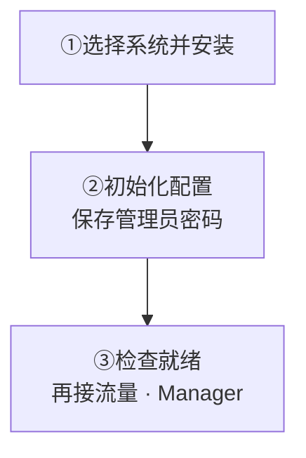

用 APT 或 DNF 安装单节点集群，再通过 systemd 启动。当前 Preview：`WK_CURRENT_RELEASE_TAG` · amd64/x86_64。

<Callout type="warn" title="Preview 是预发布通道">
  请先在非生产环境验证，再承载生产流量。
</Callout>

<details>
  <summary>支持的系统与架构</summary>

软件源仅支持 amd64/x86_64。已验证 Ubuntu 24.04、Debian 13、Rocky Linux 9 和 AlmaLinux 9；RHEL 9 可使用同一 EL9 软件源。

</details>

<div className="tutorial-diagram">



</div>

## 1. 安装

选择自己的系统，展开对应命令。

### Debian / Ubuntu

<details>
  <summary>APT 安装命令</summary>

```bash
curl -fsSL https://packages.githubim.com/repo | sudo sh
sudo apt update
sudo apt install -y wukongim
```

</details>

### RHEL / Rocky / AlmaLinux 9

<details>
  <summary>DNF 安装命令</summary>

```bash
curl -fsSL https://packages.githubim.com/repo | sudo sh
sudo dnf -y --disablerepo='*' --enablerepo=wukongim-preview makecache --refresh
sudo dnf install -y wukongim
```

</details>

**应看到：** `wukongim` 和 `wkcli` 的 `version`、`commit`、`build_source` 一致；此时服务尚未启动。

<details>
  <summary>版本检查与安装目录</summary>

同一软件包会安装服务端和统一运维工具；两者的 `version`、`commit`、`build_source` 应一致。命令用法见 [wkcli](/zh/server/tools/wkcli)。若找不到 `wkcli` 或版本不一致，先用 `command -v wkcli` 排查 `PATH` 中的旧程序，再更新为配套的软件包。

```bash
wukongim version --output json
wkcli version --output json
```

软件包会创建服务账号、systemd 服务以及 `/etc/wukongim`、`/var/lib/wukongim` 和 `/var/log/wukongim`，但不会生成配置或启动服务。

</details>

## 2. 初始化配置

执行 `sudo wukongim init`，**保存只显示一次的管理员密码**，再校验配置。默认只监听回环地址；对外开放前先配置防火墙、TLS 和入口策略。

**应看到：** `/etc/wukongim/wukongim.toml` 已生成，配置校验通过。

<details>
  <summary>初始化、校验、自动化与 Demo 转发</summary>

```bash
sudo wukongim init
# 自动化环境：
sudo wukongim init \
  --admin-password-stdin < /secure/path/manager-password
```

保存只显示一次的管理员密码。旧自动化也可继续使用 `wukongim config init --config /etc/wukongim/wukongim.toml`。然后校验配置：

```bash
sudo wukongim config validate --config /etc/wukongim/wukongim.toml
```

默认只监听回环地址。对外开放服务前，请先配置防火墙、TLS 和入口策略。

初始化的 WebSocket 监听地址为 `127.0.0.1:5200`，`/route` 会保留该具体地址。按[快速开始](/zh/guide/quick-start/single-node-cluster)转发 `5001`、`5200` 和 `5301` 后即可从自己电脑体验 Demo，无需配置 `api.external_ws_addr`。如果改为通配监听，默认公网路由可按请求主机名补全；非默认外部端口、独立域名及 TLS 代理仍需显式对外地址，见 [Docker 部署中的地址规则](/zh/server/deployment/docker)。

</details>

## 3. 启动并验证

启动 systemd 服务，检查 `/readyz`。**返回 `200` 且 `ready: true` 后才接流量**；失败时查看服务日志。

<details>
  <summary>启动、就绪检查与日志命令</summary>

```bash
sudo systemctl enable --now wukongim
curl --fail http://127.0.0.1:5001/readyz
```

`/readyz` 成功后再接入流量。启动失败时查看日志：

```bash
sudo journalctl -u wukongim -n 100 --no-pager
```

</details>

**打开 Manager：** 在自己电脑建立 SSH 隧道，再访问 [127.0.0.1:5301](http://127.0.0.1:5301)，用 `admin` 和保存的密码登录。保持 `auth_on = true`；无需公网开放 `5301`。

<details>
  <summary>SSH 隧道与多人管理入口</summary>

后台管理默认地址是 [http://127.0.0.1:5301](http://127.0.0.1:5301)，使用 `admin` 和初始化时保存的密码登录。保持 `auth_on = true`；远程访问时在自己的电脑执行下面的命令，并保持终端运行，然后打开同一个浏览器地址：

```bash
ssh -N -L 127.0.0.1:5301:127.0.0.1:5301 <user>@<server-ip>
```

无需在公网放行 `5301`。多人运维使用管理内网或 VPN，并通过 HTTPS 代理访问；配置见 [Manager 管理后台](/zh/server/operations/manager)。

</details>

<Cards>
  <Card title="配置客户端连接地址" description="域名、TLS 或非默认端口接入。" href="/zh/server/configuration/networking" />
  <Card title="部署多节点集群" description="复制与故障恢复，从三台服务器开始。" href="/zh/server/deployment/multi-node" />
</Cards>

多节点部署继续阅读[多节点集群](/zh/server/deployment/multi-node)，升级前阅读[升级与迁移](/zh/server/operations/upgrade-and-migration)。
