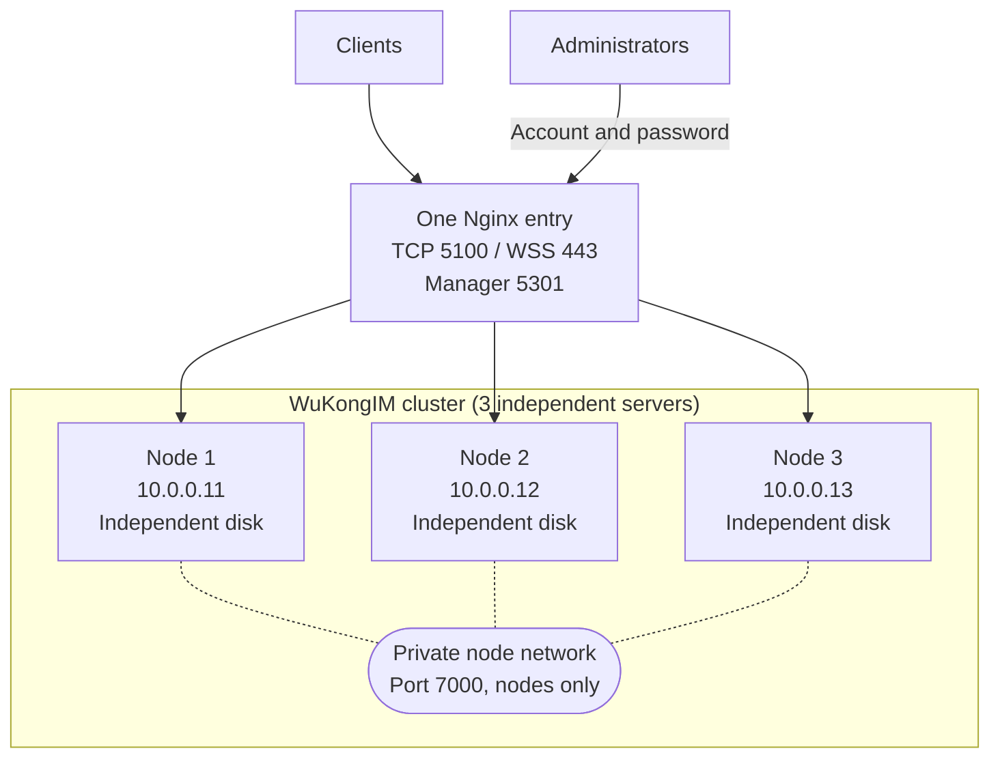

A multi-node cluster simply means **running the same WuKongIM service on several servers and keeping copies of data between them.** This example uses three servers.



## 1. Prepare three servers

| Server | Node ID | Address between nodes |
| --- | --- | --- |
| Server 1 | `1` | `10.0.0.11:7000` |
| Server 2 | `2` | `10.0.0.12:7000` |
| Server 3 | `3` | `10.0.0.13:7000` |

Before you start, check three things:

- all three servers run the same WuKongIM version;
- each server has its own persistent disk and does not share its data directory;
- the servers can reach each other on port `7000` over the private network.

## 2. Copy one cluster configuration

Put these sections in `wukongim.toml` on every server. This is the configuration for server 1:

```toml
[node]
id = 1
data_dir = "/var/lib/wukongim"

[cluster]
id = "prod-im-a"
listen_addr = "0.0.0.0:7000"
join_token = "replace-with-one-random-secret"
hash_slot_count = 256
slot_replica_n = 3
channel_replica_n = 3
nodes = [
  { id = 1, addr = "10.0.0.11:7000" },
  { id = 2, addr = "10.0.0.12:7000" },
  { id = 3, addr = "10.0.0.13:7000" }
]
```

Copy the file to servers 2 and 3, changing only `node.id` to `2` and `3`. The `[cluster]` section must be identical on every server. Replace `join_token` with the same random secret on all three.

`listen_addr` tells the current server where to listen, so `0.0.0.0` is valid there. The addresses in `nodes` tell the other servers how to connect, so they must be real private IP addresses—not `0.0.0.0` or `127.0.0.1`. See [Nodes & Cluster](/en/server/configuration/cluster) for other settings.

<Callout type="warn" title="Three servers leave no spare node">
  Three replicas mean that every piece of data needs all three servers. If one server stops, the other nodes may return `503` from `/readyz`. Use at least four servers if writes must continue while one server is offline.
</Callout>

## 3. Start and check the servers

Start WuKongIM on all three servers using the [Docker](/en/server/deployment/docker) or [Linux](/en/server/deployment/linux) deployment, then check each one:

```bash
curl --fail http://10.0.0.11:5001/readyz
curl --fail http://10.0.0.12:5001/readyz
curl --fail http://10.0.0.13:5001/readyz
```

After all three return `200` with `{"ready":true}`, send one test message. Confirm that another client receives it and can sync it after reconnecting. Finally, configure the load balancer to send traffic only to nodes whose `/readyz` check succeeds.

### Open Manager

All three nodes must use the same Manager authentication configuration. Otherwise, login fails when Nginx sends a request to another node:

```toml
[manager]
listen_addr = "0.0.0.0:5301"
auth_on = true
jwt_secret = "replace-with-the-same-random-64-character-secret"
users = [{ username = "admin", password = "replace-with-the-same-strong-password", permissions = [{ resource = "*", actions = ["*"] }] }]
```

Replace `jwt_secret` and the password with strong random values, then keep them identical on all three nodes. After the Nginx configuration below is active, open `http://manager.example.com:5301` and sign in as `admin` with the configured password. See [Manager](/en/server/operations/manager) for details.

### Add Nginx

This Nginx configuration distributes client TCP, WSS, and Manager connections. It requires the Nginx Stream and Stream SSL modules. Put `stream` at the top level of `nginx.conf`, not inside `http`:

```nginx
stream {
  upstream wukongim_tcp {
    least_conn;
    server 10.0.0.11:5100 max_fails=2 fail_timeout=10s;
    server 10.0.0.12:5100 max_fails=2 fail_timeout=10s;
    server 10.0.0.13:5100 max_fails=2 fail_timeout=10s;
  }

  upstream wukongim_ws {
    least_conn;
    server 10.0.0.11:5200 max_fails=2 fail_timeout=10s;
    server 10.0.0.12:5200 max_fails=2 fail_timeout=10s;
    server 10.0.0.13:5200 max_fails=2 fail_timeout=10s;
  }

  upstream wukongim_manager {
    least_conn;
    server 10.0.0.11:5301 max_fails=2 fail_timeout=10s;
    server 10.0.0.12:5301 max_fails=2 fail_timeout=10s;
    server 10.0.0.13:5301 max_fails=2 fail_timeout=10s;
  }

  server {
    listen 5100;
    proxy_pass wukongim_tcp;
    proxy_connect_timeout 5s;
    proxy_timeout 1h;
  }

  server {
    listen 443 ssl;
    ssl_certificate /etc/nginx/certs/im.example.com.crt;
    ssl_certificate_key /etc/nginx/certs/im.example.com.key;
    proxy_pass wukongim_ws;
    proxy_connect_timeout 5s;
    proxy_timeout 1h;
  }

  server {
    listen 5301;
    proxy_pass wukongim_manager;
    proxy_connect_timeout 5s;
    proxy_timeout 1h;
  }
}
```

Replace the domain and certificate paths, then publish the same Nginx address from every WuKongIM node:

```toml
[api]
external_tcp_addr = "im.example.com:5100"
external_wss_addr = "wss://im.example.com"
```

Point both `im.example.com` and `manager.example.com` to Nginx, then run `sudo nginx -t && sudo systemctl reload nginx`. Open-source Nginx only skips a node temporarily after connection failures; it does not actively check `/readyz`. Production automation must remove a node from `upstream` while that node is not ready. The example reserves port `443` for WuKongIM. One Nginx server is also a single point of failure, so use two Nginx servers behind one entry address or use a managed load balancer in production.

After the cluster contains data, do not directly change the cluster ID, node IDs, `hash_slot_count`, or replica counts. Read [Scaling](/en/server/operations/scaling) before adding or removing nodes.
