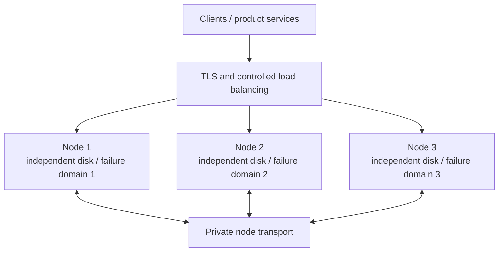

The value of multiple nodes comes from **replicas across failure domains**, not process count. Every node uses the same artifact and member inventory, while keeping a unique identity, independent storage, and a reachable transport address.



## 1. Prepare one shared member inventory

Every node uses the same cluster ID, hash-slot count, replica counts, and ordered member inventory:

```toml
[cluster]
id = "prod-im-a"
listen_addr = "0.0.0.0:7000"
hash_slot_count = 256
slot_replica_n = 3
channel_replica_n = 3
nodes = [
  { id = 1, addr = "10.0.0.11:7000" },
  { id = 2, addr = "10.0.0.12:7000" },
  { id = 3, addr = "10.0.0.13:7000" }
]
```

`listen_addr` is the local bind address; `nodes[].addr` is what peers actually dial. Never put `0.0.0.0`, loopback, or a name resolvable on only one host in the member inventory. The effective join token must also match on every node.

Set node ID, data directory, and advertised addresses separately on each node. See [Nodes & Cluster configuration](/en/server/configuration/cluster) for the complete field reference.

| Must match | Must be unique |
| --- | --- |
| Cluster ID, member inventory, hash-slot count | Node ID |
| Replica policy and artifact version | Data directory, persistent volume, and failure domain |
| Effective join token | Transport instance and node-level observability identity |

<Callout type="warn" title="Three nodes and three replicas have no node headroom">
  With three nodes, `slot_replica_n = 3`, and `channel_replica_n = 3`, losing any node leaves too few candidates for new writes and the other nodes return `503` from `/readyz`. Provide at least four eligible data nodes if one node may be lost while retaining three replica candidates.
</Callout>

## 2. Check before startup

1. Every node uses the same artifact digest and configuration version.
2. Nodes have bidirectional access to transport port `7000` over a protected private network.
3. Each node has an independent persistent disk with capacity, permissions, and alerts configured.
4. Advertised addresses are reachable from client networks; Manager, metrics, and diagnostics remain on controlled networks.
5. Fixed credentials are replaced, and benchmark and debug are disabled in production.

After data exists, do not casually change cluster ID, node IDs, hash-slot count, or replica settings. Joining, migration, and scale-in are controlled operations.

## 3. Verify and admit traffic

Check every node:

```bash
curl --fail http://10.0.0.11:5001/readyz
curl --fail http://10.0.0.12:5001/readyz
curl --fail http://10.0.0.13:5001/readyz
```

Only nodes returning `200` with `{"ready":true}` belong in backend pools. Then complete three acceptance checks:

- `/route` returns addresses that clients can actually reach;
- one end-to-end message completes send, persistence, receive, and reconnect sync;
- stopping one node in pre-production produces a recorded `/readyz` status and `reason`, and routing and replicas return to expectations after recovery.

## Advanced: repository three-node environment

`docker-compose.yml` and `docker/conf/node*.toml` can verify the member inventory, ports, readiness, and observability surface:

```bash
docker compose up -d --build
docker compose ps
curl --fail http://127.0.0.1:15001/readyz
curl --fail http://127.0.0.1:15002/readyz
curl --fail http://127.0.0.1:15003/readyz
```

It uses same-host containers, local directories, fixed credentials, and development capabilities. It proves that the configuration runs, not independent failure domains, production security, or capacity.

Finish the [Production Checklist](/en/server/deployment/production-checklist) before traffic cutover.
