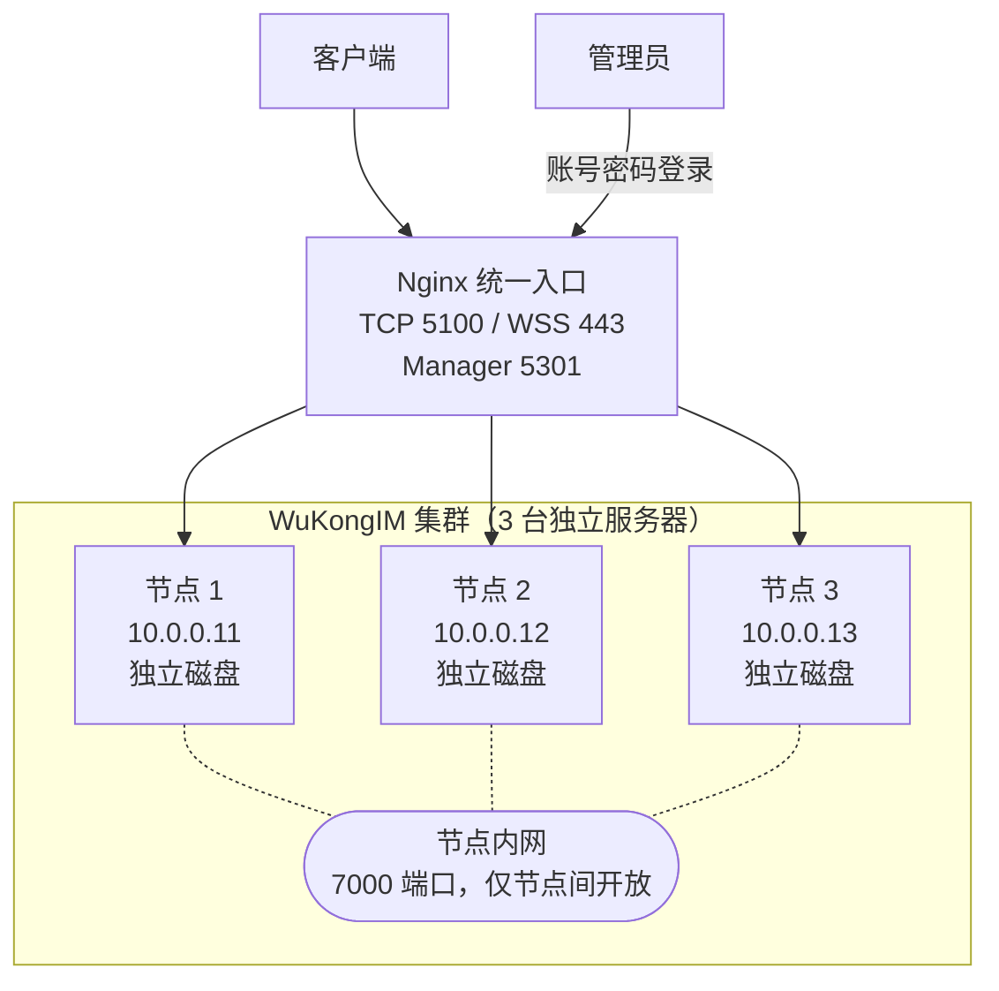

多节点集群可以简单理解为：**多台服务器运行同一套 WuKongIM，并互相保存数据副本。** 下面以 3 台服务器为例。



## 1. 准备 3 台服务器

| 服务器 | 节点 ID | 节点间地址 |
| --- | --- | --- |
| 服务器 1 | `1` | `10.0.0.11:7000` |
| 服务器 2 | `2` | `10.0.0.12:7000` |
| 服务器 3 | `3` | `10.0.0.13:7000` |

开始前只需确认三件事：

- 三台服务器使用同一版本的 WuKongIM；
- 每台服务器都有自己的持久化磁盘，不能共用数据目录；
- 三台服务器可以通过内网互相访问 `7000` 端口。

## 2. 复制同一份集群配置

把下面两段放入每台服务器的 `wukongim.toml`。这是服务器 1 的配置：

```toml
[node]
id = 1
data_dir = "/var/lib/wukongim"

[cluster]
id = "prod-im-a"
listen_addr = "0.0.0.0:7000"
join_token = "replace-with-one-random-secret"
hash_slot_count = 256
slot_replica_n = 3
channel_replica_n = 3
nodes = [
  { id = 1, addr = "10.0.0.11:7000" },
  { id = 2, addr = "10.0.0.12:7000" },
  { id = 3, addr = "10.0.0.13:7000" }
]
```

把文件复制到服务器 2 和 3，只把 `node.id` 分别改为 `2` 和 `3`。三台服务器的 `[cluster]` 配置必须完全相同，`join_token` 要替换成同一个随机密钥。

`listen_addr` 表示“本机监听”，所以可以写 `0.0.0.0`。`nodes` 里的地址表示“其他服务器怎样找到我”，必须填写真实内网 IP，不能写 `0.0.0.0` 或 `127.0.0.1`。其他配置见[节点与集群](/zh/server/configuration/cluster)。

<Callout type="warn" title="3 台服务器没有备用节点">
  配置 3 个副本，表示每份数据都需要 3 台服务器。此时任意一台停机，其他节点可能从 `/readyz` 返回 `503`。如果要求停掉一台后仍能正常写入，请至少准备 4 台服务器。
</Callout>

## 3. 启动并检查

按 [Docker](/zh/server/deployment/docker) 或 [Linux](/zh/server/deployment/linux) 部署方式启动三台服务器，然后逐台执行：

```bash
curl --fail http://10.0.0.11:5001/readyz
curl --fail http://10.0.0.12:5001/readyz
curl --fail http://10.0.0.13:5001/readyz
```

三台都返回 `200` 和 `{"ready":true}` 后，再发送一条测试消息，确认另一客户端能收到并能在重连后同步。最后让负载均衡只把流量转发给 `/readyz` 成功的节点。

### 打开管理后台

三台节点使用同一份 Manager 认证配置，否则 Nginx 转发到另一台节点后会登录失败：

```toml
[manager]
listen_addr = "0.0.0.0:5301"
auth_on = true
jwt_secret = "replace-with-the-same-random-64-character-secret"
users = [{ username = "admin", password = "replace-with-the-same-strong-password", permissions = [{ resource = "*", actions = ["*"] }] }]
```

把 `jwt_secret` 和密码替换为强随机值，并在三台节点上保持完全相同。下方 Nginx 生效后，打开 `http://manager.example.com:5301`，使用 `admin` 和配置的密码登录。更多说明见 [Manager 管理后台](/zh/server/operations/manager)。

### 接入 Nginx

下面的 Nginx 配置会分发客户端 TCP、WSS 和 Manager 连接。它需要 Nginx Stream 和 Stream SSL 模块；把 `stream` 放在 `nginx.conf` 的顶层，不能放进 `http` 内：

```nginx
stream {
  upstream wukongim_tcp {
    least_conn;
    server 10.0.0.11:5100 max_fails=2 fail_timeout=10s;
    server 10.0.0.12:5100 max_fails=2 fail_timeout=10s;
    server 10.0.0.13:5100 max_fails=2 fail_timeout=10s;
  }

  upstream wukongim_ws {
    least_conn;
    server 10.0.0.11:5200 max_fails=2 fail_timeout=10s;
    server 10.0.0.12:5200 max_fails=2 fail_timeout=10s;
    server 10.0.0.13:5200 max_fails=2 fail_timeout=10s;
  }

  upstream wukongim_manager {
    least_conn;
    server 10.0.0.11:5301 max_fails=2 fail_timeout=10s;
    server 10.0.0.12:5301 max_fails=2 fail_timeout=10s;
    server 10.0.0.13:5301 max_fails=2 fail_timeout=10s;
  }

  server {
    listen 5100;
    proxy_pass wukongim_tcp;
    proxy_connect_timeout 5s;
    proxy_timeout 1h;
  }

  server {
    listen 443 ssl;
    ssl_certificate /etc/nginx/certs/im.example.com.crt;
    ssl_certificate_key /etc/nginx/certs/im.example.com.key;
    proxy_pass wukongim_ws;
    proxy_connect_timeout 5s;
    proxy_timeout 1h;
  }

  server {
    listen 5301;
    proxy_pass wukongim_manager;
    proxy_connect_timeout 5s;
    proxy_timeout 1h;
  }
}
```

把域名和证书路径换成自己的值，再在每个 WuKongIM 节点中公布同一个 Nginx 地址：

```toml
[api]
external_tcp_addr = "im.example.com:5100"
external_wss_addr = "wss://im.example.com"
```

将 `im.example.com` 和 `manager.example.com` 都解析到 Nginx，并执行 `sudo nginx -t && sudo systemctl reload nginx`。这里的开源 Nginx 只能在连接失败后临时跳过节点，不会主动检查 `/readyz`；上线系统还需要在节点未就绪时自动或手动把它移出 `upstream`。示例假设 `443` 端口专门用于 WuKongIM；一台 Nginx 也会成为单点，生产环境应使用两台 Nginx 加一个统一入口，或使用托管负载均衡。

已有数据后，不要直接修改集群 ID、节点 ID、`hash_slot_count` 或副本数。增减节点请阅读[扩容与缩容](/zh/server/operations/scaling)。
