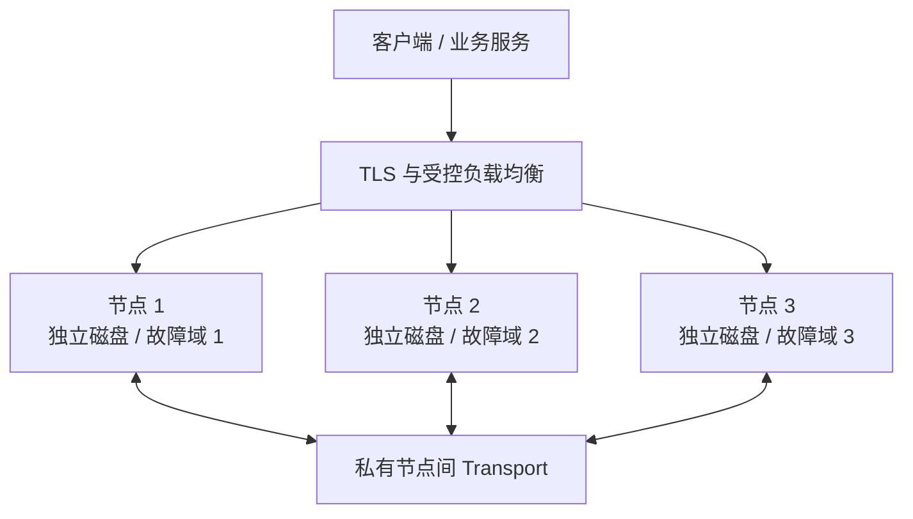

多节点的价值来自**跨故障域的副本**，而不是进程数量。所有节点使用同一制品和成员清单，但必须拥有唯一身份、独立存储和可达的 Transport 地址。



## 1. 准备相同的成员清单

每个节点都配置相同的集群 ID、Hash Slot 数、副本数和有序成员清单：

```toml
[cluster]
id = "prod-im-a"
listen_addr = "0.0.0.0:7000"
hash_slot_count = 256
slot_replica_n = 3
channel_replica_n = 3
nodes = [
  { id = 1, addr = "10.0.0.11:7000" },
  { id = 2, addr = "10.0.0.12:7000" },
  { id = 3, addr = "10.0.0.13:7000" }
]
```

`listen_addr` 是本机绑定地址，`nodes[].addr` 是其他节点实际连接的地址。不要把 `0.0.0.0`、回环地址或只有一台主机能解析的名称写进成员清单。Join Token 也必须在所有节点上得到同一个有效值。

每个节点单独设置节点 ID、数据目录和外部地址。完整字段说明见[节点与集群配置](/zh/server/configuration/cluster)。

| 必须一致 | 必须唯一 |
| --- | --- |
| 集群 ID、成员清单、Hash Slot 数 | 节点 ID |
| 副本策略和制品版本 | 数据目录、持久卷和故障域 |
| Join Token 的有效值 | Transport 实例和节点级观察标签 |

<Callout type="warn" title="三节点、三副本没有节点余量">
  三个节点同时配置 `slot_replica_n = 3` 和 `channel_replica_n = 3` 时，失去任意节点都会让新的写探针缺少副本候选，其他节点的 `/readyz` 返回 `503`。如果目标是失去一台后仍保留三个副本候选，至少准备四个合格数据节点。
</Callout>

## 2. 启动前检查

1. 所有节点使用同一制品摘要和配置版本。
2. 节点间可以通过受保护的内网双向访问 `7000` Transport。
3. 每个节点使用独立持久盘，并已设置容量、权限和告警。
4. 外部地址从客户端网络可达，Manager、指标和诊断面只在受控网络开放。
5. 替换固定凭据，生产关闭 Benchmark 和 Debug。

已有数据后，不要随意改变集群 ID、节点 ID、Hash Slot 或副本设置。加入、迁移和缩容都应按受控运维流程执行。

## 3. 验证并切流

逐个节点检查：

```bash
curl --fail http://10.0.0.11:5001/readyz
curl --fail http://10.0.0.12:5001/readyz
curl --fail http://10.0.0.13:5001/readyz
```

只有返回 `200` 且 `{"ready":true}` 的节点才能进入后端池。随后完成三项验收：

- `/route` 返回的客户端地址真实可达；
- 发送、持久化、接收和重连同步完成一条端到端消息；
- 在预生产停止一个节点，记录其余节点的 `/readyz` 与 `reason`，恢复后确认路由和副本回到预期。

## 进阶：仓库三节点环境

`docker-compose.yml` 和 `docker/conf/node*.toml` 可以验证成员清单、端口、就绪和观察面：

```bash
docker compose up -d --build
docker compose ps
curl --fail http://127.0.0.1:15001/readyz
curl --fail http://127.0.0.1:15002/readyz
curl --fail http://127.0.0.1:15003/readyz
```

它使用同机容器、本地目录、固定凭据和开发能力，只能证明配置可以运行，不能证明独立故障域、生产安全或容量。

切流前继续完成[生产检查清单](/zh/server/deployment/production-checklist)。
