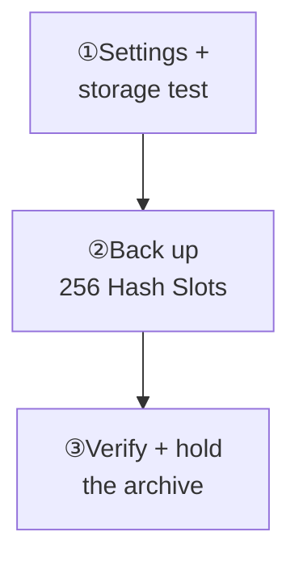
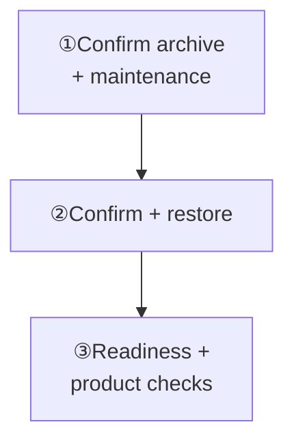

Open **Manager → Cluster → Backups**. No `wukongim.toml` change is needed.

<Cards>
  <Card title="Create a verified backup" description="Test storage, complete the task, then verify the archive." href="/en/server/operations/backup-and-restore#backup" />
  <Card title="Restore during maintenance" description="Confirm the archive, restore, then test before traffic." href="/en/server/operations/backup-and-restore#restore" />
</Cards>

Permissions: backup `cluster.backup:w`; restore explicit `cluster.restore:w`. Archives are unencrypted; enable storage-side encryption.

<section id="backup" className="scroll-m-28">

## Backup exercise

Keep automatic backup off until verification succeeds.

| Action | Expected result |
| --- | --- |
| Save settings → Test storage | Settings saved; storage **Verified** |
| Back up now | `256/256 Hash Slots`; recent task **Succeeded** |
| Verify → Hold | Archive `healthy`; **Archive verification succeeded** |

<Callout type="warn" title="Every node must share the backup directory">
  Every node's `data_dir/backup-repository` must point to the same shared storage. Without shared storage, choose OSS, COS, or S3.
</Callout>

  
Example settings and complete backup actions

Leave **Enable automatic backup** off and enter these example values:

| Setting | Example value |
| --- | --- |
| Backup frequency | Every day at 01:00 |
| Time zone | `Asia/Shanghai` |
| Storage | Shared file storage |
| Archives to keep | `7` |
| Workers per node | `1` |
| Timeout | `12` hours |

<Callout type="warn" title="Every node must share the backup directory">
  `data_dir/backup-repository` on every node must point to the same shared storage. Without shared storage, select OSS, COS, or S3.
</Callout>

1. Select **Save settings** and wait for **Backup settings saved**.
2. Select **Test storage** and wait for **Storage verification: Verified**.
3. Select **Back up now** and wait for `256/256 Hash Slots` under **Current task**.
4. Confirm **Succeeded** under **Recent tasks**.
5. Select **Verify** next to the archive, then select **Hold** after verification succeeds.

**Done when:** the archive is `healthy` and the page says **Archive verification succeeded**. Enable and save **Automatic backup** when you want scheduled runs.

</section>

<section id="restore" className="scroll-m-28">

## Restore exercise

<Callout type="warn" title="Restore replaces current data">
  Messages and changes after the archive's completion time will be lost, and clients will disconnect. Use a maintenance window.
</Callout>

**Before starting:** Every `/readyz` returns 200, no other admin task runs, and the archive is freshly verified. Per-node free space: **current data + twice the archive's logical size + 1 GiB**.

Check the cluster, archive time, and size; confirm with the current administrator password and `RESTORE <archive ID>`. Keep nodes running; make no other changes.

**Before traffic:** The task succeeds, every `/readyz` returns 200, and history, sign-in, send/receive, reconnect, webhooks, and plugins pass.

<Callout type="warn" title="Same cluster only">
  Restore only to the archive's original cluster, never into a new cluster or as a v2 → v3 migration.
</Callout>

**On failure:** Preserve task/errors; do not repeat restore. See [Troubleshooting](/en/server/operations/troubleshooting#maintenance).

  
Complete restore actions and permission requirements

<Callout type="warn" title="Restore replaces current data">
  Messages and changes after the archive's completion time will be lost, and clients will disconnect. Use a maintenance window.
</Callout>

Before starting, confirm that every `/readyz` returns 200, no other administrative task is running, the archive has just passed verification, and each node has free space for current data + twice the archive's logical size + 1 GiB.

1. Select **Restore** next to the target archive.
2. Check the cluster, archive time, and size shown on the page.
3. Enter the current administrator password.
4. Enter `RESTORE <archive ID>` as shown, then select **Start restore**.
5. Wait for the task to finish. Do not stop nodes or perform another change.
6. Sign in to Manager again, confirm **Recent tasks: Succeeded**, and check that every `/readyz` returns 200.
7. Check history, then test sign-in, message send and receive, reconnect, webhooks, and plugins. Restore traffic only after every check passes.

<Callout type="warn" title="You cannot restore into another cluster">
  An archive restores only to the same cluster that created it. It is not a new-cluster import or v2-to-v3 migration tool.
</Callout>

On failure, preserve the task and error details instead of repeatedly starting restore. Backup requires `cluster.backup:w`; restore requires explicit `cluster.restore:w`. WuKongIM does not encrypt archive contents, so enable storage-side encryption.

</section>
