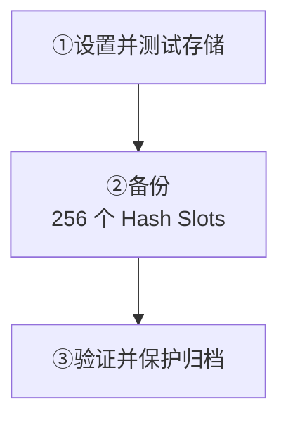
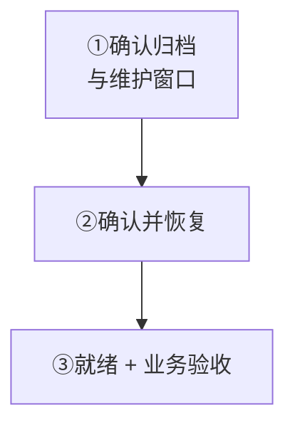

入口：**Manager → 集群 → 备份**。不需要修改 `wukongim.toml`。

<Cards>
  <Card title="创建可验证备份" description="先测试存储，再完成任务并验证归档。" href="/zh/server/operations/backup-and-restore#backup" />
  <Card title="在维护窗口恢复" description="确认归档，恢复后验收业务再接回流量。" href="/zh/server/operations/backup-and-restore#restore" />
</Cards>

权限：备份 `cluster.backup:w`；恢复单独授予 `cluster.restore:w`。归档未加密，须开启存储侧加密。

<section id="backup" className="scroll-m-28">

## 备份实操

先关闭自动备份，归档验证成功后再开启。

| 操作 | 预期结果 |
| --- | --- |
| 保存设置 → 测试存储 | 设置已保存；存储“已验证” |
| 立即备份 | `256/256 Hash Slots`；最近任务“成功” |
| 验证 → 保护 | 归档 `healthy`；“备份文件验证成功” |

<Callout type="warn" title="多节点必须共享备份目录">
  所有节点的 `data_dir/backup-repository` 必须指向同一个共享存储。没有共享存储时，选择 OSS、COS 或 S3。
</Callout>

  
示例设置与完整备份步骤

先不要开启“自动备份”，填写下面的示例值：

| 设置 | 示例值 |
| --- | --- |
| 备份频率 | 每天凌晨 1:00 |
| 时区 | `Asia/Shanghai` |
| 存储位置 | 共享文件存储 |
| 保留备份数 | `7` |
| 每节点工作数 | `1` |
| 超时 | `12` 小时 |

<Callout type="warn" title="多节点必须共享备份目录">
  所有节点的 `data_dir/backup-repository` 必须指向同一个共享存储。没有共享存储时，请选择 OSS、COS 或 S3。
</Callout>

1. 点击“保存设置”，看到“备份设置已保存”。
2. 点击“测试存储”，等“存储验证”变成“已验证”。
3. 点击“立即备份”，在“当前任务”等待 `256/256 Hash Slots`。
4. 在“最近任务”确认结果为“成功”。
5. 在“备份文件”中点击“验证”；成功后点击“保护”。

**完成标准：** 归档状态为 `healthy`，页面提示“备份文件验证成功”。需要定时执行时，再开启“自动备份”并保存。

</section>

<section id="restore" className="scroll-m-28">

## 恢复实操

<Callout type="warn" title="恢复会覆盖当前数据">
  归档完成时间之后的消息和变更会丢失，客户端也会断开。只在维护窗口执行。
</Callout>

**开始前：** 各节点 `/readyz` 为 200、无其他管理任务、归档刚验证成功。每节点可用空间：**当前数据 + 归档逻辑大小 × 2 + 1 GiB**。

核对集群、归档时间与大小，用当前管理员密码和 `RESTORE <归档 ID>` 确认。期间不停节点、不做其他变更。

**接回流量前：** 任务成功、各节点 `/readyz` 为 200；历史、登录、收发、重连、Webhook 与插件验收通过。

<Callout type="warn" title="只能恢复到原集群">
  归档只恢复到原集群，不能导入新集群或用于 v2 → v3 迁移。
</Callout>

**失败时：** 留存任务与错误，不重复恢复；见[故障排查](/zh/server/operations/troubleshooting#maintenance)。

  
完整恢复步骤与权限要求

<Callout type="warn" title="恢复会覆盖当前数据">
  归档完成时间之后的消息和变更会丢失，客户端也会断开。只在维护窗口执行。
</Callout>

开始前确认：所有节点 `/readyz` 返回 200、没有其他管理任务、归档刚刚验证成功，并且每个节点有“当前数据 + 归档逻辑大小 × 2 + 1 GiB”的可用空间。

1. 在目标归档右侧点击“恢复”。
2. 核对页面显示的集群、归档时间和大小。
3. 输入当前管理员密码。
4. 按提示输入 `RESTORE <归档 ID>`，点击“开始恢复”。
5. 等任务完成；期间不要关闭节点或执行其他变更。
6. 重新登录 Manager，确认“最近任务”为“成功”，且每个节点 `/readyz` 返回 200。
7. 检查历史消息，再测试登录、消息收发、重连、Webhook 和插件；全部正常后恢复流量。

<Callout type="warn" title="不能恢复到另一个集群">
  归档只能恢复到创建它的同一个集群，不能用于新集群导入或 v2 到 v3 迁移。
</Callout>

失败时保留任务和错误信息，不要反复点击恢复。备份需要 `cluster.backup:w`；恢复必须单独授予 `cluster.restore:w`。WuKongIM 不加密归档内容，请开启存储侧加密。

</section>
