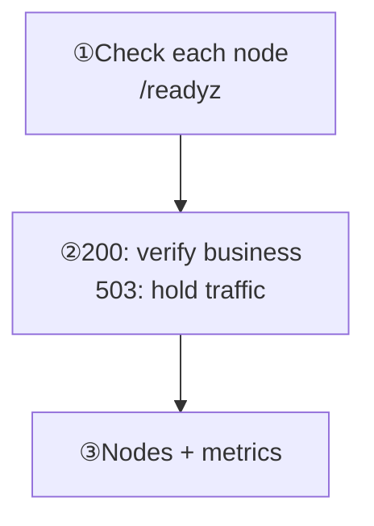

Goal: check readiness on every node, then verify product behavior and monitoring separately.

<div className="tutorial-diagram">



</div>

## 1. Check readiness on every node

Use the actual API address from the management network or a protected loopback entry:

```bash
curl -sS -i http://127.0.0.1:5001/readyz
```

| Result | Next action |
| --- | --- |
| HTTP `200`, `ready: true` | Use as a traffic-admission gate, then verify product messaging |
| HTTP `503` | Hold traffic to this node; save the full response and `reason` |
| Connection failure | Check the entry and network through [Troubleshooting](/en/server/operations/troubleshooting#connectivity) |

**`/healthz` proves only process liveness.** During restore or maintenance it may succeed while `/readyz` fails; that does not permit restoring product traffic.

<details id="run-these-three-commands-first" className="scroll-m-28">
  <summary>Complete liveness, readiness, and metrics checks</summary>

```bash
curl -sS -i http://127.0.0.1:5001/healthz
curl -sS -i http://127.0.0.1:5001/readyz
curl -sS http://127.0.0.1:5001/metrics
```

Replace `127.0.0.1:5001` with the node's real API address. The third endpoint may be unavailable when Prometheus metrics are disabled.

| Endpoint | Question it answers | Correct use |
| --- | --- | --- |
| `/healthz` | Is the WuKongIM process alive? | Process liveness checks and automatic restart |
| `/readyz` | Can this node accept product traffic now? | Load balancing, rollout gates, and restoring traffic |
| `/metrics` | How are errors, latency, queues, and resources changing? | Prometheus collection, dashboards, and alerts |

Remember one rule: **a successful `/healthz` only means that the process is alive; only a successful `/readyz` means that the node can receive product traffic.** A failed `/readyz` returns HTTP 503 and a reason. Save the complete response.

<Callout type="warn" title="The process can be alive while the product is unavailable">
  During restore or other maintenance, `/healthz`, monitoring, and diagnostics may still work while `/readyz` remains failed. Do not restore product traffic just because the process is alive.
</Callout>

</details>

## 2. Check node state and product behavior

In [Manager](/en/server/operations/manager), inspect health, readiness, and data freshness. Then verify client connection, message sending, independent receipt, and history recovery.

**Check:** Inspect every node in a multi-node cluster. Preserve stale or conflicting state and pause changes. One readiness success does not verify messaging and recovery.

<TutorialScreenshot
  src="/tutorials/manager/nodes-en.jpg"
  alt="Manager node list showing live-node count, node health, and data freshness"
  width={1280}
  height={720}
  marks={[{ x: 33, y: 55 }, { x: 48, y: 66 }]}
>
  ① Live-node count. ② Health, readiness, and data freshness. This reuses the recorded-version single-node cluster capture to show where to look; actual admission still checks `/readyz` per node. Click for the original.
</TutorialScreenshot>

## 3. Verify collection and alerts

Enable metrics, then have Prometheus scrape every node's `/metrics`. Check `up{job="wukongim"}=1` before comparing trends, alerts, and logs over the same interval. Use your own job name and cluster label.

**Successful collection does not prove readiness.** An empty result may mean an unconfigured target, disabled metrics, or an event that has not occurred; do not treat it as a healthy zero.

Cover connections and errors, queues and delivery, cluster state, and machine resources. Compare per-node maximums and high percentiles; assign an alert responder.

<details id="the-minimum-monitoring-set" className="scroll-m-28">
  <summary>Four monitoring groups: signals and problems</summary>

Start with these four groups. You do not need a complicated dashboard on day one.

| Group | Signals and problems |
| --- | --- |
| Traffic and connections | **Watch:** Connections, send errors, request rate, latency, reconnects<br/>**Problem:** Users cannot connect or messages become slow |
| Queues and delivery | **Watch:** Queue depth, rejection, drops, retries, webhook/plugin failures<br/>**Problem:** Messages back up or downstream delivery fails |
| Cluster state | **Watch:** Controller, Slot leaders, replicas, ISR, and tasks<br/>**Problem:** The process is running but cluster state is unhealthy |
| Machine resources | **Watch:** CPU, memory, goroutines, file descriptors, disk, and network<br/>**Problem:** Resource exhaustion makes the service unstable |

Manager Realtime and Top are useful for a quick view of one node. Prometheus shows trends over time. They complement one another, but neither replaces `/readyz`.

</details>

<details id="connect-an-existing-prometheus" className="scroll-m-28">
  <summary>Prometheus: download, merge, and validate</summary>

Download [prometheus.yml](/examples/monitoring/prometheus.yml) and [alerts.yml](/examples/monitoring/alerts.yml) into one directory. Replace the three private node endpoints, keep one target for a single-node cluster, and set a unique `cluster` label. Enable node metrics through [Observability](/en/server/configuration/observability).

On the Prometheus host, validate the files before loading them through your existing service management process:

```bash
promtool check config prometheus.yml
promtool check rules alerts.yml
```

Confirm every target is UP in Prometheus Targets. For an existing configuration, merge only the relevant `scrape_configs` and `rule_files`; do not overwrite other jobs or scrape the same node twice. Configure notification receivers through your existing Prometheus/Alertmanager setup.

</details>

<details id="four-queries-to-start-with" className="scroll-m-28">
  <summary>Four PromQL queries: labels, units, and interpretation</summary>

These queries use the sample's `job="wukongim"` and scrape-added `cluster` label; `node_id` comes from each node. Replace the selector if your job name differs. Check `up{job="wukongim"}` first: `0` means collection failed, while `1` only means a successful scrape, not successful `/readyz`. An empty result can mean an unconfigured target, disabled metrics, or an event that has not occurred; do not automatically interpret it as a healthy zero.


### Connections: compare nodes

```text title="PromQL"
sum by (cluster, node_id) (wukongim_gateway_connections_active{job="wukongim"})
```

The unit is connections, not distinct users. A skewed node suggests checking routing and connection distribution. For a sudden drop, compare gateway errors and client reconnects over the same interval.

### Send failures: inspect reasons

```text title="PromQL"
sum by (cluster, node_id, reason) (increase(wukongim_gateway_sendacks_total{job="wukongim",reason!="success"}[5m]))
```

Shows unsuccessful SENDACKs emitted in the last 5 minutes; it does not count all client timeouts. For `auth_fail`, check UID, device category, and token. For other reasons, consult [Reason Code](/en/api/dictionaries/reason-codes) and the relevant node logs. Metric labels use names; protocol results use numeric codes.

### Slow appends: inspect per-node P99

```text title="PromQL"
histogram_quantile(0.99,
  sum by (cluster, node_id, le) (
    rate(wukongim_message_append_duration_seconds_bucket{job="wukongim"}[5m])
  )
)
```

Values are seconds for server-side message append latency, not end-to-end receive latency. If P99 rises, compare disk IO, replication latency, and traffic on that node. Sparse traffic does not provide enough samples for a capacity conclusion.

### Delivery backlog: inspect queued batches

```text title="PromQL"
max by (cluster, node_id) (wukongim_delivery_recipient_worker_queue_depth{job="wukongim"})
```

The unit is queued delivery batches, not unread messages or undelivered users. For sustained growth, check delivery workers, downstream nodes, and connection writes before changing capacity.

The downloadable rules cover scrape failures, unsuccessful SENDACKs, and sustained delivery backlogs. The `2m`, `10m`, and `80%` thresholds are starter examples to tune against your baseline; they do not cover all readiness, storage, or cluster failures.

</details>

<details id="create-these-alerts-first" className="scroll-m-28">
  <summary>Alerts: complete starter list and threshold principles</summary>

- `/readyz` keeps returning 503 or repeatedly changes state.
- Send errors or latency keep rising.
- A queue keeps growing, or rejection, drops, or delivery failures appear.
- Disk space is low, or memory, file descriptors, or goroutines keep growing.
- Controller, Slot leader, replica, or ISR state is unhealthy.
- Monitoring collection stops, so cluster state becomes unknown.

Do not copy alert numbers from another environment. Observe the normal range for this version under a real product peak, then set thresholds. Large groups, high message rates, and many connections can create one-node or one-channel hot spots, so inspect maximums and high-percentile latency as well as averages.

</details>

## What to do after an alert

Record time, impact, and the complete `/readyz` response. Align metrics, Manager, and logs; continue through [Troubleshooting](/en/server/operations/troubleshooting) when needed.

**Alerts must not automatically move leaders, delete nodes, or change topology.** Settings are in [Logs & Observability](/en/server/configuration/observability).
