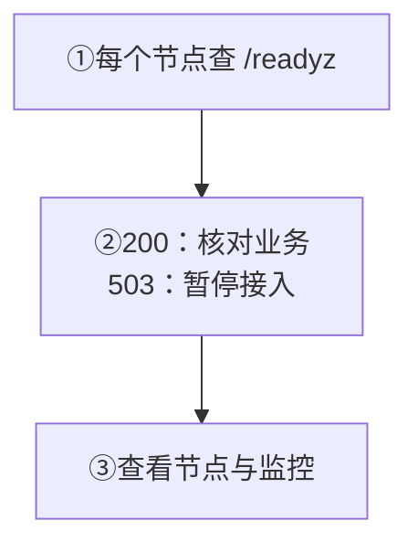

目标：逐台确认节点能接流量，再分别验证业务与监控。

<div className="tutorial-diagram">



</div>

## 1. 检查每个节点是否就绪

从管理网络或受保护的本机入口检查实际 API 地址：

```bash
curl -sS -i http://127.0.0.1:5001/readyz
```

| 结果 | 接下来做什么 |
| --- | --- |
| HTTP `200`，`ready: true` | 可作为流量准入依据，再核对业务收发 |
| HTTP `503` | 暂停接入这个节点，保存完整响应与 `reason` |
| 连接失败 | 从[故障排查](/zh/server/operations/troubleshooting#connectivity)检查入口与网络 |

**`/healthz` 只证明进程存活。** 恢复等维护期间，它可能成功而 `/readyz` 仍失败，不能因此恢复业务流量。

<details id="先运行这三个命令" className="scroll-m-28">
  <summary>完整存活、就绪与指标检查</summary>

```bash
curl -sS -i http://127.0.0.1:5001/healthz
curl -sS -i http://127.0.0.1:5001/readyz
curl -sS http://127.0.0.1:5001/metrics
```

把 `127.0.0.1:5001` 换成节点真实的 API 地址。如果没有开启 Prometheus 指标，第三个地址可能不可用。

| 地址 | 它回答的问题 | 正确用法 |
| --- | --- | --- |
| `/healthz` | WuKongIM 进程还活着吗？ | 用于进程存活检查和自动重启 |
| `/readyz` | 这个节点现在能接收业务流量吗？ | 用于负载均衡、发布和恢复流量 |
| `/metrics` | 最近的错误、延迟、队列和资源有什么变化？ | 由 Prometheus 采集，用于图表和告警 |

最容易记住的规则是：**`/healthz` 成功只代表进程活着；只有 `/readyz` 成功才代表节点可以接业务流量。** `/readyz` 失败时会返回 HTTP 503，并在响应中说明原因，请把完整响应保存下来。

<Callout type="warn" title="维护期间进程可能存活，但业务仍不可用">
  数据恢复等维护操作期间，`/healthz`、监控和诊断接口仍可能正常，`/readyz` 则会保持失败。不要因为进程存活就提前恢复业务流量。
</Callout>

</details>

## 2. 核对节点状态与业务

在 [Manager](/zh/server/operations/manager)查看节点健康、就绪与数据新鲜度，再验证客户端连接、发送、接收和历史恢复。

**核对：** 多节点集群逐台检查；过期或矛盾的状态先保存证据、暂停变更。一次就绪成功不代表业务收发与恢复已经验证。

<TutorialScreenshot
  src="/tutorials/manager/nodes.jpg"
  alt="Manager 节点列表中的存活节点数、节点健康与数据新鲜度"
  width={1280}
  height={720}
  marks={[{ x: 33, y: 55 }, { x: 48, y: 66 }]}
>
  ① 存活节点数。② 健康、就绪与数据新鲜度。复用已记录版本的单节点集群界面，仅示例查看位置；实际准入仍逐台请求 `/readyz`。点击查看原图。
</TutorialScreenshot>

## 3. 确认采集与告警

开启指标后，让 Prometheus 采集每个节点的 `/metrics`。先确认 `up{job="wukongim"}=1`，再看趋势、告警与同一时间段日志；使用自己的作业名与集群标签。

**采集成功不等于节点就绪。** 空结果可能是未配置目标、指标未启用或事件尚未发生，不能当作正常的零值。

至少覆盖连接与错误、队列与投递、集群状态、机器资源四组，按节点看最大值和高分位；告警需指定响应人。

<details id="最少需要监控什么" className="scroll-m-28">
  <summary>四组监控：关注内容与常见问题</summary>

刚开始可以先覆盖下面四组，不必一次做出很复杂的仪表盘。

| 监控组 | 关注内容与常见问题 |
| --- | --- |
| 流量与连接 | **关注：** 连接数、发送错误、请求量、延迟、重连<br/>**问题：** 用户连不上或消息变慢 |
| 队列与投递 | **关注：** 队列长度、拒绝、丢弃、重试、Webhook/插件失败<br/>**问题：** 消息积压或下游收不到 |
| 集群状态 | **关注：** Controller、Slot Leader、副本、ISR 和任务<br/>**问题：** 节点就绪但集群状态异常 |
| 机器资源 | **关注：** CPU、内存、Goroutine、文件句柄、磁盘和网络<br/>**问题：** 资源耗尽导致服务不稳定 |

Manager 的“实时监控”和 Top 适合快速查看当前节点；Prometheus 适合看一段时间内的趋势。它们互相补充，不能替代 `/readyz`。

</details>

<details id="接入现有-prometheus" className="scroll-m-28">
  <summary>Prometheus：配置下载、合并与校验</summary>

下载 [prometheus.yml](/examples/monitoring/prometheus.yml) 和 [alerts.yml](/examples/monitoring/alerts.yml)，放在同一目录。把三台节点地址换成实际管理内网地址，单节点集群只保留一个目标，并为 `cluster` 填写唯一名称。先按[日志与可观测性](/zh/server/configuration/observability)开启节点指标。

在 Prometheus 主机上校验，再按现有服务管理方式加载配置：

```bash
promtool check config prometheus.yml
promtool check rules alerts.yml
```

在 Prometheus 的 Targets 页面确认每个目标都为 UP。已有采集配置时只合并对应的 `scrape_configs` 和 `rule_files`，不要覆盖其他作业；同一节点只采集一次。告警通知需要在现有 Prometheus/Alertmanager 中配置接收人。

</details>

<details id="四个可直接使用的查询" className="scroll-m-28">
  <summary>四个 PromQL：标签、单位与结果解释</summary>

下面的查询使用样例中的 `job="wukongim"` 与采集时添加的 `cluster` 标签；`node_id` 来自节点本身。自定义作业名时相应替换选择器。先检查 `up{job="wukongim"}`：`0` 表示采集失败，`1` 只表示指标抓取成功，不代表 `/readyz` 成功。空结果也可能是目标未配置、指标未启用或该事件尚未发生，不能自动当作正常的零值。


### 连接数：比较节点分布

```text title="PromQL"
sum by (cluster, node_id) (wukongim_gateway_connections_active{job="wukongim"})
```

单位是连接，不是去重用户数。单个节点明显偏高时，先检查路由与连接分配；连接突然下降时，对照同一时间段的网关错误和客户端重连。

### 发送失败：按原因定位

```text title="PromQL"
sum by (cluster, node_id, reason) (increase(wukongim_gateway_sendacks_total{job="wukongim",reason!="success"}[5m]))
```

显示最近 5 分钟服务端发出的失败 SENDACK 数，不能代替客户端超时统计。`auth_fail` 先查 UID、设备类别和 Token；其他值结合 [Reason Code](/zh/api/dictionaries/reason-codes) 与精确节点日志检查。指标标签是原因名称，协议返回值是数字。

### 写入变慢：查看节点 P99

```text title="PromQL"
histogram_quantile(0.99,
  sum by (cluster, node_id, le) (
    rate(wukongim_message_append_duration_seconds_bucket{job="wukongim"}[5m])
  )
)
```

单位为秒，覆盖服务端消息追加耗时，不是端到端收件延迟。P99 上升时，同时查看该节点磁盘 IO、复制延迟和消息负载；低流量下样本不足，不能据此判断容量。

### 投递积压：查看等待批次数

```text title="PromQL"
max by (cluster, node_id) (wukongim_delivery_recipient_worker_queue_depth{job="wukongim"})
```

单位为等待处理的投递批次，不是未读消息或未送达用户数。持续增长时，检查投递 Worker、下游节点和连接写入；先定位瓶颈，再决定容量调整。

下载的告警规则覆盖采集中断、失败 SENDACK 和持续投递积压。`2m`、`10m` 与 `80%` 是起始示例，需按业务基线调整；它们不覆盖全部就绪、存储和集群故障。

</details>

<details id="先设置这些告警" className="scroll-m-28">
  <summary>告警：完整起始清单与阈值原则</summary>

- `/readyz` 持续返回 503，或者状态频繁变化；
- 发送错误或延迟持续上升；
- 队列持续增长，出现拒绝、丢弃或投递失败；
- 磁盘剩余空间不足，或内存、文件句柄、Goroutine 持续增长；
- Controller、Slot Leader、副本或 ISR 状态异常；
- 监控采集中断，导致无法判断集群状态。

不要直接照搬别人的告警数值。先观察当前版本在真实业务高峰时的正常范围，再设置阈值。大群、高消息率和大量连接容易产生单节点或单频道热点，因此还要看最大值和高分位延迟，不能只看平均值。

</details>

## 告警出现后怎么做

记录时间、影响和 `/readyz` 完整响应，对齐指标、Manager 与日志；需要继续定位时，进入[故障排查](/zh/server/operations/troubleshooting)。

**不要让告警自动迁移 Leader、删除节点或变更拓扑。** 完整监控与日志开关见[日志与可观测性](/zh/server/configuration/observability)。
