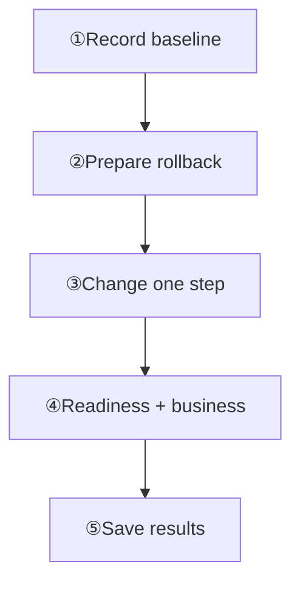

Start with three outcomes: nodes can accept traffic, someone responds to alerts, and data has a verified backup.

## Do these three things first

1. Check `/readyz` on every node, then verify product messaging and recovery.
2. Alert on readiness, errors, queues, and disk; assign a responder.
3. Configure backups in Manager, test storage, and confirm at least one complete, verified backup.

## What do you need to do?

<Cards>
  <Card title="Check service health" description="Verify readiness, product behavior, and monitoring separately." href="/en/server/operations/health-and-monitoring" />
  <Card title="Troubleshoot a problem" description="Choose a symptom and narrow the problem using evidence." href="/en/server/operations/troubleshooting" />
  <Card title="Use Manager" description="Sign in to inspect nodes, health, and tasks." href="/en/server/operations/manager" />
  <Card title="Back up or restore data" description="Verify backups and restore during maintenance." href="/en/server/operations/backup-and-restore" />
  <Card title="Add or remove nodes" description="Inspect migration tasks and safely drain old nodes." href="/en/server/operations/scaling" />
  <Card title="Upgrade WuKongIM" description="Check compatibility and rollback before upgrading." href="/en/server/operations/upgrade-and-migration" />
  <Card title="v2 → v3 Offline Migration" description="Migrate cold backups, verify data, then cut over clients." href="/en/server/operations/v2-to-v3-migration" />
</Cards>

<Callout type="warn" title="Single-node clusters follow the same procedures">
  A single-node cluster still follows Manager, Controller, and Slot procedures. Do not bypass them by editing data manually. The 256 physical hash slots remain fixed when nodes change.
</Callout>

## Use these five steps for every change

  
What each step does and when to continue

1. **Record the current state**: Save versions, configuration, node state, `/readyz`, and key metrics. Continue when: You know what normal looked like before the change.

2. **Prepare a way back**: Record the rollback method, owner, and stop conditions. Continue when: Everyone knows who stops the change and how.

3. **Make a small change**: Change one thing at a time; advance one node or a small task batch. Continue when: The current step has finished.

4. **Test the product**: Test sign-in or reconnect, message send and receive, and history. Continue when: Product checks pass and nodes are ready again.

5. **Save the result**: Keep task results, errors, metrics, and the final node list. Continue when: Someone can later see exactly what happened.

## Stop if any of these happen

- `/readyz` returns 503, or readiness repeatedly changes between success and failure.
- Manager shows missing, stale, or conflicting node, Controller, Slot, Channel, or task state.
- A previous scaling, restore, or upgrade task has not finished.
- A production change has no rollback method, or no backup has passed verification.
- The release notes do not explicitly say whether the current and target versions may run together.

Stop and preserve the current evidence, then follow [Troubleshooting](/en/server/operations/troubleshooting). See [Server Tools](/en/server/tools) when you need a command-line tool.
